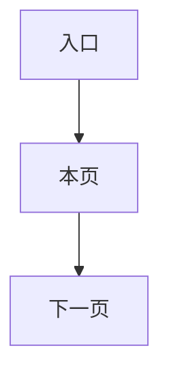

# {{页面名称}}

> 产品说明 · 微信小程序  
> 状态：草稿 / 待确认 / 已确认 / 开发中 / 已实现  
> 最后更新：YYYY-MM-DD  
> 预览地址：http://127.0.0.1:8765/miniprogram/{{preview-file}}.html  
> UI设计图地址：设计中  
> **协作提示**：桌面打开预览时，手机模型右侧会同步展示本文档（预览中不展示「§6 规则补充与验收要点」）；改文档后请运行 `python3 preview/build-pages.py` 再刷新。

---

## 1. 页面业务目标

用一两段**白话**说明：用户从哪进来、要解决什么问题、做完去哪。不要写路由、接口、文件路径。

---

## 2. 登录和身份描述

| 身份 / 场景 | 用户大概情况 | 页面上不一样的地方 |
|-------------|--------------|--------------------|
| （示例）全部用户 | | |

用「未登录 / 未申请 / 审核中 / 已认证」等中文身份，不要写英文状态码。

---

## 3. 页面详细描述

按屏幕分块：叫什么、看到什么、点了会怎样。填错时写**提示原文**，不要写正则或字段英文名。

---

## 4. 常见路径

用条目写主路径。流程图标签用中文：

---

## 5. 相关页面

| 关系 | 页面 | 何时 |
|------|------|------|
| 来源 / 去向 | [页面名](./xxx.md) | |

---

## 6. 规则补充与验收要点

> 预览右侧会隐藏本章。仍用产品语言：什么情况下允许、禁止、提示什么、后台要做什么。不要贴接口表或代码字段表。

### 6.1 已对齐（产品已确认可验收）

- 

### 6.2 还没做完

- 

---

## 7. 变更记录

| 日期 | 改了什么 |
|------|----------|
| YYYY-MM-DD | 初稿 / 改为产品可读中文 |
