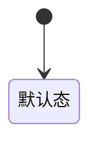

# {{页面名称}}

> 单页需求文档 · 英雄广场微信小程序  
> 状态：草稿 / 待确认 / 已确认 / 开发中 / 已完成  
> 优先级：P0 / P1 / P2 · 里程碑：M1 / M2  
> 最后更新：YYYY-MM-DD  
> 源码：`miniprogram/pages/xxx/` · 预览：`preview/miniprogram/xxx.html`

---

## 1. 页面概述

| 项 | 值 |
|---|---|
| 页面名称 | |
| 路由 | `pages/xxx/xxx` |
| 导航栏标题 | |
| 导航类型 | Tab 根页 / 子页 / 自定义导航 |
| 页面参数 | 无 / `?id=` / 见 §3 |
| 目标用户 | |
| 设计规范 | `docs/DESIGN-SPEC.md` §x.x |

---

## 2. 业务需求

### 2.1 业务目标

（本页在产品链路中的价值、要完成的业务闭环）

### 2.2 适用角色与权限

| 角色 | 可访问 | 不可访问时的处理 |
|------|--------|------------------|
| 普通用户 | | Toast + navigateBack / 隐藏入口 |
| 英雄（已认证） | | |
| 审核中 | | |

### 2.3 核心业务规则

1. 
2. 

### 2.4 状态机（如有）



---

## 3. 页面结构与 UI 元素规格

> **本章为逐元素说明**：每个可见/可交互元素须写清文案、样式、数据来源、校验与交互。  
> 表单页另见 §4 字段与校验矩阵。

### 3.1 信息架构（自上而下）

```
导航栏
└── 主内容区
    └── 区块 A
        └── 元素 …
└── 底部操作区（如有）
```

### 3.2 UI 元素清单

| 元素 ID | 类型 | 文案/占位 | 样式要点 | 数据来源 | 必填 | 校验规则 | 交互 |
|---------|------|-----------|----------|----------|------|----------|------|
| | | | | 静态/API/计算 | 是/否 | | |

#### 3.2.x 元素详细说明（复杂元素展开）

**元素名称**（`className`）

| 属性 | 规格 |
|------|------|
| 展示文案 | |
| 字体 | 字号 / 字重 / 颜色 token |
| 布局 | 间距、对齐、圆角 |
| 可见条件 | 始终 / `wx:if=` 条件 |
| 为空时 | |
| 点击行为 | |
| 异常展示 | |

---

## 4. 字段与校验矩阵（表单页必填本章）

| 字段 key | 标签 | 控件类型 | 必填 | 长度/格式 | 默认值 | 校验时机 | 错误提示 | 提交映射 |
|----------|------|----------|------|-----------|--------|----------|----------|----------|
| | | input/picker/… | | | | blur/提交 | | API 字段 |

### 4.1 提交前全局校验顺序

1. 
2. 

### 4.2 提交 payload 示例

```json
{}
```

---

## 5. 交互需求

### 5.1 操作明细

| 序号 | 用户操作 | 前置条件 | 系统行为 | 成功反馈 | 失败反馈 |
|------|----------|----------|----------|----------|----------|
| 1 | | | | | |

### 5.2 返回与导航

| 控件 | 行为 | 兜底 |
|------|------|------|
| 导航栏 ‹ | | `data-back-fallback` |
| 系统返回键 | | |
| Tab 切换 | | |

### 5.3 页面级异常

| 场景 | 处理 |
|------|------|
| 无网络 | |
| 无权限 | |
| 参数缺失 | |

---

## 6. 加载与刷新机制

| 生命周期 | 触发条件 | 请求/逻辑 | UI 表现 | 缓存策略 |
|----------|----------|-----------|---------|----------|
| onLoad | | | | |
| onShow | | | | |
| 下拉刷新 | 支持/不支持 | | | |
| 提交成功后 | | redirectTo / navigateBack | | |

---

## 7. 性能要求

| 项 | 指标 | 实现建议 |
|----|------|----------|
| 首屏可交互 | | |
| 列表数据量 | | 分页 / 虚拟列表 |
| 图片 | | 压缩、lazy-load |
| setData | | 字段级更新，避免整表 |
| 搜索/输入 | | 防抖 ms |

---

## 8. 相关页面

### 8.1 入口

| 来源 | 路径/参数 | 场景 |
|------|-----------|------|

### 8.2 出口

| 目标 | 路径/参数 | 触发 |
|------|-----------|------|

---

## 9. 接口与数据

### 9.1 接口列表

| 接口 | 方法 | 时机 | 说明 |
|------|------|------|------|

### 9.2 响应结构（关键接口展开）

**`GET /api/xxx`**

| 字段 | 类型 | 说明 |
|------|------|------|

---

## 10. 预览端差异（如有）

| 项 | 小程序 | 浏览器预览 |
|----|--------|------------|
| | | |

---

## 11. 待确认项

- [ ] 

---

## 12. 变更记录

| 日期 | 变更 |
|------|------|
| | 初稿 |
