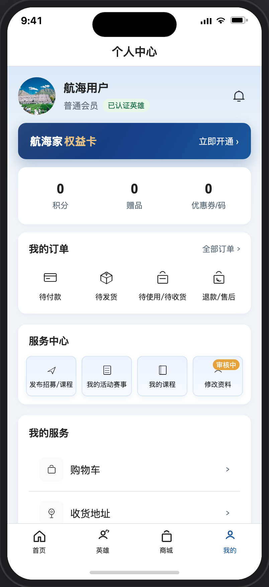
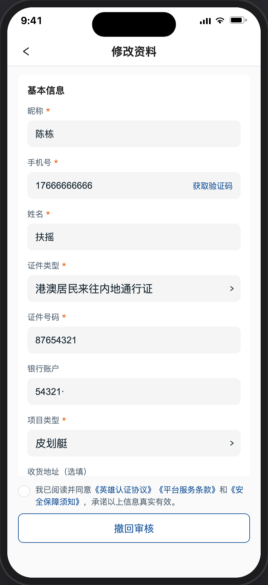
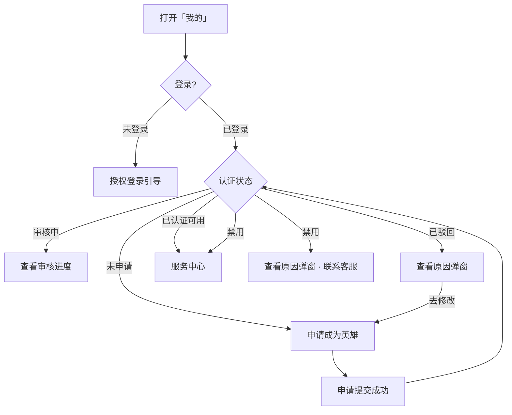

# 个人中心

> 产品说明 · 微信小程序底部 Tab「我的」  
> 状态：部分已实现 · 见 §5 规则补充与验收要点  
> 最后更新：2026-07-21 15:58
> 预览地址：[http://127.0.0.1:8765/miniprogram/profile.html](http://127.0.0.1:8765/miniprogram/profile.html)  
> UI设计图地址：https://www.figma.com/design/FQerHrZBo3Kx7ddFq7jKYx/%E5%BA%97%E9%93%BA%E8%A3%85%E4%BF%AE?node-id=8777-1717&t=m8tMpSkni5qRw93M-1
> **协作提示**：桌面打开预览时，手机模型右侧会同步展示本文档（预览中不展示「规则补充与验收要点」）；改文档后请运行 `python3 preview/build-pages.py` 再刷新。状态截图可用 `python3 scripts/shot-profile-states.py` 重拍。
> **同步约定（强制）**：个人中心页面但凡有可见变动，必须同步更新本文描述与 `images/profile/` 截图，并与本文件保持完全一致；详见 `.cursor/rules/profile-doc-sync.mdc`。小程序各页文档格式与右侧面板约定见 `.cursor/rules/miniprogram-page-docs.mdc`。

## UI说明

1、UI设计时需要特别关注申请身为英雄入口的不同状态及弹框样式。和服务中心的 2 个状态下的各入口布局。

---

## 1. 登录和身份描述

### 1.1 未登录

1、展示引导「申请成为英雄」→ 先授权）栏；

### 1.2 已登录且未申请

1、还没提交过英雄认证申请，展示引导「申请成为英雄」→ 先授权）栏；

### 1.3 已登录且审核中

1、已提交入驻申请、平台尚未处理。仍显示普通会员，标签为「未认证」；

2、展示引导文案「认证申请审核中，请耐心等待」；按钮「查看审核进度」。入口 （点 → 进审核进度页（和提交成功是同一页面）。

### 1.4 已登录且已驳回

1、平台驳回了入驻申请。仍显示「未认证」；

2、展示引导文案展示引导文案：认证申请被驳回，请修改后再次提交申请；按钮「查看原因」。点按钮后弹出「申请失败」说明。

3、申请失败弹框取驳回时必填的驳回理由。点按钮「去修改」，跳申请成为英雄页后需要回填数据，以便于二次编辑后再提交。

### 1.5 已登录且已认证（可用）

1、已成为英雄显示「已认证英雄」；消息（点 →进消息类型列表）；

### 1.6 已登录且已认证且禁用（指禁用英雄身份，不是禁用账号）

1、已认证的英雄但被平台禁用，仍显示「已认证英雄」且支持查看原因。

2、禁用后仍展示服务中心整栏（同已认证可用：发布招募/课程、我的活动赛事、我的课程、修改资料）；点入口弹出「英雄身份禁用」说明，不进入业务页。

3、引导文案：您的英雄身份不可用，可联系客服处理；按钮「查看原因」。点按钮后弹出说明：标题「英雄身份禁用」；正文取禁用时填写的原因，若未填写则兜底「您的英雄身份不可用，具体原因可联系客服处理」；按钮「知道了」。

---

## 2. 页面详细描述

### 2.1 顶部：我的信息

| 展示内容 | 说明                                                           |
| ---- | ------------------------------------------------------------ |
| 头像   | 已登录：用户头像；未登录：默认头像（界面见 [§1.1](#11-未登录)）                       |
| 昵称   | 已登录：用户头像；未登录：「授权登录」→ 手机号授权                                   |
| 会员   | 已登录：「普通会员」（不影响权限）；未登录：不显示                                    |
| 认证标签 | 已登录：未认证 / 「已认证英雄」；未登录：不显示                                      |
| 消息图标 | 用户信息行右侧，铃铛图标；已登录点 → [消息中心](./消息.md)；未登录点 → 先授权 |

### 2.2 航海家权益卡

现有功能，本期无改动。

### 2.3 商城资产

现有功能，本期无改动。

### 2.4 英雄申请 / 身份引导

位于用户信息（及权益卡，若有）下方、**商城资产上方**。

| 身份      | 提示文案                   | 按钮     | 点按钮之后      | 界面参考              |
| ------- | ---------------------- | ------ | ---------- | ----------------- |
| 未登录     | 同未申请引导文案               | 申请成为英雄 | → 先授权登录    | [§1.1](#11-未登录)   |
| 未申请     | 成为英雄，发布赛事招募，开启您的水上教育事业 | 申请成为英雄 | → 申请页      | [§1.2](#12-未申请)   |
| 审核中     | 认证申请审核中，请耐心等待          | 查看审核进度 | → 审核进度页    | [§1.3](#13-审核中)   |
| 已驳回     | 认证申请被驳回，请修改后再次提交申请     | 查看原因   | → 申请失败弹窗   | [§1.4](#14-已驳回)   |
| 禁用      | 您的英雄身份不可用，可联系客服处理      | 查看原因   | → 英雄身份禁用弹窗 | [§1.6](#16-禁用)    |
| 已认证（可用） | （不展示本块）                | —      | —          | [§1.5](#15-已认证可用) |

**已驳回弹窗：** 标题「申请失败」；正文为驳回原因；无原因时兜底「您的英雄身份当前不可用，可联系客服处理」；按钮「取消」「去修改」。界面见上图「已驳回 · 查看原因弹窗」。

**禁用弹窗：** 标题「英雄身份禁用」；正文为禁用原因；无原因时兜底「您的英雄身份不可用，具体原因可联系客服处理」；按钮「知道了」。界面见上图「禁用 · 查看原因弹窗」。

### 2.5 我的订单

第一期就有。可进入 [我的订单](./我的订单.md)：

| 入口 | 默认 Tab |
|------|----------|
| 「全部订单 ›」 | 全部 |
| 「待付款」 | 待付款 |
| 「待发货」 | 待发货 |
| 「待使用/待收货」 | 待使用/待收货；演示角标数字 `1` |
| 「退款/售后」 | 全部（本期无独立退款 Tab） |

未登录点入口先授权。订单卡「券码凭证」→ [二维码凭证](./二维码凭证.md)。

### 2.6 服务中心

- **未认证通过**（未登录 / 未申请 / 审核中 / 已驳回）：「我的活动赛事」「我的课程」；可进入对应页（我的活动赛事 → [我的报名](./我的报名.md)；我的课程 → [我的课程](./我的课程.md)）；未登录点入口先授权
- **已认证英雄（可用）**：「发布招募/课程」「我的活动赛事」「我的课程」「修改资料」；
- **已认证且禁用**：仍展示与可用态相同的四入口；点任一入口弹出「英雄身份禁用」说明，不进入业务页

「发布招募/课程」（仅已认证可用时可完成发布流程）：底部弹出「发布赛事招募」「申请课程」「取消」；「申请课程」→ 跳转后台投票调研表单（说明见 [发布课程](./发布课程.md)）。

**修改资料 / 审核中**（仅已认证可用时生效）

1. 提交后对外正式资料不立刻变
2. 有待审时角标「审核中」；进入修改资料页时底部**仅**「撤回审核」，不展示「提交修改」
3. 待审回填最近一次提交；支持 **仅资料变更待审** 的用户端撤回（撤回后后台待审记录移除，本页恢复「提交修改」）
4. 须先撤回后再提交修改（待审期间不可再次提交覆盖）
5. 审核通过后对外才更新

### 2.7 我的服务

现有功能，本期无改动。

---

## 3. 常见路径

- **未登录进页：** 见 [未登录](#11-未登录)；点昵称 / 申请 / 订单 → 授权；权益卡、商城资产与我的服务入口本期无反应  
- **申请英雄：** 我的 → 申请 → 提交 → 再进变为查看进度（界面：[未申请](#12-未申请) → [审核中](#13-审核中)）  
- **驳回再改：** 查看原因 → 去修改 → 再交（界面：[已驳回](#14-已驳回)）  
- **英雄日常：** 发布招募/课程 / 改资料（界面：[已认证](#15-已认证可用)）  
- **被禁用：** 引导 → 查看原因 → 知道了；服务中心仍展示，点入口同样弹出禁用说明；启用后恢复可用态（界面：[禁用](#16-禁用)）

---

## 4. 相关页面

| 关系                           | 页面                    | 何时          |
| ---------------------------- | --------------------- | ----------- |
| Tab                          | 我的                    | 主入口         |
| 申请/改资料                       | [申请成为英雄](./申请成为英雄.md) | 申请或修改资料     |
| 进度                           | [申请提交成功](./申请提交成功.md) | 查看审核进度      |
| 发招募                          | [发布招募](./发布招募.md)     | 底部选「发布赛事招募」 |
| 发课程                          | [发布课程](./发布课程.md)     | 底部选「申请课程」→ 跳转后台投票调研表单 |
| 管招募                          | [我的活动赛事](./我的招募.md)     | 服务中心「我的活动赛事」        |
| 课程                           | [我的课程](./我的课程.md)     | 服务中心（未认证 / 已认证均有） |
| 活动赛事                         | [我的报名](./我的报名.md)     | 未认证服务中心「我的活动赛事」 |
| 订单 | [我的订单](./我的订单.md) / [二维码凭证](./二维码凭证.md) | 全部订单 / 订单宫格 / 券码凭证 |
| 授权 / 购物车 / 地址 / 客服 / 账号 | 待补文档                  | 未登录或对应入口    |

---

## 5. 规则补充与验收要点

> 拍板已确认（2026-07-14）：A 禁用收起服务中心（**2026-07-20 已变更：禁用仍展示服务中心**） · B 发布入口底部弹层 · C 恢复我的课程 · D 撤回仅资料变更 · E 原因缺失兜底「您的英雄身份当前不可用，可联系客服处理」  
> 版式拍板（2026-07-14）：商城权益卡 + 积分/赠品/优惠券；加购物车；不做精选产品；**已移除「英雄数据」区块**。  
> 入口可见性（2026-07-20 修订）：所有身份均展示服务中心（含禁用）；禁用点入口弹禁用说明。  
> 2026-07-15：服务中心入口文案为「发布招募/课程」；点击底部弹出「发布赛事招募」「申请课程」「取消」。

### 5.1 六种身份展示规则（可验收）

| 身份      | 必须看到                                  | 必须不出现              |
| ------- | ------------------------------------- | ------------------ |
| 未登录     | 默认头像、「授权登录」、申请引导（资产上方）、商城资产、服务中心入口    | 会员标签、认证标签、权益卡、英雄数据 |
| 未申请     | 「未认证」、申请引导（资产上方）、「申请成为英雄」、商城资产、服务中心入口 | 权益卡、英雄数据           |
| 审核中     | 「未认证」、「查看审核进度」（资产上方）、商城资产、服务中心入口      | 权益卡、英雄数据           |
| 已驳回     | 「未认证」、引导（资产上方）、「查看原因」、商城资产、服务中心入口   | 权益卡、英雄数据           |
| 已认证（可用） | 「已认证英雄」、权益卡、商城资产、服务中心               | 申请引导块、英雄数据         |
| 禁用      | 「已认证英雄」、权益卡、不可用引导（资产上方）、「查看原因」、商城资产、服务中心（点入口弹禁用说明） | 英雄数据          |

审核中、已驳回在认证标签上仍显示「未认证」。

### 5.2 弹窗与提示原文

| 场景              | 标题         | 正文                                       | 按钮         |
| --------------- | ---------- | ---------------------------------------- | ---------- |
| 已驳回 · 查看原因      | **申请失败**   | 平台填写的驳回原因；无原因时兜底：「您的英雄身份当前不可用，可联系客服处理」   | 「取消」「去修改」  |
| 禁用 · 查看原因       | **英雄身份禁用** | 平台填写的禁用原因；无原因时兜底：「您的英雄身份不可用，具体原因可联系客服处理」 | 「知道了」      |
| 审核中点申请          | —          | 「申请审核中」                                  | 约 1.5 秒后返回 |
| 已认证点申请          | —          | 「您已是认证英雄」                                | —          |
| 权益卡（已登录） | — | 不跳转、无提示 | — |
| 商城资产（已登录） | — | 不跳转、无提示 | — |

「去修改」→ 进入 [申请成为英雄](./申请成为英雄.md) 重新填写。

### 5.3 服务中心规则

| 规则     | 说明                                  |
| ------ | ----------------------------------- |
| **允许** | 所有身份均展示服务中心（含禁用） |
| **允许** | 未认证通过：入口为「我的活动赛事」「我的课程」，可进对应页（未登录先授权） |
| **允许** | 已认证可用：入口为「发布招募/课程」「我的活动赛事」「我的课程」「修改资料」 |
| **允许** | 已认证禁用：入口同可用态四入口；点任一入口弹出「英雄身份禁用」说明，不进入业务页 |
| **允许** | 点「发布招募/课程」弹出底部选择：「发布赛事招募」「申请课程」「取消」；「申请课程」跳转后台投票调研表单 |
| **允许** | 「修改资料」进入认证表单（从「修改资料」进入）             |
| **允许** | 资料变更待审时，「修改资料」入口显示「审核中」角标           |
| **允许** | 用户撤回**仅资料变更**的待审申请（撤回后后台待审记录移除，修改资料页恢复「提交修改」）     |
| **规则** | 资料变更提交后，对外正式资料不立刻更新；有待审时底部仅「撤回审核」，不可再次提交覆盖     |
| **规则** | 审核通过后，对外资料才更新                       |

### 5.4 后台要做什么

| 场景       | 后台要做什么               |
| -------- | -------------------- |
| 用户提交认证申请 | 在待审核列表处理；批准或驳回       |
| 审核驳回     | 填写驳回原因；用户在个人中心弹窗可见   |
| 禁用英雄     | 填写禁用原因；用户仍见「已认证英雄」与服务中心，点入口弹禁用说明 |
| 启用英雄     | 恢复已认证可用态             |
| 资料变更待审   | 在供方列表审核；通过后更新对外资料    |
| 用户撤回资料变更 | 移除对应待审记录             |

### 5.5 已对齐（产品已确认可验收）

- 未申请 / 审核中 / 已驳回 / 已认证（可用）四种主流程态
- 「已认证英雄」标签、服务中心基础入口（已移除「英雄数据」区块）
- 已认证展示航海家权益卡；未认证隐藏权益卡，申请引导置于商城资产上方；商城资产三列 + 我的服务含购物车（本期占位交互）
- 驳回弹窗「取消」「去修改」
- 修改资料待审角标、须先撤回再提交、回填最新
- 禁用态：「已认证英雄」+ 引导 + 弹窗；仍展示服务中心，点入口弹禁用说明
- 「发布招募/课程」底部弹层：「发布赛事招募」「申请课程」「取消」（「申请课程」跳转后台投票调研表单）
- 用户信息右侧「消息」入口（铃铛 → [消息中心](./消息.md)）
- 服务中心按身份分流：未认证「我的活动赛事 / 我的课程」；已认证「发布招募/课程 / 我的活动赛事 / 我的课程 / 修改资料」
- 驳回/禁用原因缺失兜底文案

### 5.6 还没做完

| 优先级 | 能力                     | 现状                 |
| --- | ---------------------- | ------------------ |
| 高   | 真实登录与授权跳转              | 预览可模拟未登录；真实登录链路未完成 |
| 中   | 订单真实跳转                 | 已接 [我的订单](./我的订单.md) / [二维码凭证](./二维码凭证.md)（演示数据） |
| 中   | 权益卡开通 / 积分赠品优惠券业务      | 权益卡与商城资产点击均无反应 |
| 中   | 购物车 / 地址 / 客服 / 账号真实跳转 | 本期点击无反应             |
| 低   | 子页产品说明、统计接真实数据         | 未完成                |

---

## 6. 变更记录

| 日期         | 改了什么                                           |
| ---------- | ---------------------------------------------- |
| 2026-07-20 | 按铁律去掉 UI 样式描述 |
| 2026-07-20 | 禁用弹窗截图正文改为兜底文案「您的英雄身份不可用，具体原因可联系客服处理」 |
| 2026-07-20 | 「我的招募」页标题与导航改为「我的活动赛事」；入口与相关跳转文案同步 |
| 2026-07-20 | 需求预览补「修改资料 · 待审仅撤回审核」截图 |
| 2026-07-20 | 修改资料待审：仅「撤回审核」；撤回后才显示「提交修改」 |
| 2026-07-20 | 去掉「页面业务目标」整章 |
| 2026-07-03 | 初稿                                             |

