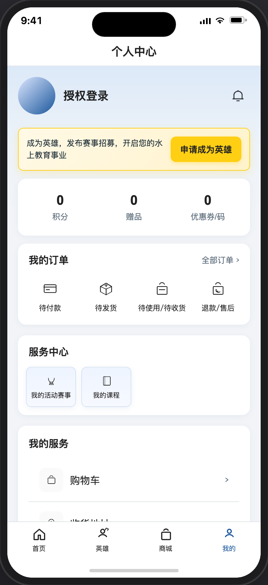
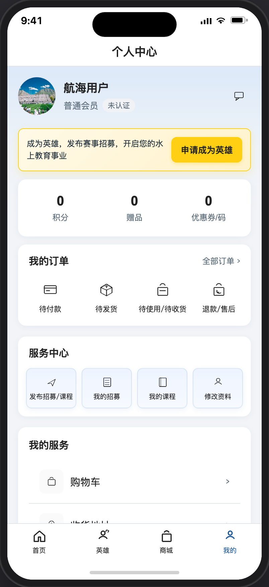
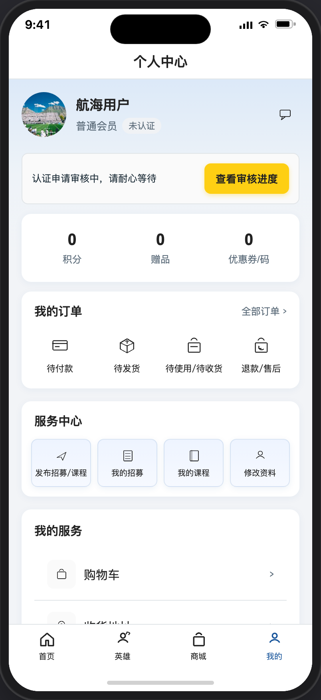
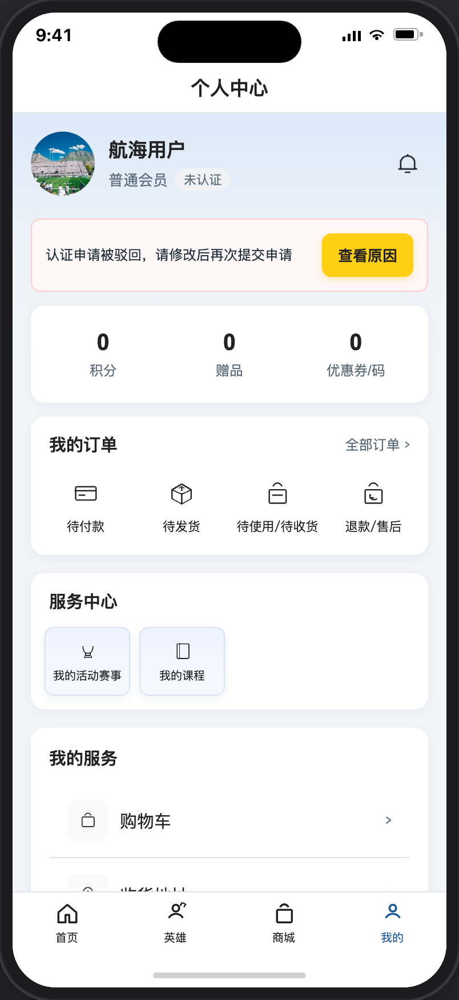
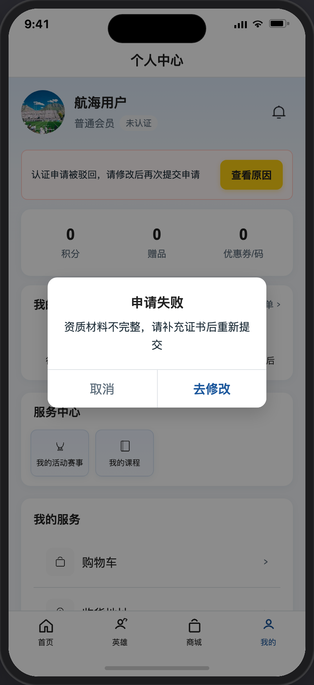
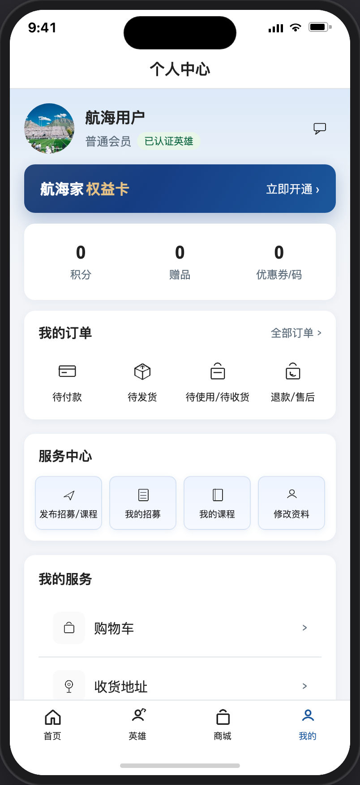
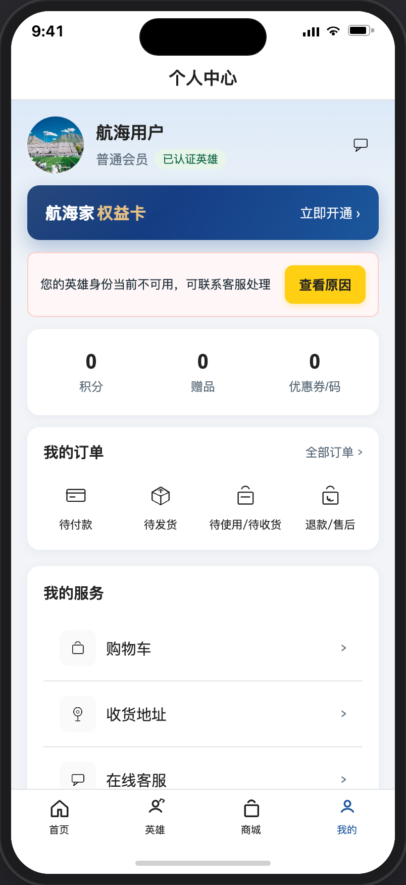
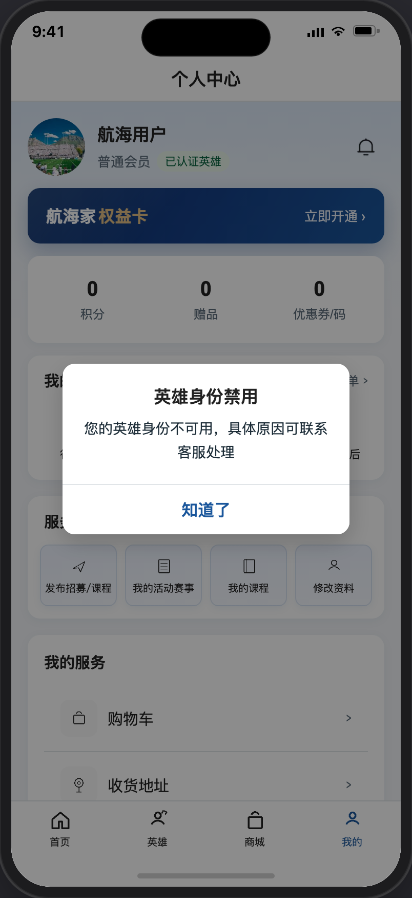
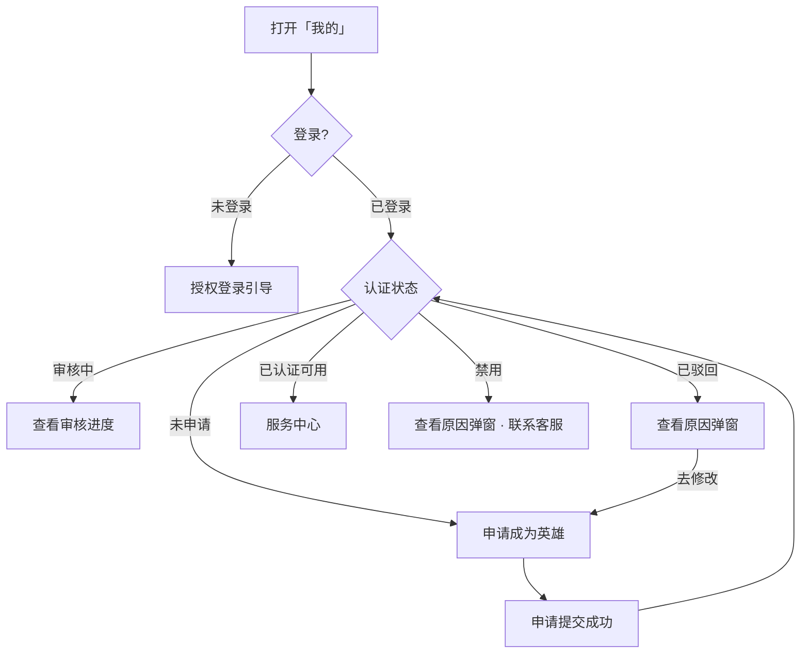

# 个人中心

> 产品说明 · 微信小程序底部 Tab「我的」  
> 状态：部分已实现 · 见 §6 规则补充与验收要点  
> 最后更新：2026-07-15  
> 预览地址：[http://127.0.0.1:8765/miniprogram/profile.html](http://127.0.0.1:8765/miniprogram/profile.html)  
> **协作提示**：桌面打开预览时，手机模型右侧会同步展示本文档（预览中不展示「§6 规则补充与验收要点」）；改文档后请运行 `python3 preview/build-pages.py` 再刷新。状态截图可用 `python3 scripts/shot-profile-states.py` 重拍。  
> **同步约定（强制）**：个人中心页面但凡有可见变动，必须同步更新本文描述与 `images/profile/` 截图，并与本文件保持完全一致；详见 `.cursor/rules/profile-doc-sync.mdc`。小程序各页文档格式与右侧面板约定见 `.cursor/rules/miniprogram-page-docs.mdc`。

---

## 1. 页面业务目标

「个人中心」是用户打开小程序后，通过底部 **「我的」** 进入的页面。

主要解决三件事：

1. **看清自己是谁**：头像、昵称、会员身份、是否已是「认证英雄」
2. **商城资产与订单**：权益卡、积分/赠品/优惠券，以及订单入口
3. **引导成为英雄 / 管理英雄业务**：未认证的人去申请；已认证的人发布招募/课程、改资料等

常用服务入口：购物车、收货地址、客服、账号设置等。

---

## 2. 登录和身份描述

| 身份  | 用户大概情况      | 页面上多出来 / 不一样的地方                                             |
| --- | ----------- | ----------------------------------------------------------- |
| 未登录 | 尚未授权手机号     | 默认头像 +「授权登录」；无会员/认证标签；无权益卡；申请引导在商城资产上方；有商城资产；展示服务中心（点入口先授权） |
| 未申请 | 已登录，还没申请当英雄 | 「未认证」；无权益卡；申请引导在商城资产上方；展示服务中心入口                             |
| 审核中 | 申请审核中       | 「未认证」；无权益卡；「查看审核进度」引导在商城资产上方；展示服务中心入口                       |
| 已驳回 | 申请被驳回       | 「未认证」；无权益卡；「查看原因」引导在商城资产上方；展示服务中心入口                         |
| 已认证 | 英雄且可用       | 绿标 + 航海家权益卡 + 服务中心可跳转；无申请引导                                 |
| 禁用  | 英雄被平台禁用     | 仍显示绿标 + 权益卡；**不显示**服务中心；不可用引导在商城资产上方                        |

> 审核中、已驳回标签仍为「未认证」。点申请 / 订单 / 我的服务等：未登录先走授权。权益卡仅已认证英雄可见；商城资产三列所有身份可见。

### 2.0 未登录

2.0.1、头像是默认头像，昵称为可点的「授权登录」；不展示「普通会员」与认证标签；消息（点 → 先授权）；

2.0.2、展示引导「申请成为英雄」→ 先授权）栏；

2.0.3、展示商城资产（积分、赠品、优惠券/码）、我的订单、服务中心、我的服务，入口（点 → 先授权）。

### 2.1 已登录且未申请

2.1.1、还没提交过英雄认证申请。显示为普通会员，标签为「未认证」；

2.1.2、展示引导「申请成为英雄」→ 先授权）栏；

2.1.3、展示商城资产（积分、赠品、优惠券/码）、我的订单、服务中心（点击均提示请先成为认证英雄）、我的服务，入口（点 → 进对应页面）。

### 2.2 已登录且审核中

2.2.1、已提交入驻申请、平台尚未处理。仍显示普通会员，标签为「未认证」；

2.2.2、展示引导文案「认证申请审核中，请耐心等待」；按钮「查看审核进度」。入口 （点 → 进审核进度页（和提交成功是同一页面）。

2.2.3、展示商城资产（积分、赠品、优惠券/码）、我的订单、服务中心（点击均提示 您的认证英雄申请，正在审核中，请耐心等待）、我的服务，入口（点 → 进对应页面）。

### 2.3 已登录且已驳回

2.3.1、平台驳回了入驻申请。仍显示「未认证」；

2.3.2、展示引导文案展示引导文案：认证申请被驳回，请修改后再次提交申请；按钮「查看原因」。点按钮后弹出「申请失败」说明。

2.3.3、申请失败弹框取驳回时必填的驳回理由。点按钮「去修改」，跳申请成为英雄页后需要回填数据，以便于二次编辑后再提交。

### 2.4 已登录且已认证（可用）

2.4.1、已成为英雄显示「已认证英雄」；消息（点 →进消息类型列表）；

2.4.2、展示航海家权益卡、商城资产（积分、赠品、优惠券/码）、我的订单、服务中心、我的服务，入口（点 → 跳对应页面）。

### 2.5 已登录且已认证且禁用（指禁用英雄身份，不是禁用账号）

2.5.1、已认证的英雄但被平台禁用，仍显示「已认证英雄」与航海家权益卡。只是在权益卡下方显示出禁用栏。

2.5.2、 禁用后点击服务中心个入口，提示：您的英雄身份被禁用，当前功能暂不可用。

2.5.3、引导文案：您的英雄身份不可用，可联系客服处理；按钮「查看原因」。点按钮后弹出说明：标题「英雄身份禁用」；正文取禁用时填写的原因，若未填写则兜底「您的英雄身份不可用，具体原因可联系客服处理」；按钮「知道了」。

---

## 3. 页面详细描述

### 3.1 顶部：我的信息

| 展示内容 | 说明                                                           |
| ---- | ------------------------------------------------------------ |
| 头像   | 已登录：用户头像；未登录：默认头像（界面见 [§2.0](#20-未登录)）                       |
| 昵称   | 已登录：用户头像；未登录：「授权登录」→ 手机号授权                                   |
| 会员   | 已登录：「普通会员」（不影响权限）；未登录：不显示                                    |
| 认证标签 | 已登录：未认证 / 已认证绿标；未登录：不显示                                      |
| 消息图标 | 用户信息行右侧；已登录点 → 本期 toast「功能开发中」（[消息](./消息.md) 第二期）；未登录点 → 先授权 |

### 3.2 航海家权益卡

第一期就有，本期不变动

### 3.3 商城资产

第一期就有，本期不变动

### 3.4 英雄申请 / 身份引导

位于用户信息（及权益卡，若有）下方、**商城资产上方**。

| 身份      | 提示文案                   | 按钮     | 点按钮之后      | 界面参考              |
| ------- | ---------------------- | ------ | ---------- | ----------------- |
| 未登录     | 同未申请引导文案               | 申请成为英雄 | → 先授权登录    | [§2.0](#20-未登录)   |
| 未申请     | 成为英雄，发布赛事招募，开启您的水上教育事业 | 申请成为英雄 | → 申请页      | [§2.1](#21-未申请)   |
| 审核中     | 认证申请审核中，请耐心等待          | 查看审核进度 | → 审核进度页    | [§2.2](#22-审核中)   |
| 已驳回     | 认证申请被驳回，请修改后再次提交申请     | 查看原因   | → 申请失败弹窗   | [§2.3](#23-已驳回)   |
| 禁用      | 您的英雄身份不可用，可联系客服处理      | 查看原因   | → 英雄身份禁用弹窗 | [§2.5](#25-禁用)    |
| 已认证（可用） | （不展示本块）                | —      | —          | [§2.4](#24-已认证可用) |

**已驳回弹窗：** 标题「申请失败」；正文为驳回原因；无原因时兜底「您的英雄身份当前不可用，可联系客服处理」；按钮「取消」「去修改」。界面见上图「已驳回 · 查看原因弹窗」。

**禁用弹窗：** 标题「英雄身份禁用」；正文为禁用原因；无原因时兜底「您的英雄身份不可用，具体原因可联系客服处理」；按钮「知道了」。界面见上图「禁用 · 查看原因弹窗」。

### 3.5 我的订单

第一期就有，本期不变动

### 3.6 服务中心

位于订单下方。**禁用态不展示**；其余身份均展示入口（含未认证）。

| 入口                 | 已认证可用                   | 未认证 / 未登录                              |
| ------------------ | ----------------------- | -------------------------------------- |
| 发布招募/课程            | 底部弹出：「发布赛事招募」「申请课程」「取消」 | 未登录→授权；未申请→「请先成为认证英雄」；审核中→进度页；已驳回→失败弹窗 |
| 我的招募 / 我的课程 / 修改资料 | 进入对应页                   | 同门禁                                    |

**修改资料 / 审核中**（仅已认证可用时生效）

1. 提交后对外正式资料不立刻变
2. 有待审时角标「审核中」
3. 待审回填最近一次提交；支持 **仅资料变更待审** 的用户端撤回（撤回后后台待审记录移除）
4. 再次提交覆盖同一条待审
5. 审核通过后对外才更新

### 3.7 我的服务

第一期就有，本期不变动

---

## 4. 常见路径

- **未登录进页：** 见 [未登录](#20-未登录)；点昵称 / 申请 / 权益卡 / 商城资产 / 订单 / 我的服务 → 授权  
- **申请英雄：** 我的 → 申请 → 提交 → 再进变为查看进度（界面：[未申请](#21-未申请) → [审核中](#22-审核中)）  
- **驳回再改：** 查看原因 → 去修改 → 再交（界面：[已驳回](#23-已驳回)）  
- **英雄日常：** 发布招募/课程 / 改资料（界面：[已认证](#24-已认证可用)）  
- **被禁用：** 引导 → 查看原因 → 知道了；启用后恢复可用态（界面：[禁用](#25-禁用)）

---

## 5. 相关页面

| 关系                           | 页面                    | 何时          |
| ---------------------------- | --------------------- | ----------- |
| Tab                          | 我的                    | 主入口         |
| 申请/改资料                       | [申请成为英雄](./申请成为英雄.md) | 申请或修改资料     |
| 进度                           | [申请提交成功](./申请提交成功.md) | 查看审核进度      |
| 发招募                          | [发布招募](./发布招募.md)     | 底部选「发布赛事招募」 |
| 发课程                          | [发布课程](./发布课程.md)     | 底部选「申请课程」   |
| 管招募                          | [我的招募](./我的招募.md)     | 我的招募        |
| 课程                           | [我的课程](./我的课程.md)     | 服务中心        |
| 授权 / 订单 / 购物车 / 地址 / 客服 / 账号 | 待补文档                  | 未登录或对应入口    |

---

## 6. 规则补充与验收要点

> 拍板已确认（2026-07-14）：A 禁用收起服务中心 · B 发布入口底部弹层 · C 恢复我的课程 · D 撤回仅资料变更 · E 原因缺失兜底「您的英雄身份当前不可用，可联系客服处理」  
> 版式拍板（2026-07-14）：商城权益卡 + 积分/赠品/优惠券；加购物车；不做精选产品；**已移除「英雄数据」区块**。  
> 入口可见性（2026-07-14 修订）：未认证也展示服务中心入口；仅禁用收起。  
> 2026-07-15：服务中心入口文案为「发布招募/课程」；点击底部弹出「发布赛事招募」「申请课程」「取消」。

### 6.1 六种身份展示规则（可验收）

| 身份      | 必须看到                                  | 必须不出现              |
| ------- | ------------------------------------- | ------------------ |
| 未登录     | 默认头像、「授权登录」、申请引导（资产上方）、商城资产、服务中心入口    | 会员标签、认证标签、权益卡、英雄数据 |
| 未申请     | 「未认证」、申请引导（资产上方）、「申请成为英雄」、商城资产、服务中心入口 | 权益卡、英雄数据           |
| 审核中     | 「未认证」、「查看审核进度」（资产上方）、商城资产、服务中心入口      | 权益卡、英雄数据           |
| 已驳回     | 「未认证」、粉色引导（资产上方）、「查看原因」、商城资产、服务中心入口   | 权益卡、英雄数据           |
| 已认证（可用） | 绿色「已认证英雄」、权益卡、商城资产、服务中心               | 申请引导块、英雄数据         |
| 禁用      | 绿色「已认证英雄」、权益卡、不可用引导（资产上方）、「查看原因」、商城资产 | 服务中心、英雄数据          |

审核中、已驳回在认证标签上仍显示「未认证」。

### 6.2 弹窗与提示原文

| 场景              | 标题         | 正文                                       | 按钮         |
| --------------- | ---------- | ---------------------------------------- | ---------- |
| 已驳回 · 查看原因      | **申请失败**   | 平台填写的驳回原因；无原因时兜底：「您的英雄身份当前不可用，可联系客服处理」   | 「取消」「去修改」  |
| 禁用 · 查看原因       | **英雄身份禁用** | 平台填写的禁用原因；无原因时兜底：「您的英雄身份不可用，具体原因可联系客服处理」 | 「知道了」      |
| 审核中点申请          | —          | 「申请审核中」                                  | 约 1.5 秒后返回 |
| 已认证点申请          | —          | 「您已是认证英雄」                                | —          |
| 权益卡 / 商城资产（已登录） | —          | 「即将开放」                                   | —          |

「去修改」→ 进入 [申请成为英雄](./申请成为英雄.md) 重新填写。

### 6.3 服务中心规则

| 规则     | 说明                                  |
| ------ | ----------------------------------- |
| **允许** | 除禁用外，所有身份均展示服务中心入口（未认证时点入口走门禁）      |
| **允许** | 仅已认证且未被禁用时，入口可进入真实业务页               |
| **允许** | 点「发布招募/课程」弹出底部选择：「发布赛事招募」「申请课程」「取消」 |
| **允许** | 「修改资料」进入认证表单（从「修改资料」进入）             |
| **允许** | 资料变更待审时，「修改资料」入口显示「审核中」角标           |
| **允许** | 用户撤回**仅资料变更**的待审申请（撤回后后台待审记录移除）     |
| **规则** | 资料变更提交后，对外正式资料不立刻更新；再次提交覆盖同一条待审     |
| **规则** | 审核通过后，对外资料才更新                       |

### 6.4 后台要做什么

| 场景       | 后台要做什么               |
| -------- | -------------------- |
| 用户提交认证申请 | 在待审核列表处理；批准或驳回       |
| 审核驳回     | 填写驳回原因；用户在个人中心弹窗可见   |
| 禁用英雄     | 填写禁用原因；用户仍见绿标但收起服务中心 |
| 启用英雄     | 恢复已认证可用态             |
| 资料变更待审   | 在供方列表审核；通过后更新对外资料    |
| 用户撤回资料变更 | 移除对应待审记录             |

### 6.5 已对齐（产品已确认可验收）

- 未申请 / 审核中 / 已驳回 / 已认证（可用）四种主流程态
- 已认证绿标、服务中心基础入口（已移除「英雄数据」区块）
- 已认证展示航海家权益卡；未认证隐藏权益卡，申请引导置于商城资产上方；商城资产三列 + 我的服务含购物车（本期占位交互）
- 驳回弹窗「取消」「去修改」
- 修改资料待审角标、覆盖提交、回填最新
- 禁用态：绿标 + 引导 + 弹窗；不展示服务中心
- 「发布招募/课程」底部弹层：「发布赛事招募」「申请课程」「取消」
- 用户信息右侧「消息」入口（本期「功能开发中」）
- 「我的课程」快捷入口（可从弹层「申请课程」进入发布页）
- 驳回/禁用原因缺失兜底文案

### 6.6 还没做完

| 优先级 | 能力                     | 现状                 |
| --- | ---------------------- | ------------------ |
| 高   | 真实登录与授权跳转              | 预览可模拟未登录；真实登录链路未完成 |
| 中   | 订单真实跳转                 | 仅界面展示              |
| 中   | 权益卡开通 / 积分赠品优惠券业务      | UI +「即将开放」         |
| 中   | 购物车 / 地址 / 客服 / 账号真实跳转 | 页面提示占位             |
| 低   | 子页产品说明、统计接真实数据         | 未完成                |

---

## 7. 变更记录

| 日期         | 改了什么                                           |
| ---------- | ---------------------------------------------- |
| 2026-07-15 | 服务中心入口改为「发布招募/课程」；点击恢复底部弹层（发布赛事招募 / 申请课程 / 取消） |
| 2026-07-15 | 用户信息右侧加消息图标；服务中心入口文案曾改为「发布招募」                  |
| 2026-07-15 | 重拍个人中心各状态截图（同步「发布赛事招募」等最新 UI）                  |
| 2026-07-15 | 去掉「发布课程」页与「申请课程」入口；服务中心改为「发布赛事招募」直达            |
| 2026-07-15 | 未认证隐藏权益卡；申请引导移到商城资产上方                          |
| 2026-07-15 | 恢复权益卡全员可见；申请入口回到资产下方引导条                        |
| 2026-07-14 | **去掉「英雄数据」整块**（学员/课程/评分入口不再展示）                 |
| 2026-07-14 | 未认证（含未登录/审核中/已驳回）也展示服务中心入口；禁用仍收起；点入口走门禁        |
| 2026-07-14 | 「我的服务」标题移入白卡片内                                 |
| 2026-07-14 | 商城版式：权益卡 + 积分/赠品/优惠券；我的服务加购物车；不做精选产品           |
| 2026-07-14 | 全文改为产品可读中文                                     |
| 2026-07-14 | 约定：页面可见变动必须同步更新本文描述与状态截图                       |
| 2026-07-14 | 补充未登录态截图与 §2.0 说明                              |
| 2026-07-14 | 五种身份 + 驳回/禁用弹窗预览截图写入文档 §2                      |
| 2026-07-14 | 固化 A～E 拍板；本轮实现禁用态、发布选择、我的课程、资料撤回、原因兜底          |
| 2026-07-14 | 产品向中文说明 + 实现对照                                 |
| 2026-07-13 | 修改资料待审规则；我的服务；驳回原因弹窗                           |
| 2026-07-03 | 初稿                                             |

