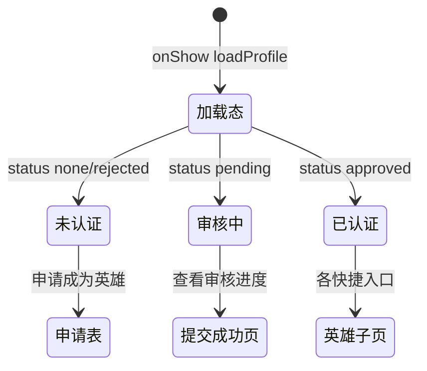

# 个人中心

> 单页需求文档 · 英雄广场微信小程序  
> 状态：已实现 · P0 · M1  
> 最后更新：2026-07-10  
> 源码：`miniprogram/pages/profile/` · 预览：`preview/miniprogram/profile.html`

---

## 1. 页面概述

| 项 | 值 |
|---|---|
| 页面名称 | 个人中心（Tab 我的） |
| 路由 | `pages/profile/profile` |
| 导航栏标题 | **个人中心** |
| 导航类型 | **Tab 根页** |
| 页面参数 | 无 |
| 目标用户 | 全部用户；英雄教练额外展示英雄中心 |
| 设计规范 | `DESIGN-SPEC` · 用户头图 + 认证 CTA / 英雄中心 + 活动菜单 |

---

## 2. 业务需求

### 2.1 业务目标

- 展示用户身份、会员等级、英雄认证状态
- 未认证/审核中：引导 [申请成为英雄](./申请成为英雄.md) 或 [申请提交成功](./申请提交成功.md)
- 已认证英雄：英雄中心快捷入口（发布、招募、课程、资料）+ 学员/评分/课程统计
- 「我的活动」汇总报名与评价数量，跳转列表页
- M1 提供 **预览：切换认证状态** 开发开关（`mock_hero_role`）

### 2.2 适用角色与权限

| 角色 | `mock_hero_role` | UI 差异 |
|------|------------------|---------|
| 未申请 | `none` / 空 | 未认证标签 + 申请 CTA |
| 审核中 | `pending` | 未认证 + pending CTA「查看审核进度」 |
| 已认证 | `approved` | 已认证英雄徽章 + 英雄中心 + 统计栏 |
| 已驳回 | `rejected` | 同未认证；点申请 Toast 驳回原因后进表单 |

### 2.3 正常流程

进入「我的」→ 拉取认证状态 + 报名/评价汇总 → 按角色展示 CTA / 英雄中心。

### 2.4 核心业务规则

1. 认证状态以 `getHeroApplyStatus` 为准（优先于本地 storage）
2. 仅 `approved` 显示英雄中心与英雄统计
3. `pending`：CTA「查看审核进度」→ 申请提交成功页
4. `rejected`：Toast 驳回原因后进入申请表单
5. 英雄中心各入口需 `isHero` 守卫，非英雄不响应
6. M1 预览可切换 `approved` ↔ `none`（写 `mock_hero_role`）

### 2.5 异常与边界

- API 不可用时回退 store / mock

### 2.6 待确认项

- [ ] 会员等级是否参与权限判断
- [ ] 正式环境是否保留「切换认证状态」开关

### 2.7 状态机



---

## 3. 页面结构与 UI 元素规格

### 3.1 信息架构

```
.page.profile
├── .profile-user（头像/昵称/会员/认证）
│   └── .profile-user__stats（仅 isHero）
├── .profile-dev-toggle（预览开关）
├── .profile-hero-cta（!isHero）
│   OR .profile-hero-center（isHero）
├── .profile-section「我的活动」
│   ├── 我的报名
│   └── 我的评价
└── .profile-action-sheet（发布选择）
```

### 3.2 UI 元素清单

| 元素 ID | 类型 | 文案 | 样式要点 | 数据来源 | 交互 |
|---------|------|------|----------|----------|------|
| avatar | 占位 | — | cover-placeholder 圆 | 静态 | 无 |
| nickname | 文本 | **航海用户** | 主标题 | `user.nickname` | 无 |
| member | 文本 | **普通会员** | 次要 | `user.member` | 无 |
| cert-none | 标签 | **未认证** | 灰底 | `!isHero` | 无 |
| cert-hero | 可点行 | **已认证英雄 ›** | 主色可点 | `isHero` | → 认证成功 |
| stat-students | 统计 | 数字 + **学员** | 可点 | `hero.student_count` | → 我的学员 |
| stat-rating | 统计 | 数字 + **评分** | 可点 | `hero.rating` | → 英雄评价列表 |
| stat-courses | 统计 | 数字 + **课程** | 可点 | `hero.course_count` | → 我的课程 |
| dev-toggle | 行 | **预览：切换为{已认证/未认证}状态** | 开发用 | 静态 | toggle mock 角色 |
| cta-hint-pending | 文本 | **认证申请审核中，请耐心等待** | pending 态 | 条件 | 无 |
| cta-hint-default | 文本 | **成为英雄，发布赛事招募，开启您的水上教育事业** | 默认 | 条件 | 无 |
| cta-btn-pending | 按钮 | **查看审核进度** | 主按钮 | pending | → 申请提交成功 |
| cta-btn-apply | 按钮 | **申请成为英雄** | 主按钮 | !pending | → 申请成为英雄 |
| section-hero | 标题 | **英雄中心** | isHero | 静态 | — |
| shortcut-publish | 项 | 📢 **发布招募/课程** | 九宫格 | 静态 | ActionSheet |
| shortcut-recruitments | 项 | 📋 **我的招募** | | | → 我的招募 |
| shortcut-courses | 项 | 📚 **我的课程** | | | → 我的课程 |
| shortcut-profile | 项 | 👤 **英雄资料** | 次行 | | → 我的英雄资料 |
| menu-signups | 行 | **我的报名** | desc 进行中/已完成 | `activity.*` | → 我的报名 |
| menu-reviews | 行 | **我的评价** | desc 已评价 N | `activity.reviewCount` | → 我的评价 |
| sheet-event | 项 | **发布赛事招募** | ActionSheet | | → 发布招募 type=event |
| sheet-course | 项 | **发布课程** | | | → 发布课程 |
| sheet-cancel | 项 | **取消** | cancel 样式 | | 关闭 sheet |

#### 3.2.1 我的活动描述文案（精确）

| 菜单 | desc 格式 |
|------|-----------|
| 我的报名 | `进行中 {{signupOngoing}}，已完成 {{signupDone}}` |
| 我的评价 | `已评价 {{reviewCount}}` |

---

## 4. 字段与校验矩阵

> 本页**无用户输入**；逻辑字段如下。

| 逻辑字段 | 来源 API/存储 | 说明 |
|----------|---------------|------|
| `user.nickname` | 静态 M1 | 默认航海用户 |
| `user.member` | 静态 M1 | 普通会员 |
| `isHero` | status===approved | 控制英雄 UI |
| `heroPending` | status===pending | 控制 CTA |
| `hero.student_count` | Mock 128 | 学员数 |
| `hero.rating` | Mock 4.9 | 评分 |
| `hero.course_count` | Mock 12 | 课程数 |
| `activity.signupOngoing` | getMySignupSummary | 进行中报名数 |
| `activity.signupDone` | getMySignupSummary | 已完成报名数 |
| `activity.reviewCount` | getMyReviewCount | 评价条数 |
| `showPublishSheet` | 本地 boolean | ActionSheet 显隐 |

---

## 5. 交互需求

### 5.1 操作明细

| 序号 | 操作 | 前置 | 行为 | 成功 | 失败 |
|------|------|------|------|------|------|
| 1 | 申请成为英雄 | !isHero !pending | getHeroApplyStatus → navigateTo apply | 跳转 | approved Toast；rejected Toast 1.5s 仍进 apply |
| 2 | 查看审核进度 | pending | navigateTo submitted | 跳转 | — |
| 3 | 已认证英雄 | isHero | navigateTo apply-success | 跳转 | — |
| 4 | 发布招募/课程 | isHero | showPublishSheet | 弹出 | — |
| 5 | 发布赛事招募 | sheet | navigateTo create?type=event | 跳转 | — |
| 6 | 发布课程 | sheet | navigateTo course-create | 跳转 | — |
| 7 | 切换预览状态 | dev | setAppState + storage + reload | UI 切换 | — |
| 8 | 统计/菜单项 | isHero（统计） | 对应 navigateTo | 跳转 | 非英雄统计无响应 |

### 5.2 返回与导航

| 控件 | 行为 |
|------|------|
| TabBar | switchTab |
| 子页返回 | onShow 刷新 loadProfile |

### 5.3 页面级异常

| 场景 | 处理 |
|------|------|
| getHeroApplyStatus 失败 | 降级 storage mock_hero_role |
| 已是英雄点申请 | Toast **您已是认证英雄** |

---

## 6. 加载与刷新机制

| 生命周期 | 逻辑 |
|----------|------|
| `onShow` | loadProfile（status + signup summary + review count） |
| `onLoad` | M1 无独立逻辑 |
| 下拉刷新 | 不支持 |

---

## 7. 性能要求

| 项 | 指标 |
|----|------|
| onShow 请求 | ≤3 并行 Promise |
| 首屏 | 依赖 status 接口 < 500ms |
| setData | 合并 user/hero/activity 字段 |

---

## 8. 相关页面

### 8.1 入口

| 来源 | 场景 |
|------|------|
| TabBar「我的」 | 主入口 |
| 各成功页 switchTab | 申请提交成功/认证成功返回 |

### 8.2 出口

| 目标 | 触发 |
|------|------|
| [申请成为英雄](./申请成为英雄.md) | 申请按钮 |
| [申请提交成功](./申请提交成功.md) | 查看审核进度 |
| [认证成功](./认证成功.md) | 已认证英雄徽章 |
| [我的英雄资料](./我的英雄资料.md) | 英雄资料 |
| [发布招募](./发布招募.md) | ActionSheet |
| [发布课程](./发布课程.md) | ActionSheet |
| [我的招募](./我的招募.md) | 快捷入口 |
| [我的课程](./我的课程.md) | 快捷/统计 |
| [我的学员](./我的学员.md) | 学员统计 |
| [英雄评价列表](./英雄评价列表.md) | 评分统计 |
| [我的报名](./我的报名.md) | 菜单 |
| [我的评价](./我的评价.md) | 菜单 |

---

## 9. 接口与数据

### 9.1 接口列表

| 接口 | 方法 | 时机 |
|------|------|------|
| `/api/heroes/apply/status` | GET | onShow |
| `/api/app-state/my_signups` | GET | 间接 summary |
| `/api/app-state/my_reviews` | GET | review count |

### 9.2 `GET /api/heroes/apply/status`

| 字段 | 类型 | 说明 |
|------|------|------|
| status | string | none/pending/approved/rejected |
| reject_reason | string? | 驳回原因 Toast |
| application_id | string? | M2 |

---

## 10. 预览端差异

| 项 | 小程序 | 预览 |
|----|--------|------|
| dev-toggle | 展示 | 应对齐 mock 切换 |
| ActionSheet | 原生层 | HTML modal |
| 英雄 Mock 数据 | loadProfile 写死小哥 | 同源 |

---

## 11. 待确认项

- [ ] M2 移除 `profile-dev-toggle` 生产环境
- [ ] 用户昵称/头像接微信用户信息
- [ ] rejected 态 CTA 是否改为「重新申请」文案

---

## 12. 变更记录

| 日期 | 变更 |
|------|------|
| 2026-07-07 | 重写：角色态 UI、ActionSheet、统计字段、接口与出口全表 |
| 2026-07-03 | 初稿 |
