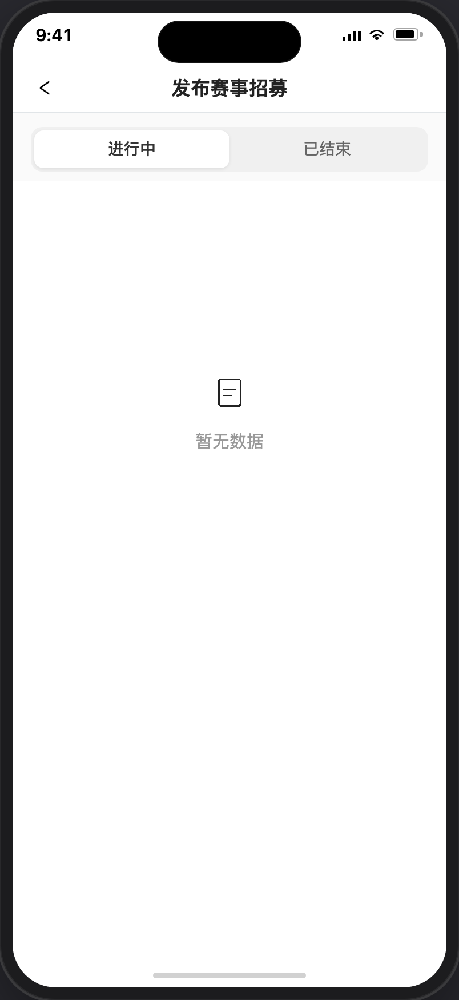

# 发布招募

> 产品说明 · 微信小程序  
> 状态：列表页 · 大图卡  
> 最后更新：2026-07-17 12:00
> 预览地址：[http://127.0.0.1:8765/miniprogram/recruitment-create.html](http://127.0.0.1:8765/miniprogram/recruitment-create.html)  
> UI设计图地址：https://www.figma.com/design/FQerHrZBo3Kx7ddFq7jKYx/%E5%BA%97%E9%93%BA%E8%A3%85%E4%BF%AE?node-id=8777-1717&t=m8tMpSkni5qRw93M-1
> **协作提示**：桌面打开预览时，手机模型右侧会同步展示本文档（预览中不展示「页面业务目标」「规则补充与验收要点」）；改文档后请运行 `python3 preview/build-pages.py` 再刷新。

## UI说明

1、需 UI 设计，只要字段信息和按钮不少，可完全灵活设计。

---

## 1. 页面业务目标

1、此页面只有已认证的英雄进来。

2、英雄选择进行中的招募，可发起自己的招募。

3、和查看已结束的招募。

> 【特别说明】此页面UI可以自行发挥，只要字段信息不缺少就行。

---

## 2. 页面详细描述

1、导航栏标题：发布赛事招募。

2、状态筛选：  
2.1、进入该页面，默认锚定进行中，进行中若为空，也是锚定在进行中。  
2.2、从哪个状态进入详情，再次返回此页就锚定在这个状态上。

3、状态切换时需刷新数据，下拉时无需刷新。

4、进行中取值和排序：

4.1、取进行中且已发布且未隐藏（若已发起招募，即便隐藏也显示）。

4.2、按开始时间正序、开始时间相同按结束时间正序，开始和结束都相同按创建时间倒序。

5、已结束取值和排序：

5.1、取已结束且已发布且未隐藏（若已发起招募，即便隐藏也显示）。

5.2、按结束时间倒序、结束时间相同按创建时间倒序。

6、顶部状态筛选：

| 元素   | 说明                                                                                              |
| ---- | ----------------------------------------------------------------------------------------------- |
| 状态筛选 | 「进行中(N)」/「已结束(N)」；                                                                              |
| 时间 | 1、取项目时间 2、显示格式： 2.1、同一天，示例：7月20日(周一) 08:00 - 17:00 2.2、非同一天，示例：7月20日(周一) 08:00 - 7月23日(周四)17:00 |
| 类型标签 | 「赛事」或「活动」                                                                                       |
| 标题   | 取招募名称，最多显示 2 行                                                                                  |
| 地点   | 取项目地址，最多显示 2 行                                                                                  |
| 价格   | 整数取整，非整数保留小数点后两位。采用千分位格式。                                                                       |
| 按钮 | 进行中状态下： 1、英雄未发起招募，按钮显示：发起招募，点击进详情 2、英雄已发起招募，按钮显示：招募中... 点击进详情 已结束状态下：按钮统一显示「活动已结束」，点击进详情 |

无数据空态：当前 Tab 无数据时展示图标 +「暂无数据」。

---

## 3. 相关页面

| 关系  | 页面                                    | 何时                      |
| --- | ------------------------------------- | ----------------------- |
| 来源  | [个人中心](./个人中心.md)                     | 服务中心 · 发布招募/课程 → 发布赛事招募 |
| 来源  | [我的活动赛事](./我的招募.md)                     | 空态 CTA                  |
| 去向  | [赛事详情](./赛事详情.md) / [活动详情](./活动详情.md) | 点「发起招募」/「招募中...」或卡片空白区  |
| 姊妹页 | [招募编辑](./招募编辑.md)                     | 编辑已有招募（另议）              |

---

## 4. 规则补充与验收要点

### 4.1 已对齐（产品已确认可验收）

- 顶部「进行中 / 已结束」分段筛选，括号内为条数
- 页面为竖排大图招募列表（时间条 / 类型 / 标题 / 地点 / 价格 / 操作按钮）
- 「已结束」Tab：按钮统一为「活动已结束」（视觉禁用），点击进详情
- **进行中 / 已结束卡片均可点击进入赛事详情或活动详情**（已结束详情页仅不可报名）
- 进行中点「发起招募」或「招募中...」、已结束点「活动已结束」均直接进详情（列表页不再弹二次确认）
- 从本页进入详情再返回，Tab 锚定在离开前状态；外部重新进入本页固定落在「进行中」
- 无数据时展示图标 +「暂无数据」

### 4.2 待确认 / 未做完

- 正式发布/新建入口与表单
- 列表数据范围（全部可报 / 仅本人可发等）
- 详情页确认发起后是否真正创建/关联一条「我的活动赛事」记录（本期仅跳转）

---

## 5. 变更记录

| 日期         | 改了什么                                        |
| ---------- | ------------------------------------------- |
| 2026-07-20 | 去掉「§4 常见路径」整节                               |
| 2026-07-20 | 空态改为图标 +「暂无数据」                              |
| 2026-07-20 | 已结束「活动已结束」按钮改为点击进详情                         |
| 2026-07-20 | 状态截图并入 §3 对应说明（进行中 / 已结束 / 空态），去掉独立「状态预览」节  |
| 2026-07-20 | 列表「发起招募」改为直接进详情；去掉本页二次确认/成功弹层；§2 仅保留列表三态截图  |
| 2026-07-20 | §2 补充五种状态预览截图（进行中 / 已结束 / 空态 / 确认弹窗 / 成功弹层） |
| 2026-07-07 | 初稿字段与校验                                     |

