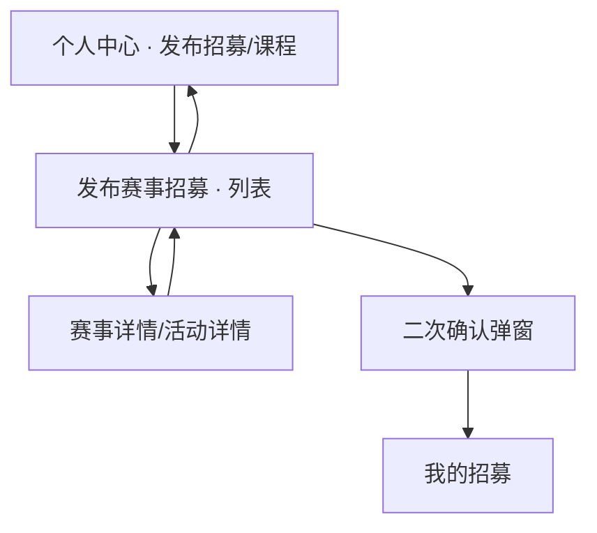

# 发布招募

> 产品说明 · 微信小程序  
> 状态：列表页 · 大图卡  
> 最后更新：2026-07-15  
> 预览地址：http://127.0.0.1:8765/miniprogram/recruitment-create.html  
> **协作提示**：桌面打开预览时，手机模型右侧会同步展示本文档（预览中不展示「§6 规则补充与验收要点」）；改文档后请运行 `python3 preview/build-pages.py` 再刷新。

---

## 1. 页面业务目标

「发布赛事招募」当前为**赛事/活动招募列表**，以大图卡展示可浏览的招募条目（与首页精选活动同壳）。

点击卡片进入 [赛事详情](./赛事详情.md) 或 [活动详情](./活动详情.md)（按类型）。正式「填写并发布」流程另议。

---

## 2. 登录和身份描述

| 身份 | 用户大概情况 | 页面上看到什么 |
|------|--------------|----------------|
| 已认证英雄等 | 个人中心 → 发布招募/课程 → 发布赛事招募 | 竖排大图招募卡列表 |
| 无数据 | — | 「暂无赛事招募」 |

---

## 3. 页面详细描述

导航栏标题：**发布赛事招募**。

竖排大图卡列表，顶部状态筛选：

| 元素 | 说明 |
|------|------|
| 状态筛选 | 分段控件「招募进行中(N)」/「招募已结束(N)」；选中白底浮起 |
| 封面图 | 全幅背景 |
| 时间条 | 左上半透明胶囊 + 色点（赛事黄 / 活动橙） |
| 类型标签 | 「赛事」或「活动」 |
| 标题 | 招募名称 |
| 地点 | 活动地点 |
| 价格 | `¥xxx/人` |
| 按钮 | 「招募进行中」Tab：点「发起招募」→ **当前页二次确认**；「招募已结束」Tab：统一「活动已结束」（禁用）。**点卡片空白区进详情**（已结束仅不可报名） |

---

## 4. 常见路径

- **浏览：** 我的 → 发布招募/课程 → 发布赛事招募 → 本列表  
- **看详情：** 任意 Tab 点击卡片（非「发起招募」按钮）→ [赛事详情](./赛事详情.md) / [活动详情](./活动详情.md)（已结束亦可进，详情页不可报名）  
- **发起招募：** 进行中 Tab 点「发起招募」→ 当前页弹窗确认 → 确认后进入 [我的招募](./我的招募.md)  
- **返回锚定：** 从本页进入详情后再返回，仍停留在离开前的 Tab；**从个人中心等外部重新进入本页，一律先落在「招募进行中」**  
- **返回个人中心：** 点导航栏 ‹ → 固定回到 [个人中心](./个人中心.md)  

### 发起招募二次确认

| 元素 | 文案 |
|------|------|
| 标题 | 确认发起赛事招募 |
| 正文 | 确认发起赛事招募后，在我的页>服务中心>我的招募中查看。 |
| 取消 | 关闭弹窗 |
| 确认开始招募 | 关闭弹窗并进入我的招募 |
---

## 5. 相关页面

| 关系 | 页面 | 何时 |
|------|------|------|
| 来源 | [个人中心](./个人中心.md) | 服务中心 · 发布招募/课程 → 发布赛事招募 |
| 来源 | [我的招募](./我的招募.md) | 空态 CTA |
| 去向 | [赛事详情](./赛事详情.md) / [活动详情](./活动详情.md) | 点击卡片 |
| 去向 | [我的招募](./我的招募.md) | 确认发起招募后 |
| 姊妹页 | [招募编辑](./招募编辑.md) | 编辑已有招募（另议） |

---

## 6. 规则补充与验收要点

### 6.1 已对齐（产品已确认可验收）

- 顶部「招募进行中 / 招募已结束」分段筛选，括号内为条数
- 页面为竖排大图招募列表（时间条 / 类型 / 标题 / 地点 / 价格 / 操作按钮）
- 「招募已结束」Tab：按钮统一为禁用「活动已结束」
- **进行中 / 已结束卡片均可点击进入赛事详情或活动详情**（已结束详情页仅不可报名）
- 进行中点「发起招募」弹出二次确认；确认后进入我的招募
- 从本页进入详情再返回，Tab 锚定在离开前状态；外部重新进入本页固定落在「招募进行中」
- 无数据时展示空态文案

### 6.2 待确认 / 未做完

- 正式发布/新建入口与表单
- 列表数据范围（全部可报 / 仅本人可发等）
- 确认发起后是否真正创建/关联一条「我的招募」记录（本期仅跳转）

---

## 7. 变更记录

| 日期 | 改了什么 |
|------|----------|
| 2026-07-15 | 发起招募增加二次确认弹窗，确认后进入我的招募 |
| 2026-07-15 | 外部进入本页固定落在「招募进行中」；仅从详情返回才恢复 Tab |
| 2026-07-15 | 导航返回固定回到个人中心 |
| 2026-07-15 | 「招募已结束」Tab 按钮统一为禁用「活动已结束」 |
| 2026-07-15 | 非本人已结束卡片按钮文案改为「活动已结束」 |
| 2026-07-15 | 进入详情/报名列表返回后锚定原 Tab |
| 2026-07-15 | 招募已结束卡片也可进详情（仅不可报名） |
| 2026-07-15 | 招募已结束：本人「查看报名」/ 非本人禁用「招募已结束」 |
| 2026-07-15 | 增加「招募 / 招募已结束」分段筛选 |
| 2026-07-15 | 改为赛事招募大图卡列表（对齐示意） |
| 2026-07-15 | 去掉页面主体表单区，暂留空页 |
| 2026-07-15 | 精简为封面/类型/名称/时间/地点/费用；去掉提交与弃用字段；定位为录入预览 |
| 2026-07-14 | 按个人中心产品说明结构改写 |
| 2026-07-07 | 初稿字段与校验 |
