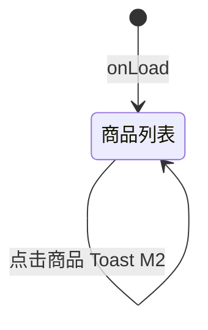

# 商城

> 单页需求文档 · 英雄广场微信小程序  
> 状态：已实现（M1 占位） · P2 · M1  
> 最后更新：2026-07-07  
> 源码：`miniprogram/pages/mall/` · 预览：`preview/miniprogram/mall.html`

---

## 1. 页面概述

| 项 | 值 |
|---|---|
| 页面名称 | 好物商城（Tab 商城） |
| 路由 | `pages/mall/mall` |
| 导航栏标题 | **商城** |
| 导航类型 | **Tab 根页** |
| 页面参数 | 无 |
| 目标用户 | 购买航海装备与周边的全部用户 |
| 设计规范 | `DESIGN-SPEC` · 双列商品网格 + 底部提示 |

---

## 2. 业务需求

### 2.1 业务目标

- Tab 位占位「好物商城」，展示 Mock 商品列表与品牌副标题
- M1 **无商品详情页**；点击商品 Toast **商城详情（M2）**
- 底部文案 **更多商品即将上线** 管理用户预期

### 2.2 适用角色与权限

| 角色 | 可访问 | 不可访问时的处理 |
|------|--------|------------------|
| 全部用户 | ✅ | — |

### 2.3 核心业务规则

1. `onLoad` 一次性 `setData({ products: mock.products })`
2. 商品卡片点击统一 `onProductTap` → Toast，不跳转
3. 无下拉刷新、无 onShow 重载
4. 价格展示格式：**¥{price}**（整数，无小数强制）

### 2.4 状态机



---

## 3. 页面结构与 UI 元素规格

### 3.1 信息架构

```
.page.mall
├── .mall-header（标题 + 副标题）
├── .mall-grid（双列商品）
│   └── .mall-item × N
└── .mall-tip（底部提示）
```

### 3.2 UI 元素清单

| 元素 ID | 类型 | 文案 | 样式要点 | 数据来源 | 必填 | 校验 | 交互 |
|---------|------|------|----------|----------|------|------|------|
| header-title | 文本 | **好物商城** | 页面主标题 | 静态 | — | — | 无 |
| header-sub | 文本 | **航海装备与精选好物** | 副标题次要色 | 静态 | — | — | 无 |
| item-cover | 占位图 | — | cover-placeholder--warm | 静态 | — | — | 无 |
| item-title | 文本 | `{{item.title}}` | 两行省略 | products | — | — | 无 |
| item-price | 文本 | **¥{{item.price}}** | 强调色 | products | — | — | 无 |
| mall-tip | 文本 | **更多商品即将上线** | 居中弱提示 | 静态 | — | — | 无 |

#### 3.2.1 商品卡片 `.mall-item`

| 属性 | 规格 |
|------|------|
| 布局 | 双列 grid，等宽 |
| 封面 | 统一 warm 占位，M2 换 `item.cover_url` |
| 标题 | `text-ellipsis-2` 最多两行 |
| 价格 | 前缀 **¥**，无「起」字 |
| 点击 | 整卡 bindtap `onProductTap` |

---

## 4. 字段与校验矩阵

> 本页**无用户输入**。

| 逻辑字段 | 类型 | 来源 | 说明 |
|----------|------|------|------|
| `products[]` | array | `mock.products` | 商品列表 |
| `products[].id` | string | Mock | wx:key |
| `products[].title` | string | Mock | 标题 |
| `products[].price` | number | Mock | 售价 |

---

## 5. 交互需求

### 5.1 操作明细

| 序号 | 用户操作 | 前置条件 | 系统行为 | 成功反馈 | 失败反馈 |
|------|----------|----------|----------|----------|----------|
| 1 | 点击商品卡片 | 无 | showToast | **商城详情（M2）** icon none | — |
| 2 | Tab 切换离开 | — | — | — | — |

### 5.2 返回与导航

| 控件 | 行为 |
|------|------|
| TabBar | switchTab |
| 系统返回 | Tab 根页无栈 |

### 5.3 页面级异常

| 场景 | 处理 |
|------|------|
| products 空数组 | 仅显示 header + tip |

---

## 6. 加载与刷新机制

| 生命周期 | 触发 | 逻辑 | UI |
|----------|------|------|-----|
| `onLoad` | 首次 | setData products | 网格渲染 |
| `onShow` | — | M1 无 | — |
| 下拉刷新 | **不支持** | — | — |

---

## 7. 性能要求

| 项 | 指标 | 说明 |
|----|------|------|
| 首屏 | < 200ms | 纯 Mock 一次 setData |
| 商品数 | M1 ≤12 | 无分页 |
| 图片 | 占位 CSS | M2 WebP lazy-load |

---

## 8. 相关页面

### 8.1 入口

| 来源 | 场景 |
|------|------|
| TabBar「商城」 | 主入口 |
| [营销首页](./营销首页.md) 精选好物 | M1 无直链，仅 Tab |

### 8.2 出口

| 目标 | 说明 |
|------|------|
| 商品详情 | M2 规划，当前 Toast |

---

## 9. 接口与数据

### 9.1 接口列表（M2）

| 接口 | 方法 | 时机 | 说明 |
|------|------|------|------|
| `/api/products` | GET | onLoad | 商品列表 |
| `/api/products/:id` | GET | 详情页 | 商品详情 |

### 9.2 M1 Mock `products[]`

| 字段 | 类型 | 说明 |
|------|------|------|
| id | string | 商品 id |
| title | string | 名称 |
| price | number | 价格（元） |
| tag | string? | 角标（首页 grid 用，商城页未展示 tag） |

---

## 10. 预览端差异

| 项 | 小程序 | 预览 |
|----|--------|------|
| 点击商品 | Toast M2 | 应对齐 Toast 或 alert |
| Tab | 系统 TabBar | SPA Tab |

---

## 11. 待确认项

- [ ] M2 商品详情路由与支付接入方式
- [ ] 是否与首页「精选好物」共用 API
- [ ] 会员折扣与 [营销首页](./营销首页.md) 权益卡联动

---

## 12. 变更记录

| 日期 | 变更 |
|------|------|
| 2026-07-07 | 重写：UI 元素表、M1 占位行为、M2 接口规划 |
| 2026-07-03 | 初稿 |
