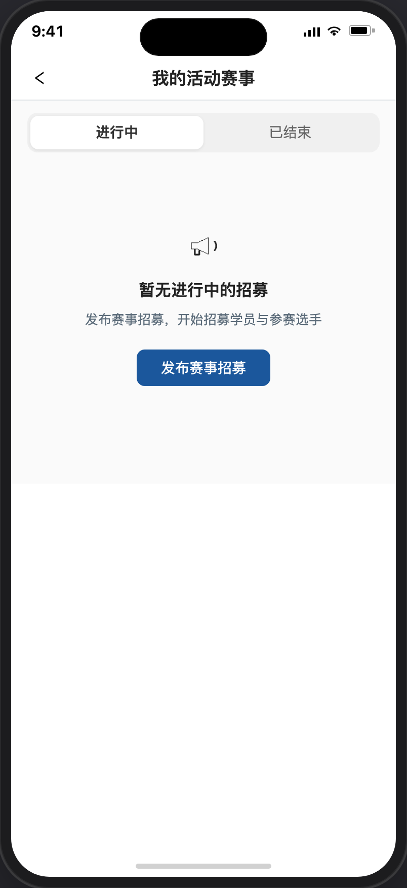
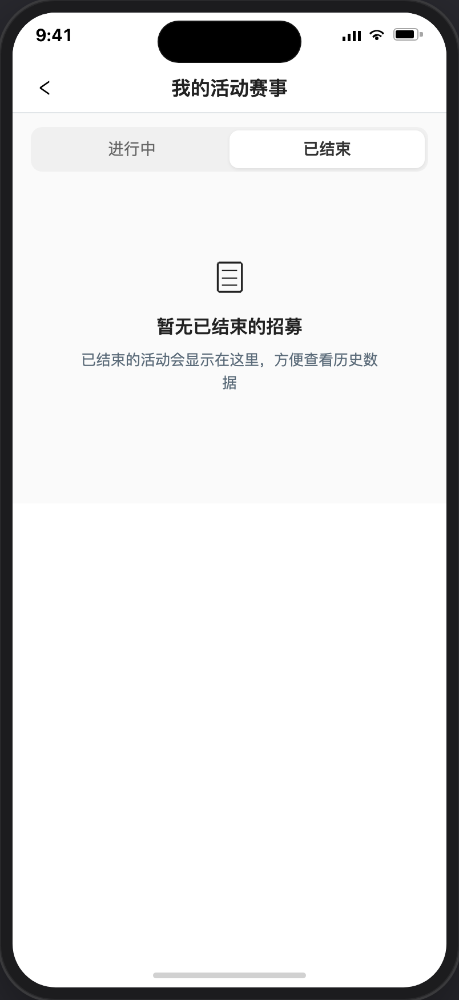

# 我的活动赛事

> 产品说明 · 微信小程序  
> 状态：已实现 · 见 §4 验收要点  
> 最后更新：2026-07-21 15:08
> 预览地址：http://127.0.0.1:8765/miniprogram/my-recruitments.html  
> UI设计图地址：https://www.figma.com/design/FQerHrZBo3Kx7ddFq7jKYx/%E5%BA%97%E9%93%BA%E8%A3%85%E4%BF%AE?node-id=8777-1717&t=m8tMpSkni5qRw93M-1
> **协作提示**：桌面打开预览时，手机模型右侧会同步展示本文档（预览中不展示「§4 规则补充与验收要点」）；改文档后请运行 `python3 preview/build-pages.py` 再刷新。

## UI说明

1、需 UI 设计，只是字段信息和按钮不少，可完全灵活设计。

---

## 1. 页面业务目标

「我的活动赛事」供用户查看自己发起或已报名参加的赛事/活动列表。

主要解决两件事：

1. **分状态查看**：进行中、已结束两个 Tab，一眼看清每条处于什么阶段
2. **日常运营**：英雄可筛选「仅显示我发起的」、查看报名人员（仅「我发起的」）；非英雄仅看自己参与的，无该筛选

---

## 2. 页面详细描述

**前言：**

1、支持英雄查看自己发起的或参与的别人的赛事和活动，且支持快速筛选出仅显示我发起的。
2、支持非英雄查看自己参与的别人的赛事和活动，且不显示「仅显示我发起的」操作。

### 2.1 顶部 Tab

1、切换 Tab 刷新，Tab 相对页面顶部吸顶固定。

2、仅显示我发起的：

2.1、仅英雄身份展示，非英雄不展示该筛选。

2.2、默认不勾选，勾选后当前 Tab 列表只保留「我发起的」数据，Tab 括号数量同步为筛选后条数；取消勾选恢复全部。

2.3、无论在哪个 Tab，勾选 / 取消勾选同时作用于进行中、已结束两个 Tab。

2.4、当前 Tab 列表为空（空态）时不展示该筛选；若因勾选筛选导致列表变空，仍保留筛选以便取消勾选。

3、进行中取值和排序：

3.1、取进行中且已发布且未隐藏（若已发起招募，即便隐藏也显示）。

3.2、按开始时间正序、开始时间相同按结束时间正序，开始和结束都相同按创建时间倒序。

4、已结束取值和排序：

4.1、取已结束且已发布且未隐藏（若已发起招募，即便隐藏也显示）。

4.2、按结束时间倒序、结束时间相同按创建时间倒序。

### 2.2 招募卡片

| 内容 | 说明 |
|------|------|
| 左上角关系 | `我发起的`：本人发布，他人可报名，可看「已报名人员」 `我参加的`：他人发布且本人已报名成功，不展示「已报名人员」 |
| 标题 + 类型标签 | 「赛事」/「活动」 |
| 时间 | 与 [发布招募](./发布招募.md) 列表一致 1、取项目起止时间 2、同一天示例：`06/08 (周六) 09:00-16:00` 3、非同一天示例：`06/08 (周六) 09:00-06/09 16:00` |
| 地点 | `赛事地点：…` 或 `活动地点：…`（按类型） |
| 费用 | `¥X/人` |
| 底栏左 | `招募名额：已报/总额 · 状态` 进行中且未招满：`进行中` 进行中且已招满：`已招满` 已结束 Tab / 活动已结束：`已结束` 无上限：`…/不限 · 进行中` |
| 底栏右操作 | **我发起的**：进行中 / 已结束均为 `已报名人员` **我参加的**：不展示该按钮 |
| 已结束 | 已结束 Tab 卡片与进行中区分展示；报名截止（`closed`）/已招满仍留在进行中 Tab，名额旁文案为「已招满」 |

### 2.3 空态

| Tab | 标题 | 提示 | 按钮 |
|-----|------|------|------|
| 进行中 | 暂无进行中的招募 | 发布赛事招募，开始招募学员与参赛选手 | 发布赛事招募 |
| 已结束 | 暂无已结束的招募 | 已结束的活动会显示在这里，方便查看历史数据 | 无 |

---

## 3. 相关页面

| 关系 | 页面 | 何时 |
|------|------|------|
| 来源 | [个人中心](./个人中心.md) | 服务中心 · 我的活动赛事 |
| 来源 | [发布招募](./发布招募.md) | 发布成功后 |
| 去向 | [发布招募](./发布招募.md) | 空态 CTA |
| 去向 | [报名人员列表](./报名人员列表.md) | 已报名人员 |
| 去向 | [赛事详情](./赛事详情.md) / [活动详情](./活动详情.md) | 点卡片（按类型） |

---

## 4. 规则补充与验收要点

### 4.1 已对齐（产品已确认可验收）

- 两个 Tab（进行中 / 已结束）及括号内数量展示正确
- 进行中 Tab「我发起的」卡可「已报名人员」；点卡片主体可进赛事详情或活动详情
- 已结束「我发起的」卡可「已报名人员」（与进行中一致）
- 各 Tab 空态文案与按钮符合 §2.3；空态不展示「仅显示我发起的」
- 从发布页返回后，列表应刷新为最新状态

### 4.2 还没做完

- 「已结束」与「已下架」的展示细则待产品拍板
- 非发布者能否编辑他人招募，待权限规则确认

---

## 5. 变更记录

| 日期 | 改了什么 |
|------|----------|
| 2026-07-21 | §2.1 补充进行中 / 已结束取值与排序规则 |
| 2026-07-21 | 去掉「常见路径」整章 |
| 2026-07-21 | 空态不展示「仅显示我发起的」；筛选导致变空时仍保留以便取消勾选 |
| 2026-07-20 | 卡片时间格式对齐发布赛事招募列表（含星期） |
| 2026-07-20 | 按铁律去掉 UI 样式描述（颜色/灰化/主色按钮等） |
| 2026-07-20 | 页面详细描述增加前言：英雄可筛选仅发起；非英雄不显示该筛选 |
| 2026-07-03 | 初稿 |
