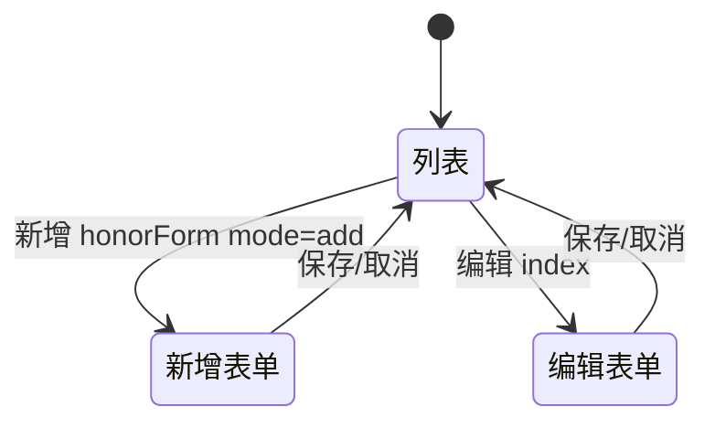

# 我的英雄资料

> 单页需求文档 · 英雄广场微信小程序  
> 状态：已实现 · P0 · M1  
> 最后更新：2026-07-10  
> 源码：`miniprogram/pages/hero-profile/` · 预览：`preview/miniprogram/hero-profile.html`

---

## 1. 页面概述

| 项 | 值 |
|---|---|
| 页面名称 | 修改英雄资料（教练资料编辑） |
| 路由 | `pages/hero-profile/hero-profile` |
| 导航栏标题 | **修改英雄资料** |
| 导航类型 | 子页 |
| 页面参数 | 无（M1 固定编辑 hero_id=`1`） |
| 目标用户 | 已认证英雄教练 |
| 设计规范 | 同 [英雄详情](./英雄详情.md) 布局 + 编辑态控件 |

---

## 2. 业务需求

### 2.1 业务目标

- 教练维护公开展示资料：关于我、荣誉、精彩瞬间、资质证书
- 关于我跳转 [简介编辑](./简介编辑.md)；荣誉弹窗表单；图片相册式增删排序
- 变更 `persistProfile` → `updateHero(MY_HERO_ID, patch)`

### 2.2 适用角色与权限

| 角色 | 可否进入 | 处理 |
|------|----------|------|
| 已认证英雄 | ✅ | — |
| 未认证 | ❌ | 个人中心入口已守卫 |
| 他人资料 | ❌ M1 | 固定 id=1 |

### 2.3 正常流程

已认证进入 → 展示/编辑关于我、荣誉、瞬间、证书 → 持久化到英雄资料。

### 2.4 核心业务规则

1. 设计上敏感变更应走 `profile_change_requests`，审核通过后写 `heroes`
2. 关于我跳转简介编辑；荣誉弹窗；图片最多 9 张可排序
3. M1 可能仍直写 `updateHero`（以实现为准）

### 2.5 异常与边界

- 未认证无入口；M1 固定本人 id

### 2.6 待确认项

- [ ] 哪些字段必须审核 vs 可直写 `updateHero`（实现可能仍直写）

### 2.7 状态机（荣誉表单）



---

## 3. 页面结构与 UI 元素规格

### 3.1 信息架构

```
同 hero-detail 头图区（无分享按钮）
├── 关于我 + 「编辑」
├── 过往荣誉 + 「新增」+ honor-row（编辑/删除）
├── 精彩瞬间 + 「长按拖动排序」+ 网格（添加图片）
├── 资质证书 + 同上 + 「添加证书」
├── honorForm sheet
└── image-viewer
```

### 3.2 UI 元素清单

| 元素 ID | 类型 | 文案 | 交互 |
|---------|------|------|------|
| profile-head | 区 | 同详情：姓名/副标题/星/标签/统计 | 只读 |
| stat-honors | 统计 | honors.length（非 honors_count） | 只读 |
| link-edit-about | 链接 | **编辑** | onEditAbout |
| bio | 文本 | aboutMe | 只读 |
| link-add-honor | 链接 | **新增** | onAddHonor |
| honor-empty | 文本 | **暂无荣誉，点击新增添加** | honors=0 |
| honor-edit-icon | 按钮 | 编辑 | onEditHonor |
| honor-del-icon | 按钮 | 删除 | onDeleteHonor Modal |
| hint-drag | 文本 | **长按拖动排序** | 瞬间/证书区 |
| media-del | 文本 | **×** | 删图 |
| media-handle | 文本 | **⋮⋮** | 拖动提示 |
| add-moment | 块 | **+ 添加图片** | onAddMoment |
| add-cert | 块 | **+ 添加证书** | onAddCert |
| sheet-title-add | 文本 | **新增荣誉** | |
| sheet-title-edit | 文本 | **编辑荣誉** | |
| honor-icon-input | input | label **图标（emoji）** placeholder **如 🏆** | |
| honor-name-input | input | **荣誉名称** | 必填 |
| honor-summary-input | textarea | **简介** placeholder **简要说明** | |
| sheet-cancel | 按钮 | **取消** | 关 sheet |
| sheet-save | 按钮 | **保存** | onHonorFormSave |

---

## 4. 字段与校验矩阵

### 4.1 荣誉表单（sheet）

| 字段 key | 标签 | 控件 | 必填 | 默认 | 错误 Toast | API 映射 |
|----------|------|------|------|------|------------|----------|
| icon | 图标（emoji） | input | ❌ | 新增 🏆 | — | past_honors[].icon |
| name | 荣誉名称 | input | ✅ | — | **请填写荣誉名称** | past_honors[].name |
| summary | 简介 | textarea | ❌ | trim | — | past_honors[].summary |

### 4.2 媒体字段

| 字段 | 上限 | 来源 | 持久化 |
|------|------|------|--------|
| moments | 9 | chooseMedia image | moments[] url |
| certificates | 9 | chooseMedia image | certificates[]{name,image} |
| aboutMe | — | bio-edit 回写 | about_me |

### 4.3 persistProfile patch

| 字段 | 说明 |
|------|------|
| about_me | 关于我 |
| past_honors | 荣誉数组（去 id） |
| honors_count | honors.length |
| moments | url 字符串数组 |
| certificates | {name,image}[] |

---

## 5. 交互需求

### 5.1 操作明细

| 序号 | 操作 | 行为 | 反馈 |
|------|------|------|------|
| 1 | 编辑关于我 | storage + navigate bio-edit | — |
| 2 | 保存荣誉 | 校验 name | Toast **已保存** |
| 3 | 删除荣誉 | Modal **确定删除「{name}」？** | **已删除** |
| 4 | 添加图片 | chooseMedia remain | 超 9 Toast **最多添加9张图片** |
| 5 | 长按排序 | splice 换位 + persist | 震动 |
| 6 | 预览 | image-viewer | 拖动中不预览 |
| 7 | load 失败 | — | **资料加载失败** |

### 5.2 返回与导航

| 来源 | 行为 |
|------|------|
| bio-edit 保存返回 | onShow reload |
| ‹ | navigateBack |

---

## 6. 加载与刷新机制

| 生命周期 | 逻辑 |
|----------|------|
| onLoad | loadHero |
| onShow | loadHero（接 bio-edit 回写） |
| 下拉 | 不支持 |

---

## 7. 性能要求

| 项 | 指标 |
|----|------|
| 图片 | 本地 tempFilePath M1 |
| persist | 每次变更 PUT hero；M2 批量/防抖 |
| 拖动 | 仅 touchend 一次 persist |

---

## 8. 相关页面

### 8.1 入口

| 来源 | |
|------|--|
| [个人中心](./个人中心.md) 英雄资料 | |
| [认证成功](./认证成功.md) 步骤 1 | |

### 8.2 出口

| 目标 | |
|------|--|
| [简介编辑](./简介编辑.md) | 关于我 |

---

## 9. 接口与数据

| 接口 | 方法 | 说明 |
|------|------|------|
| `/api/heroes/1` | GET | loadHero |
| `/api/heroes/1` | PUT | persistProfile |

### Hero 编辑字段

同 [英雄详情](./英雄详情.md) §9.2，另含可写 `past_honors`, `moments`, `certificates`, `about_me`, `honors_count`。

---

## 10. 预览端差异

| 项 | 小程序 | 预览 |
|----|--------|------|
| chooseMedia | 原生 | file input |
| 长按排序 | touch 事件 | 可简化 |
| honor sheet | 底部 sheet | modal |

---

## 11. 待确认项

- [ ] M2 多 hero 账号 vs 固定 id=1
- [ ] 图片上传 OSS 与压缩规范
- [ ] 证书名称是否可编辑（M1 自动 证书n）

---

## 12. 变更记录

| 日期 | 变更 |
|------|------|
| 2026-07-07 | 重写：荣誉矩阵、9 图上限、persist 字段、与详情页差异 |
| 2026-07-03 | 初稿 |
