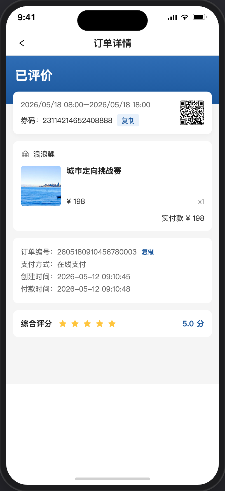

# 我的订单

> 产品说明 · 微信小程序  
> 状态：已实现 · 见 §5 验收要点  
> 最后更新：2026-07-21 17:45
> 预览地址：http://127.0.0.1:8765/miniprogram/my-orders.html  
> UI设计图地址：https://www.figma.com/design/FQerHrZBo3Kx7ddFq7jKYx/%E5%BA%97%E9%93%BA%E8%A3%85%E4%BF%AE?node-id=8777-1717&t=m8tMpSkni5qRw93M-1
> **协作提示**：桌面打开预览时，手机模型右侧会同步展示本文档（预览中不展示「§5 规则补充与验收要点」）；改文档后请运行 `python3 preview/build-pages.py` 再刷新。

## UI说明

1、需设计评分按钮、评分的对话框、评分后在订单详情页如何显示。

---

## 1. 页面业务目标

用户从个人中心进入，按状态浏览自己的商城订单；点订单卡进入 [订单详情](./订单详情.md)；「待使用」等订单可打开「券码凭证」进入 [二维码凭证](./二维码凭证.md)。

---

## 2. 页面详细描述

### 2.1 已完成订单支持评分

1、已完成状态下，列表显示去评分按钮，点击后跳订单详情并自动从页面底部滑出评分对话框。

2、已完成状态下且已完成评分，则列表不显示去评分按钮，跳详情后可以看到已评评分。

---

## 3. 相关页面

| 关系 | 页面 | 何时 |
|------|------|------|
| 来源 | [个人中心](./个人中心.md) | 全部订单 / 订单宫格 |
| 去向 | [订单详情](./订单详情.md) | 点订单卡 |
| 去向 | [二维码凭证](./二维码凭证.md) | 券码凭证 |

---

## 4. 规则补充与验收要点

### 4.1 已对齐

- 五个入口 Tab 分流正确（退款→全部）
- Tab 与卡片字段对齐参考图；「全部」有演示单
- 「券码凭证」进入凭证页
- 点订单卡进入订单详情

### 4.2 还没做完

- 真实支付 / 退款 / 核销

---

## 5. 变更记录

| 日期 | 改了什么 |
|------|----------|
| 2026-07-21 | 演示「周末帆船」始终未评价可去评分 |
| 2026-07-21 | 挂入评分对话框、已评价详情截图 |
| 2026-07-21 | 「已完成订单支持评分」补充列表/详情评分正文 |
| 2026-07-21 | 「订单卡」改为「已完成订单支持评分」 |
| 2026-07-21 | 去掉「Tab」小节 |
| 2026-07-21 | 去掉「入口」小节 |
| 2026-07-21 | 初稿：列表 Tab、演示订单、券码入口 |
