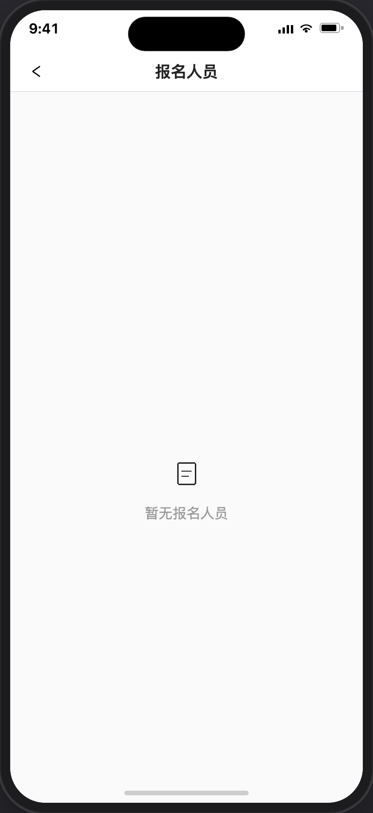

# 报名人员列表

> 产品说明 · 微信小程序  
> 状态：已实现 · 见 §5 验收要点  
> 最后更新：2026-07-21 15:37
> 预览地址：http://127.0.0.1:8765/miniprogram/signup-list.html  
> UI设计图地址：https://www.figma.com/design/FQerHrZBo3Kx7ddFq7jKYx/%E5%BA%97%E9%93%BA%E8%A3%85%E4%BF%AE?node-id=8777-1717&t=m8tMpSkni5qRw93M-1
> **协作提示**：桌面打开预览时，手机模型右侧会同步展示本文档（预览中不展示「§5 规则补充与验收要点」）；改文档后请运行 `python3 preview/build-pages.py` 再刷新。

## UI说明

1、需 UI 设计，只要字段信息和按钮不少，可完全灵活设计。

---

## 1. 页面业务目标

「报名人员列表」有两种用法：

1. **招募名单**：活动发布者查看某条招募的报名人员（只读）
2. **课程已报名成员**：教练从「我的课程」查看某门课的报名成员（只读）

---

## 2. 页面详细描述

1、赛事、活动、课程都可以查看已报名成员，都跳此页，显示对应的数据即可。

2、用户只要报名就算是已报名成员，哪怕是后续取消了报名，这里也不会做剔除。

3、此页面目前仅作显示，不支持点击跳转。

| 展示 | 说明 |
|------|------|
| 成员行 | 左：头像 + 昵称 + 手机号（脱敏，如 `137****0909`）；右上：报名时间 |
| 排序 | 按报名时间**倒序**（新报名在上） |
| 时间格式 | `YYYY年M月D日 HH:mm:ss`（如 `2026年7月14日 18:32:15`） |
| 手机号 | 报名人员列表统一脱敏：前 3 后 4，中间 `****` |

无确认/拒绝操作，只读。

### 2.2 空态

---

## 3. 常见路径

- **课程成员：** 我的课程 → 已报名成员 → 本页  
- **查看招募报名：** 我的活动赛事 → 已报名人员 → 本页  
- **返回：** ‹ → 上一页  

---

## 4. 相关页面

| 关系 | 页面 | 何时 |
|------|------|------|
| 来源 | [我的课程](./我的课程.md) | 「已报名成员」 |
| 来源 | [我的活动赛事](./我的招募.md) | 已报名人员 |
| 数据关联 | [我的报名](./我的报名.md) | 用户侧报名记录（权限隔离） |

---

## 5. 规则补充与验收要点

### 5.1 已对齐（产品已确认可验收）

- 课程 / 招募模式：头像、昵称、脱敏手机号（`137****0909`）；报名时间在行右上角；按报名时间倒序
- 招募模式：与课程同版式，只读名单（无状态、无确认）
- 从「我的活动赛事」进入时，名单条数与上一页卡片已报人数一致（演示 mock）
- 空态：居中图标 +「暂无报名人员」（课程模式为「暂无已报名成员」）
- 从其他页面返回时列表应刷新

### 5.2 还没做完

- 招募名单后续改为按招募唯一标识匹配真实报名数据（避免重名；当前演示按 `signed` 生成 mock）
- 导出名单（导出时是否明文另议）

---

## 6. 变更记录

| 日期 | 改了什么 |
|------|----------|
| 2026-07-21 | §2 补充：赛事/活动/课程共用本页；取消报名不剔除；仅展示不可跳转 |
| 2026-07-21 | 去掉「课程已报名成员 / 招募报名名单」分节标题；去掉导航栏标题句与招募分节正文 |
| 2026-07-21 | 去掉「登录和身份描述」整章 |
| 2026-07-20 | 去掉页内赛事/活动/课程名称页头，仅保留导航栏标题 |
| 2026-07-17 | 空态改为居中图标+「暂无报名人员」，截图写入需求预览 |
| 2026-07-17 | 从我的招募进入时，按卡片已报人数（`signed`）生成同数量 mock 名单 |
| 2026-07-03 | 初稿 |
