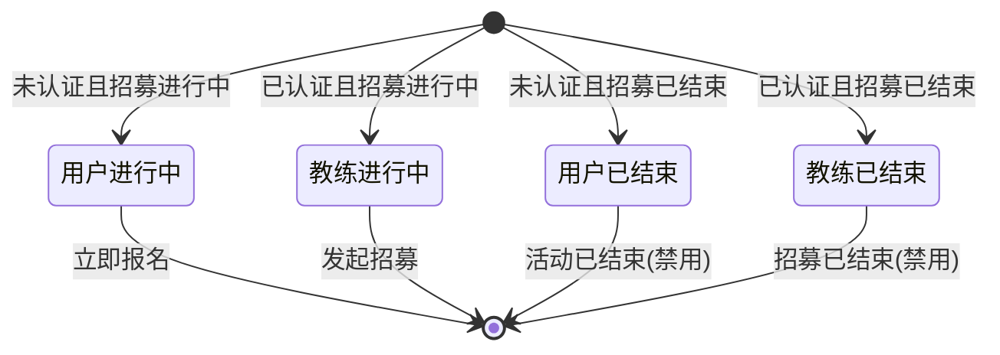

# 招募详情

> 产品说明 · 微信小程序子页（活动/赛事详情）  
> 状态：已实现 · 第一期 · 优先级最高  
> 最后更新：2026-07-15  
> 预览地址：http://127.0.0.1:8765/miniprogram/recruitment-detail.html  
> **协作提示**：桌面打开预览时，手机模型右侧会同步展示本文档（预览中不展示「§6 规则补充与验收要点」）；改文档后请运行 `python3 preview/build-pages.py` 再刷新。

---

## 1. 页面业务目标

「招募详情」展示某场 **赛事或活动** 的完整信息，并支持用户报名或已认证教练发起招募。

主要解决四件事：

1. **看清活动信息**：类型标签、时间地点、价格、活动详情与组织者介绍
2. **立即报名**：未认证用户在招募进行中可填写姓名+手机提交报名
3. **发起招募**：已认证教练在招募进行中可点「发起招募」，经二次确认后进入我的招募查看
4. **状态感知**：底栏主按钮随身份 × 招募状态变化

---

## 2. 登录和身份描述

底栏左侧固定 **首页**、**客服**；右侧主按钮按身份与招募状态显示：

| 身份 | 招募进行中 | 招募已结束 |
|------|------------|------------|
| 已认证教练 | **发起招募**（可点 → 二次确认 → 我的招募） | **招募已结束**（灰色禁用） |
| 未认证用户 | **立即报名**（可点 → 报名表单） | **活动已结束**（灰色禁用） |

### 2.1 活动存在

正常展示封面、活动信息、详情区块、固定底栏。

### 2.2 活动不存在

页面提示「活动不存在」，页面不渲染。

---

## 3. 页面详细描述

### 3.1 自定义导航

| 展示内容 | 说明 |
|----------|------|
| 返回按钮 | ‹ → 返回上一页 |
| 滚动标题 | 页面向下滚动后显示活动标题（沉浸导航） |

### 3.2 封面区

封面多图时轮播并自动切换；**仅一张封面时不轮播**，静态展示。

### 3.3 活动信息

浅灰页面底上叠多张白卡片（左右留边，首卡略上移压封面）：

| 卡片 | 内容 |
|------|------|
| 概要卡 | 类型标签、标题、内容标签（最多 3 个）、价格 + 分享 |
| VIP 引导条 | 「VIP会员卡 · 可享5大权益」+「立即尊享 ›」（本期 toast「即将开放」） |
| 时间地点卡 | 时间、地点（带 ›）、主办（建筑图标 +「{教练名}主办」）、备注（标题在上、内容在下，左对齐） |
| 活动详情卡 | 「活动详情」描述 + 组织者多维介绍 |

### 3.4 固定底栏

- 左侧：**首页**（回营销首页）、**客服**（第一期提示「功能开发中」）
- 右侧：主按钮文案与禁用态见 §2（蓝色可点 / 灰色禁用；不展示价格）

### 3.5 报名表单弹窗

标题「填写报名信息」：

| 字段 | 说明 |
|------|------|
| 联系人姓名 | 必填 |
| 联系电话 | 必填，11 位手机号 |
| 备注 | 选填 |
| 取消 / 提交 | 关闭弹窗 / 提交报名 |

**校验失败时的页面提示：**

| 情况 | 提示原文 |
|------|----------|
| 姓名为空 | 「请填写联系人」 |
| 手机号格式不对 | 「手机号格式不正确」 |
| 已报名再点 | 「您已报名」 |
| 提交成功 | 「报名成功」 |
| 提交失败 | 「报名失败」 |

### 3.6 发起招募二次确认

已认证教练点「发起招募」时，当前页弹窗：

| 元素 | 文案 |
|------|------|
| 标题 | 确认发起赛事招募 |
| 正文 | 确认发起赛事招募后，在我的页>服务中心>我的招募中查看。 |
| 取消 | 关闭弹窗 |
| 确认开始招募 | 关闭弹窗并进入 [我的招募](./我的招募.md) |

---

## 4. 常见路径

- **浏览活动：** 营销首页 / 英雄广场 / 英雄详情 → 进入本页 → 展示详情
- **报名（未认证）：** 点「立即报名」→ 填表单 → 提交成功
- **发起招募（已认证教练）：** 点「发起招募」→ 二次确认 → 确认后进入我的招募
- **招募/活动已结束：** 主按钮灰色不可点
- **首页 / 客服：** 底栏左侧入口
- **返回：** ‹ 或系统返回 → 上一页

---

## 5. 相关页面

| 关系 | 页面 | 何时 |
|------|------|------|
| 入口 | [营销首页](./营销首页.md) | Banner 行动按钮 / 活动卡片 |
| 入口 | [英雄广场](./英雄广场.md) | 卡片底部活动行 |
| 入口 | [英雄详情](./英雄详情.md) | 招募卡片 |
| 入口 | [我的报名](./我的报名.md) | 从报名记录进入 |
| 出口 | [我的招募](./我的招募.md) | 已认证教练确认发起招募后 |
| 出口 | [营销首页](./营销首页.md) | 底栏「首页」 |
| 出口 | 上一页 | 返回 |

---

## 6. 规则补充与验收要点

### 6.1 已对齐（产品已确认可验收）

| 能力 | 说明 |
|------|------|
| 沉浸导航 + 封面 + 活动信息 | 有 |
| 组织者多维介绍（有数据时展示） | 有 |
| 底栏：首页 / 客服 + 身份×状态主按钮 | 有 |
| 报名表单（姓名、手机、备注）与校验提示 | 有 |
| 发起招募二次确认 → 我的招募 | 有 |
| 活动不存在时页面提示且不渲染 | 有 |

### 6.2 还没做完

| 优先级 | 能力 | 现状 |
|--------|------|------|
| 待确认 | 满员是否禁止报名 | 第一期未校验名额上限 |
| 待确认 | 支付默认策略 | 报名后默认「待支付」 |
| P2 | 满员/截止报名校验 | 未做 |
| P2 | 客服真实接入 | 第一期提示「功能开发中」 |

### 6.3 边界与提示

| 场景 | 期望表现 |
|------|----------|
| 活动不存在 | 页面提示「活动不存在」 |
| 未认证 × 招募已结束 | 主按钮灰色「活动已结束」 |
| 已认证 × 招募已结束 | 主按钮灰色「招募已结束」 |
| 已报名再点「立即报名」 | 页面提示「您已报名」 |
| 姓名为空 | 页面提示「请填写联系人」 |
| 手机号不是 11 位 | 页面提示「手机号格式不正确」 |

---

## 7. 变更记录

| 日期 | 改了什么 |
|------|----------|
| 2026-07-15 | 发起招募增加二次确认弹窗，确认后进入我的招募 |
| 2026-07-15 | 主办改为建筑图标，去掉右侧 › |
| 2026-07-15 | 主办方改为图标 +「{名}主办」行样式 |
| 2026-07-15 | 标题下增加内容标签（最多 3 个） |
| 2026-07-15 | 时间地点卡增加主办方、备注字段 |
| 2026-07-15 | 正文拆为概要 / 时间地点 / 活动详情三张卡片 |
| 2026-07-15 | 去掉发布者区块与报名进度条 |
| 2026-07-15 | 标题下增加价格与分享按钮 |
| 2026-07-15 | 时间/地点改为圆角信息卡片，地点带 › |
| 2026-07-15 | 页面底色浅灰，突出白色正文卡片 |
| 2026-07-15 | 底栏改为首页/客服 + 身份×状态主按钮（去掉价格与签到态） |
| 2026-07-15 | 详情正文左右留边并上移叠压封面 |
| 2026-07-15 | 封面仅一张时不轮播，静态展示 |
| 2026-07-14 | 全文改为产品可读中文 |
| 2026-07-14 | 按个人中心格式改写；保留流程图 |
| 2026-07-07 | 重写：自定义导航、报名表单、底栏状态、组织者区块 |
| 2026-07-03 | 初稿 |
