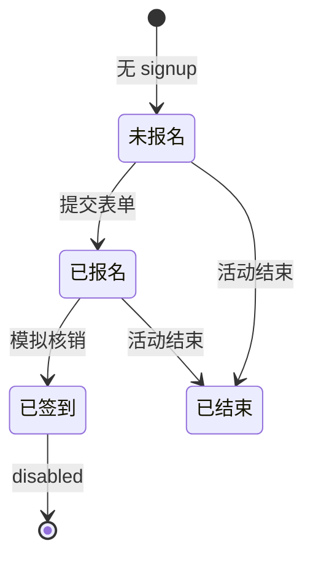

# 招募详情

> 单页需求文档 · 英雄广场微信小程序  
> 状态：已实现 · P0 · M1  
> 最后更新：2026-07-10  
> 源码：`miniprogram/pages/recruitment-detail/` · 预览：`preview/miniprogram/recruitment-detail.html`

---

## 1. 页面概述

| 项 | 值 |
|---|---|
| 页面名称 | 招募/活动详情 |
| 路由 | `pages/recruitment-detail/recruitment-detail` |
| 导航栏标题 | **自定义沉浸**（滚动后显示标题） |
| 导航类型 | 子页；`navigationStyle: custom` |
| 页面参数 | **`id`**（recruit_id，必填） |
| 目标用户 | 浏览并报名赛事/活动的用户 |
| 设计规范 | `DESIGN-SPEC` · 封面 swiper + 进度条 + 固定底栏 + 报名/签到弹窗 |

---

## 2. 业务需求

### 2.1 业务目标

- 展示活动完整信息：类型标签、时间地点、发布者、报名进度、详情与组织者多维介绍
- 支持用户 **立即报名**（表单弹窗）→ 写入 my_signups
- 已报名用户展示 **签到二维码核销** 流程（M1 Mock）
- 根据 `signup-action.resolveSignupFooter` 动态底栏：立即报名 / 签到 / 已签到 / 活动已结束

### 2.2 适用角色与权限

| 角色 | 行为 |
|------|------|
| 未报名用户 | 底栏「立即报名」 |
| 已报名未签到 | 「签到二维码核销」 |
| 已签到 | 「已签到」disabled |
| 活动已结束 | 「活动已结束」disabled |

### 2.3 正常流程

带 id 进入 → 展示详情 → 未报名可填姓名+手机报名写 `signups` → 已报名可签到 `checked_in` → 已结束底栏 disabled。

### 2.4 核心业务规则

1. 缺 id → Toast「活动不存在」
2. 底栏四态：立即报名 / 签到核销 / 已签到 / 活动已结束
3. 报名校验：姓名 trim 非空；手机 `/^1\d{10}$/`
4. 报名成功写 `signups`，招募 `signed+1`
5. 签到成功：signup → `checked_in`
6. 已结束：底栏 disabled，不可报名/签到

### 2.5 异常与边界

- 并行拉招募 + 本人报名初始化 footer；无报名记录视为未报名

### 2.6 待确认项

- [ ] 满员是否禁止报名
- [ ] 是否允许重复报名
- [ ] 前后台状态映射定稿
- [ ] 支付默认策略
- [ ] 签到是否必须扫码（M1 为 Mock 核销）

### 2.7 状态机（底栏）



---

## 3. 页面结构与 UI 元素规格

### 3.1 信息架构

```
.recruit-detail
├── 自定义 chrome（返回 + 滚动标题）
├── 封面 swiper / 单图
├── body（标签/标题/meta/发布者/进度/详情区块）
├── 固定 footer（价格 + 按钮）
├── 签到 modal（showCheckin）
└── 报名表单 modal（showForm）
```

### 3.2 UI 元素清单

| 元素 ID | 类型 | 文案 | 数据来源 | 交互 |
|---------|------|------|----------|------|
| back | 按钮 | **‹** | 静态 | navigateBack |
| nav-title | 文本 | `{{item.title}}` | navSolid 时可见 | 无 |
| cover-swiper | swiper | 多图轮播 | coverImages | 自动 2s |
| type-tag | 组件 | typeLabel | category-tag | 无 |
| title | 文本 | `{{item.title}}` | item | 无 |
| meta-time | 文本 | 🕐 `{{item.timeDisplay}}` | item | 无 |
| meta-loc | 文本 | 📍 `{{item.location}}` | item | 无 |
| publisher | 行 | **发布** + hero_name | item | 无 |
| progress-text | 文本 | **已报名 {{signed}} / {{total}} 人** | 计算 | 无 |
| progress-bar | 条 | width=progress% | signed/total | 无 |
| label-detail | 标题 | **活动详情** | 静态 | 无 |
| desc | 文本 | description | item | 无 |
| dim-credentials | 块 | **专业资质与荣誉** | organizer_profile | wx:if |
| dim-philosophy | 块 | **教学理念** | | wx:if |
| dim-race | 块 | **丰富的赛事经验** | | wx:if |
| dim-leadership | 块 | **卓越长航领队教学特色** | | wx:if |
| dim-social | 块 | **社会贡献** | | wx:if |
| slogan | 文本 | organizer_profile.slogan | | wx:if |
| footer-price | 文本 | **¥{fee}**/人 | item.fee | 无 |
| footer-btn | 按钮 | footerLabel | resolveSignupFooter | onFooterTap |
| checkin-title | 文本 | **签到二维码** | modal | 无 |
| checkin-qr | 占位 | ▦ | Mock | 无 |
| checkin-hint | 文本 | **请向工作人员出示此码完成核销** | | 无 |
| checkin-close | 按钮 | **关闭** | | 关 modal |
| checkin-submit | 按钮 | **模拟核销** | | checkin API |
| form-title | 文本 | **填写报名信息** | | 无 |
| form-name | input | placeholder **联系人姓名** | form.name | bindinput |
| form-phone | input | **联系电话** number maxlength 11 | form.phone | |
| form-remark | input | **备注（选填）** | form.remark | |
| form-cancel | 按钮 | **取消** | | 关表单 |
| form-submit | 按钮 | **提交** | | onSubmit |

#### 3.2.1 底栏文案（footerLabel）

| 状态 | 文案 | disabled |
|------|------|----------|
| 可报名 | **立即报名** | false |
| 可签到 | **签到二维码核销** | false |
| 已签到 | **已签到** | true |
| 已结束 | **活动已结束** | true |

---

## 4. 字段与校验矩阵

### 4.1 页面参数

| 字段 | 必填 | 规则 | 错误 Toast |
|------|------|------|------------|
| `id` | ✅ | recruit_id | **活动不存在** |

### 4.2 报名表单

| 字段 key | 标签 | 控件 | 必填 | 格式 | 错误 Toast | 写入字段 |
|----------|------|------|------|------|------------|----------|
| `name` | 联系人姓名 | input | ✅ | trim 非空 | **请填写联系人** | name |
| `phone` | 联系电话 | input number | ✅ | `/^1\d{10}$/` | **手机号格式不正确** | phone |
| `remark` | 备注 | input | ❌ | 任意 | — | remark |

### 4.3 提交 payload（addMySignup）

| 字段 | 说明 |
|------|------|
| recruit_id | 当前活动 id |
| title | 活动标题 |
| name, phone, remark | 表单 |
| signed_at | ISO 时间 |
| start_at, end_at, location, fee | 活动快照 |
| payStatus | 默认 **待支付** |
| checked_in | false |
| status | **已报名** |

---

## 5. 交互需求

### 5.1 操作明细

| 序号 | 操作 | 前置 | 行为 | 成功 | 失败 |
|------|------|------|------|------|------|
| 1 | 点底栏报名 | action=signup | showForm=true | 弹窗 | disabled 无响应 |
| 2 | 提交报名 | 表单合法 | addMySignup + update signed | Toast 报名成功 | 报名失败 |
| 3 | 点底栏签到 | action=checkin | showCheckin=true | 弹窗 | — |
| 4 | 模拟核销 | checkin modal | checkinMySignup | Toast 核销成功 | 核销失败 |
| 5 | 滚动页面 | — | navSolid 切换 | 标题显隐 | — |
| 6 | 返回 | — | navigateBack | — | — |

### 5.2 返回与导航

| 控件 | 行为 |
|------|------|
| ‹ | navigateBack |
| 报名成功 | 停留本页，footer 更新 |

### 5.3 页面级异常

| 场景 | 处理 |
|------|------|
| item 不存在 | Toast，不渲染 |
| 已满员 M1 | 未校验 total，M2 需拦截 |

---

## 6. 加载与刷新机制

| 生命周期 | 逻辑 |
|----------|------|
| `onLoad` | 读 id，Promise.all 拉招募+signup |
| `onShow` | M1 无 |
| 下拉 | 不支持 |

---

## 7. 性能要求

| 项 | 指标 |
|----|------|
| 首屏 | 2 并行请求 |
| 滚动 | 仅 navSolid 布尔 setData，阈值 180px |
| 封面高度 | statusBar + 44 + 180 |

---

## 8. 相关页面

### 8.1 入口

| 来源 | 参数 |
|------|------|
| [营销首页](./营销首页.md) | id |
| [英雄广场](./英雄广场.md) hero-card 行 | id |
| [英雄详情](./英雄详情.md) | id |
| [我的报名](./我的报名.md) | id |

### 8.2 出口

| 目标 | 说明 |
|------|------|
| 上一页 | navigateBack |

---

## 9. 接口与数据

### 9.1 接口

| 接口 | 方法 | 时机 |
|------|------|------|
| `/api/recruitments/:id` | GET | onLoad |
| `/api/signups/mine` | GET | 查是否已报 |
| `/api/signups` | POST | 提交报名 |
| `/api/signups/:id/checkin` | POST | 核销 M2 |

### 9.2 Recruitment 字段

| 字段 | 类型 | 说明 |
|------|------|------|
| recruit_id | string | id |
| title | string | 标题 |
| type / typeLabel | string | event/activity |
| timeDisplay | string | 展示时间 |
| location | string | 地点 |
| hero_name | string | 发布者 |
| signed / total | number | 报名进度 |
| fee | number | 单价 |
| description | string | 详情 |
| cover_images | string[] | 封面 |
| organizer_profile | object | 多维介绍 |
| start_at / end_at | ISO | 时间 |

---

## 10. 预览端差异

| 项 | 小程序 | 预览 |
|----|--------|------|
| 自定义导航 | statusBar 动态 | 模拟 chrome |
| chooseLocation | 无 | — |
| 签到 QR | 字符 ▦ | 可换静态图 |

---

## 11. 待确认项

- [ ] 满员/截止报名校验
- [ ] 支付流程与 payStatus 变更
- [ ] 真实二维码生成与扫码核销

---

## 12. 变更记录

| 日期 | 变更 |
|------|------|
| 2026-07-07 | 重写：自定义 nav、报名表单矩阵、footer 状态机、organizer 区块 |
| 2026-07-03 | 初稿 |
