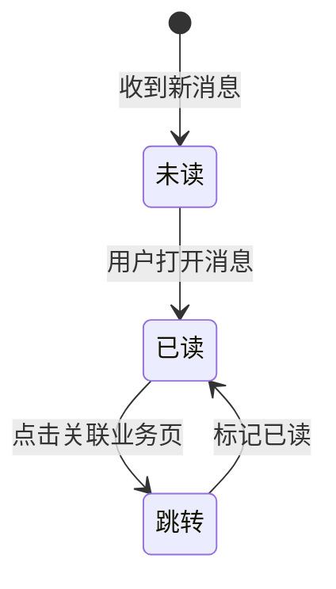

# 消息

> 产品说明 · 微信小程序消息中心（第二期规划）  
> 状态：**第一期不做** · 优先级较低 · 第二期  
> 最后更新：2026-07-14  
> 预览地址：无 · 第一期不做  
> **协作提示**：桌面打开预览时，手机模型右侧会同步展示本文档（预览中不展示「§6 规则补充与验收要点」）；改文档后请运行 `python3 preview/build-pages.py` 再刷新。

---

## 1. 页面业务目标

「消息中心」用于 **系统通知、审核结果、报名提醒、活动变更** 等消息的集中触达。

第一期 **不做** 本页。当前替代方案：

1. **审核结果** → [个人中心](./个人中心.md) 身份引导与状态标签
2. **报名记录** → 用户主动查看 [我的报名](./我的报名.md)
3. **活动提醒** → 暂无推送，第二期与微信订阅消息、站内信统一

---

## 2. 登录和身份描述

| 阶段 | 身份 | 页面上看到什么 |
|------|------|----------------|
| 第一期 | 全部用户 | 个人中心有消息图标入口；点后 toast「功能开发中」，**无消息列表页** |
| 第二期（规划） | 全部用户 | 消息列表 + 未读角标 |
| 第二期（规划） | 英雄教练 | 额外收到报名/审核类通知 |

### 第一期当前替代

| 场景 | 用户去哪看 |
|------|------------|
| 审核中 | 个人中心 →「查看审核进度」→ [申请提交成功](./申请提交成功.md) |
| 审核通过 | 个人中心已认证态 → [认证成功](./认证成功.md) |
| 报名成功 | [我的报名](./我的报名.md) |

---

## 3. 页面详细描述

### 第一期

**页面不存在**，无界面。

### 第二期规划

```
消息中心页
├── 顶栏（可选「全部已读」）
├── 消息列表（分页）
│   └── 消息项 × N
│       ├── 类型图标
│       ├── 标题 + 摘要
│       ├── 时间
│       └── 未读圆点
└── 空态「暂无消息」
```

**消息类型（规划）：**

| 类型 | 标题示例 | 点击跳转 |
|------|----------|----------|
| 审核通过 | 英雄认证已通过 | [认证成功](./认证成功.md) |
| 审核驳回 | 英雄认证未通过 | [申请成为英雄](./申请成为英雄.md) |
| 审核中 | 认证审核中 | [申请提交成功](./申请提交成功.md) |
| 报名成功 | 报名成功 | [我的报名](./我的报名.md) |
| 活动提醒 | 活动即将开始 | [招募详情](./招募详情.md) |
| 系统公告 | 平台公告 | 富文本详情 |

---

## 4. 常见路径

### 第一期

任意操作 → **页面不存在**。

### 第二期规划

- **收到通知：** 推送或写入 → 列表出现未读消息
- **阅读消息：** 点击消息 → 标记已读 → 跳转关联业务页
- **全部已读：** 点「全部已读」→ 角标清零



---

## 5. 相关页面

| 关系 | 页面 | 何时 |
|------|------|------|
| 第一期替代 | [个人中心](./个人中心.md) | 审核状态展示 |
| 第一期替代 | [我的报名](./我的报名.md) | 报名记录 |
| 第二期跳转 | [认证成功](./认证成功.md) | 审核通过通知 |
| 第二期跳转 | [申请提交成功](./申请提交成功.md) | 审核中通知 |
| 第二期跳转 | [申请成为英雄](./申请成为英雄.md) | 审核驳回通知 |
| 第二期跳转 | [招募详情](./招募详情.md) | 活动提醒 |
| 第二期入口（规划） | 个人中心顶部图标 | 未读角标 |
| 第二期入口（规划） | 订阅消息点击 | 直达消息中心或业务页 |

---

## 6. 规则补充与验收要点

### 6.1 第一期边界（已确认）

| 结论 | 说明 |
|------|------|
| 第一期不做 | 不注册页面、不占底部 Tab |
| 审核结果 | 走个人中心状态引导 |
| 报名结果 | 走我的报名 |
| 无推送 | 活动提醒暂不提供 |

### 6.2 第二期规划（待建设）

| 优先级 | 能力 | 说明 |
|--------|------|------|
| P1 | 消息列表 + 未读角标 | 分页展示，支持全部已读 |
| P1 | 点击消息跳转业务页 | 见 §3 消息类型表 |
| P2 | 筛选（全部/审核/报名/系统） | 可选 |
| P2 | 入口位置 | 待确认：第五 Tab 或个人中心图标 |
| 待确认 | 订阅消息模板与场景映射 | 审核/报名等 |
| 待确认 | 消息保留天数与已读归档 | 未定 |
| 待确认 | 是否与我的评价评论通知合并 | 未定 |

### 6.3 边界与提示（第二期规划）

| 场景 | 期望表现 |
|------|----------|
| 未登录 | 引导登录 |
| 消息无效 | 页面提示并停留列表 |
| 关联活动已下架 | 跳转列表页并提示 |

---

## 7. 变更记录

| 日期 | 改了什么 |
|------|----------|
| 2026-07-14 | 全文改为产品可读中文 |
| 2026-07-15 | 第一期：个人中心已加消息图标入口（点后「功能开发中」） |
| 2026-07-14 | 按个人中心格式改写；保留流程图 |
| 2026-07-07 | 重写：第一期不做边界、第二期完整规划、类型跳转表 |
| 2026-07-07 | 补全六大需求章节；标注第一期不做 |
| 2026-07-03 | 初稿 |
