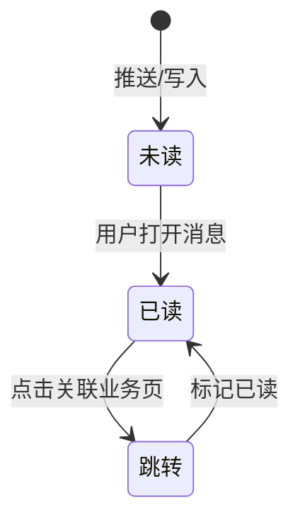

# 消息

> 单页需求文档 · 英雄广场微信小程序  
> 状态：**M1 不做** · P2 · M2  
> 最后更新：2026-07-07  
> 源码：**未注册**（规划 `pages/messages/messages`） · 预览：无

---

## 1. 页面概述

| 项 | 值 |
|---|---|
| 页面名称 | 消息中心 |
| 路由 | **未注册**（规划 `pages/messages/messages`） |
| 导航栏标题 | **消息**（规划） |
| 导航类型 | 规划为子页或独立 Tab（M2 决策） |
| 页面参数 | 无 / `?type=` 筛选（规划） |
| 目标用户 | 全部用户 |
| 设计规范 | `DESIGN-SPEC` · 列表 + 未读角标（规划） |

---

## 2. 业务需求

### 2.1 业务目标

- 系统通知、审核结果、报名提醒、活动变更等消息触达闭环
- 替代 M1 分散态：审核结果靠 [个人中心](./个人中心.md) 状态；活动提醒靠用户主动查看 [我的报名](./我的报名.md)
- M2 与微信订阅消息、站内信统一

### 2.2 适用角色与权限

| 角色 | M1 | M2 规划 |
|------|-----|---------|
| 全部用户 | 无入口 | ✅ 消息列表 |
| 英雄教练 | 无 | ✅ 报名/审核类通知 |

### 2.3 M1 决策（必须遵守）

1. **不注册路由**，不占 TabBar 四栏（首页/英雄/商城/我的）
2. **不实现** wxml/js 页面源码
3. 相关文案引用保留在 [申请提交成功](./申请提交成功.md) 等待确认项

### 2.4 M2 状态机（规划）



---

## 3. 页面结构与 UI 元素规格（M2 规划）

### 3.1 信息架构（规划）

```
messages-page
├── 顶栏（可选「全部已读」）
├── 消息列表（分页）
│   └── message-item × N
│       ├── 类型图标
│       ├── 标题 + 摘要
│       ├── 时间
│       └── 未读圆点
└── 空态「暂无消息」
```

### 3.2 UI 元素清单（规划）

| 元素 ID | 类型 | 文案/占位 | 样式要点 | 数据来源 | 交互 |
|---------|------|-----------|----------|----------|------|
| msg-icon | 图标 | 按 type 映射 | 审核/报名/系统 | API type | 无 |
| msg-title | 文本 | 标题 | 未读加粗 | title | 点击进详情 |
| msg-summary | 文本 | 一行摘要 | 次要色 | summary | 无 |
| msg-time | 文本 | 相对/绝对时间 | 右对齐 | created_at | 无 |
| unread-dot | 圆点 | — | 主色 | read=false | 无 |
| empty | 空态 | **暂无消息** | 居中 | list 空 | 无 |
| mark-all-read | 按钮 | **全部已读** | 导航右 | 静态 | 批量已读 |

### 3.3 消息类型（规划）

| type | 图标语义 | 标题示例 | 跳转目标 |
|------|----------|----------|----------|
| audit_approved | ✓ | 英雄认证已通过 | [认证成功](./认证成功.md) |
| audit_rejected | ✕ | 英雄认证未通过 | [申请成为英雄](./申请成为英雄.md) |
| audit_pending | ⏳ | 认证审核中 | [申请提交成功](./申请提交成功.md) |
| signup_success | 📋 | 报名成功 | [我的报名](./我的报名.md) |
| event_reminder | 🔔 | 活动即将开始 | [招募详情](./招募详情.md)?id= |
| system | 📢 | 平台公告 | 富文本详情 |

---

## 4. 字段与校验矩阵

> M1 无用户输入。

### 4.1 M2 列表项字段（规划）

| 字段 | 类型 | 说明 |
|------|------|------|
| id | string | 消息 id |
| type | enum | 见 §3.3 |
| title | string | 标题 |
| summary | string | 摘要 |
| body | string? | 详情 HTML |
| read | boolean | 已读 |
| created_at | ISO | 时间 |
| link_type | string | 内部路由类型 |
| link_params | object | 如 `{ id: 'r1' }` |

### 4.2 M2 筛选（规划，无表单提交）

| 逻辑字段 | 说明 |
|----------|------|
| filter_type | 全部/审核/报名/系统 |
| unread_only | 仅未读 |

---

## 5. 交互需求

### 5.1 M1 操作

| 操作 | 行为 |
|------|------|
| 任意 | **页面不存在** |

### 5.2 M2 操作明细（规划）

| 序号 | 操作 | 前置 | 行为 | 成功 | 失败 |
|------|------|------|------|------|------|
| 1 | 进入列表 | 登录 | GET /api/messages | 渲染列表 | 空态/Toast |
| 2 | 点击消息 | — | PUT read + 跳转 | 已读+跳转 | Toast |
| 3 | 全部已读 | 有未读 | PUT batch read | 角标清零 | — |
| 4 | 下拉刷新 | — | 重拉第一页 | 更新 | — |
| 5 | 上拉加载 | 有 next | 分页 | 追加 | — |

### 5.3 页面级异常（规划）

| 场景 | 处理 |
|------|------|
| 未登录 | 跳转登录 |
| 消息 id 无效 | Toast + 停留列表 |
| 关联活动已下架 | 跳转列表页 + Toast |

---

## 6. 加载与刷新机制

### M1

| 时机 | 行为 |
|------|------|
| — | **不实现** |

### M2（规划）

| 生命周期 | 逻辑 | UI |
|----------|------|-----|
| onLoad | 拉取第 1 页 + 未读数 | 骨架屏 |
| onShow | 增量刷新未读数 | Tab 角标同步 |
| 下拉刷新 | 重置分页 | loading |
| 订阅消息回调 | 插入/刷新列表 | 可选横幅 |

---

## 7. 性能要求

### M1

无页面，无指标。

### M2（规划）

| 项 | 指标 | 说明 |
|----|------|------|
| 首屏 | < 800ms | 分页 20 条 |
| 未读数 | 本地缓存 + onShow 校正 | 减少全量拉取 |
| 列表 | 分页 | 避免一次拉全量 |
| 推送 | 合并通知 | 避免频繁弹窗 |
| setData | 分页追加 | 字段级更新 read 态 |

---

## 8. 相关页面

### 8.1 M1 间接关联

| 场景 | 当前替代 |
|------|----------|
| 审核中 | [个人中心](./个人中心.md) pending CTA → [申请提交成功](./申请提交成功.md) |
| 审核通过 | [个人中心](./个人中心.md) → [认证成功](./认证成功.md) |
| 报名 | [我的报名](./我的报名.md) |

### 8.2 M2 入口（规划）

| 来源 | 说明 |
|------|------|
| 个人中心顶部图标 | 未读角标 |
| 订阅消息点击 | 深链到 messages 或业务页 |

### 8.3 M2 出口（规划）

| 目标 | 触发 type |
|------|-----------|
| [认证成功](./认证成功.md) | audit_approved |
| [申请提交成功](./申请提交成功.md) | audit_pending |
| [申请成为英雄](./申请成为英雄.md) | audit_rejected |
| [招募详情](./招募详情.md) | event_reminder |
| [我的报名](./我的报名.md) | signup_success |

---

## 9. 接口与数据

### 9.1 M1

**无接口**（页面未实现）。

### 9.2 M2 接口列表（规划）

| 接口 | 方法 | 时机 | 说明 |
|------|------|------|------|
| `/api/messages` | GET | onLoad/分页 | `?page=&type=&unread=` |
| `/api/messages/unread-count` | GET | onShow/Tab | 角标 |
| `/api/messages/:id` | GET | 详情 | 可选独立详情页 |
| `/api/messages/:id/read` | PUT | 点击 | 单条已读 |
| `/api/messages/read-all` | PUT | 全部已读 | 批量 |

### 9.3 `GET /api/messages` 响应（规划）

| 字段 | 类型 | 说明 |
|------|------|------|
| items | array | 消息列表 |
| items[].id | string | id |
| items[].type | string | 类型枚举 |
| items[].title | string | 标题 |
| items[].summary | string | 摘要 |
| items[].read | boolean | 已读 |
| items[].created_at | string | ISO 时间 |
| items[].link | object? | `{ path, params }` |
| next_page | number? | 分页 |

---

## 10. 预览端差异

| 项 | M1 | M2 规划 |
|----|-----|---------|
| 页面 | 不存在 | 可选 preview/messages.html |
| 订阅消息 | — | 仅小程序 |
| 角标 | — | TabBar 需自定义或 profile 入口 |

---

## 11. 待确认项

- [ ] M2 是否增加第五 Tab「消息」或仅个人中心入口
- [ ] 订阅消息模板 id 与审核/报名场景映射
- [ ] 消息保留天数与已读归档策略
- [ ] 是否与 [我的评价](./我的评价.md) 评论通知合并

---

## 12. 变更记录

| 日期 | 变更 |
|------|------|
| 2026-07-07 | 重写：M1 不做边界、M2 完整 UI/接口/性能规划、类型跳转表 |
| 2026-07-07 | 补全六大需求章节；标注 M1 不做 |
| 2026-07-03 | 初稿 |
