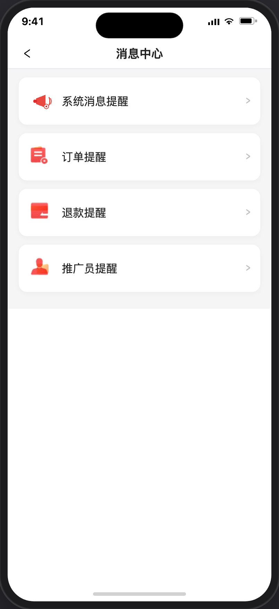

# 消息

> 产品说明 · 微信小程序消息中心  
> 状态：已实现分类入口 · 见 §6 验收要点  
> 最后更新：2026-07-17  
> 预览地址：[http://127.0.0.1:8765/miniprogram/messages.html](http://127.0.0.1:8765/miniprogram/messages.html)
>
> 设计图地址：设计中  
> **协作提示**：桌面打开预览时，手机模型右侧会同步展示本文档的**开头说明**（不展示 §1 及之后章节，也不展示「§6 规则补充与验收要点」）；改文档后请运行 `python3 preview/build-pages.py` 再刷新。

---

说明：此页增加了系统消息提醒。点击跳消息详情

## 1. 页面业务目标

「消息中心」提供 **消息分类入口**（系统消息 / 订单 / 退款 / 推广员提醒），从个人中心铃铛进入。

本期：系统消息提醒进入 [消息详情](./消息详情.md)；其余分类点后 toast「功能开发中」。未读角标后续再做。

---

## 2. 登录和身份描述

| 身份 | 用户大概情况 | 页面上多出来 / 不一样的地方 |
|------|--------------|------------------------------|
| 未登录 | 个人中心点铃铛 | toast「请先授权登录」，不进入本页 |
| 已登录 | 个人中心点铃铛 | 进入消息中心分类列表 |
| 全部已登录用户 | 打开本页 | 四个分类入口；系统消息提醒 → [消息详情](./消息详情.md)；其余 → toast「功能开发中」 |

---

## 3. 页面详细描述



```
消息中心页
├── 顶栏「消息中心」+ 返回
└── 分类卡片列表（白底圆角，彼此间距）
    ├── 系统消息提醒（左图标 + 文案 + 右箭头）→ 消息详情
    ├── 订单提醒
    ├── 退款提醒
    └── 推广员提醒
```

| 展示内容 | 说明 |
|----------|------|
| 顶栏 | 标题「消息中心」；返回固定到个人中心 |
| 系统消息提醒 | 置顶；点 → [消息详情](./消息详情.md) |
| 订单提醒 | 分类入口；本期点 → toast「功能开发中」 |
| 退款提醒 | 分类入口；本期点 → toast「功能开发中」 |
| 推广员提醒 | 分类入口；本期点 → toast「功能开发中」 |

后续规划（未做）：其余分类进入列表、未读角标、全部已读等。

---

## 4. 常见路径

- **进入：** [个人中心](./个人中心.md) → 铃铛 → 消息中心
- **未登录：** 点铃铛 →「请先授权登录」
- **系统消息：** 点「系统消息提醒」→ [消息详情](./消息详情.md)
- **其他分类：** toast「功能开发中」（本期）

---

## 5. 相关页面

| 关系 | 页面 | 何时 |
|------|------|------|
| 入口 | [个人中心](./个人中心.md) | 用户信息行右侧铃铛 |
| 下级 | [消息详情](./消息详情.md) | 点「系统消息提醒」 |
| 后续 | 订单/退款/推广员列表 | 未做 |

---

## 6. 规则补充与验收要点

### 6.1 本期边界

| 结论 | 说明 |
|------|------|
| 有分类入口页 | 四个分类卡片；系统消息置顶 |
| 系统消息 | 点 → 消息详情 |
| 其他分类 | 点 → toast「功能开发中」 |
| 无未读角标 | 铃铛与分类均无角标 |
| 未登录 | 个人中心入口拦截，不进本页 |

### 6.2 后续规划（待建设）

| 优先级 | 能力 | 说明 |
|--------|------|------|
| P1 | 分类下消息列表 + 未读角标 | 分页展示，支持全部已读 |
| P1 | 点击消息跳转业务页 | 审核 / 报名 / 活动等 |
| P2 | 筛选与归档策略 | 待确认 |
| 待确认 | 订阅消息模板与场景映射 | 审核/报名等 |
| 待确认 | 是否与我的评价评论通知合并 | 未定 |

---

## 7. 变更记录

| 日期 | 改了什么 |
|------|----------|
| 2026-07-17 | 右侧需求预览改为只展示开头说明（对齐营销首页）：此页增加了系统消息提醒，点击跳消息详情 |
| 2026-07-17 | 消息中心返回固定到个人中心；修复进详情后再返回栈错乱 |
| 2026-07-17 | 置顶增加「系统消息提醒」，点击跳转[消息详情](./消息详情.md) |
| 2026-07-17 | 落地消息中心分类入口页（订单/退款/推广员提醒）；个人中心铃铛跳转本页 |
| 2026-07-15 | 第一期：个人中心已加消息图标入口（点后「功能开发中」） |
| 2026-07-14 | 全文改为产品可读中文 |
| 2026-07-14 | 按个人中心格式改写；保留流程图 |
| 2026-07-07 | 重写：第一期不做边界、第二期完整规划、类型跳转表 |
| 2026-07-07 | 补全六大需求章节；标注第一期不做 |
| 2026-07-03 | 初稿 |
