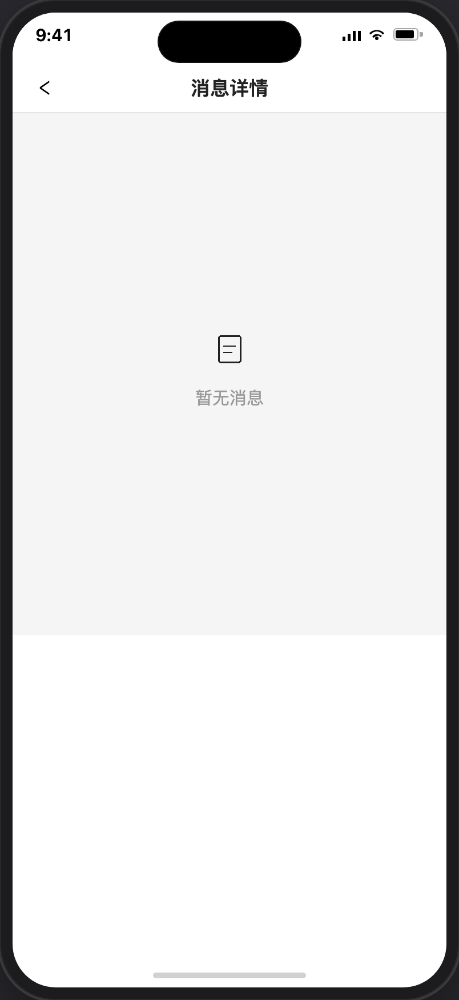

# 消息详情

> 产品说明 · 微信小程序系统消息  
> 状态：已实现 · 见 §6 验收要点  
> 最后更新：2026-07-17  
> 预览地址：[http://127.0.0.1:8765/miniprogram/message-detail.html](http://127.0.0.1:8765/miniprogram/message-detail.html)  
> **协作提示**：桌面打开预览时，手机模型右侧会同步展示本文档（预览中不展示「§6 规则补充与验收要点」）；改文档后请运行 `python3 preview/build-pages.py` 再刷新。

---

## 1. 页面业务目标

1.1、无消息：展示空态页面**系统消息**

1.2、有消息：展示**系统消息，包含** 4 类：课程申请成功、认证英雄成功、认证英雄驳回、英雄身份被禁用

---

## 2. 登录和身份描述

| 身份  | 用户大概情况        | 页面上多出来 / 不一样的地方 |
| --- | ------------- | --------------- |
| 已登录 | 消息中心点「系统消息提醒」 | 系统消息列表或空态       |
| 无消息 | 尚无系统消息        | 「暂无消息」          |

---

## 3. 页面详细描述

导航栏标题：**消息详情**；返回 [消息中心](./消息.md)。

### 3.1 有消息

每条消息卡片展示：标题 + 时间 + 正文。

| 展示内容    | 触发节点                                                          | 接收对象                  | 消息内容                                                                    |
| ------- | ------------------------------------------------------------- | --------------------- | ----------------------------------------------------------------------- |
| 您的赛事已上架 | 场景：B端直接去创建赛事关联此英雄 后台成功发布赛事时、或成功公开时                            | 赛事所关联的英雄（注意不推送给已报名的人） | 固定文案+动态获取赛事名称： 您的赛事《我是赛事名称》已开始招募，可前往我的>服务中心中（我的招募）中查看。                  |
| 您的赛事已下架 | 成功取消发布时、成功隐藏时、成功删除时 （额外说明：若赛事存在已报名人员后台无法删除） | 赛事所关联的英雄（注意不推送给已报名的人） | 1、取消发布、隐藏、删除在 C 端统一用标题「您的赛事已下架」 2、固定文案+动态获取赛事名称：您的赛事《我是赛事名称》已下架，无法继续招募。 |
| 您的活动已上架 | 场景：B端直接去创建活动关联此英雄 后台成功发布活动时、或成功公开时                            | 活动所关联的英雄（注意不推送给已报名的人） | 固定文案+动态获取活动名称： 您的活动《我是活动名称》已开始报名，可前往我的>服务中心中（我的招募）中查看。                  |
| 您的活动已下架 | 成功取消发布时、成功隐藏时、成功删除时 （额外说明：若课程存在已报名人员后台无法删除） | 活动所关联的英雄（注意不推送给已报名的人） | 1、取消发布、隐藏、删除在 C 端统一用标题「您的活动已下架」 2、固定文案+动态获取活动名称：您的活动《我是活动名称》已下架，无法继续报名。 |
| 您的课程已上架 | 场景 1：英雄C端申请，B端去创建课程关联此英雄 场景 2：B端直接去创建课程关联此英雄 后台成功发布课程时、或成功公开时 | 课程所关联的英雄（注意不推送给已报名的人） | 固定文案+动态获取课程名称： 您有一门课程《我是课程名称》已上架，可前往我的>服务中心中（我的课程）中查看。 |
| 您的课程已下架 | 成功取消发布时、成功隐藏时、成功删除时 （额外说明：若课程存在已报名人员后台无法删除）                   | 课程所关联的英雄（注意不推送给已报名的人） | 取消发布、隐藏、删除在 C 端统一用标题「您的课程已下架」 固定文案+动态获取课程名称：您有一门课程《我是课程名称》已下架，无法继续报名。   |
| 认证英雄成功  | 后台审核成功成功通过时                                                   |                       | 固定文案：恭喜您完成英雄认证，已成功加入英雄广场，即刻发布赛事招募与课程，开启您的英雄之旅吧                          |
| 认证英雄驳回  | 后台成功驳回时                                                       |                       | 正文取后台驳回原因（后台必填，无兜底文案）                                                   |
| 英雄身份被禁用 | 后台成功禁用时                                                       |                       | 正文取后台禁用原因；无原因时兜底文案：「您的英雄身份不可用，具体原因可联系客服处理」                              |

### 3.2 空态

无系统消息时：居中空态图标 + 文案「暂无消息」。

---

## 4. 常见路径

- **进入：** [消息中心](./消息.md) → 系统消息提醒 → 本页
- **返回：** 顶栏返回 → 消息中心

---

## 5. 相关页面

| 关系  | 页面            | 何时        |
| --- | ------------- | --------- |
| 入口  | [消息](./消息.md) | 点「系统消息提醒」 |

---

## 6. 规则补充与验收要点

| 结论     | 说明                                      |
| ------ | --------------------------------------- |
| 入口唯一本期 | 仅系统消息提醒进入本页                             |
| 驳回正文   | 取后台 `reject_reason`（必填）；预览无数据时用 mock 文案 |
| 禁用正文   | 取后台 `disable_reason`，与个人中心禁用弹窗同源        |
| 列表只读   | 本期不可点进更深层、无删除                           |
| 空态     | 无数据时：空态图标 +「暂无消息」                       |

---

## 7. 变更记录

| 日期         | 改了什么                                 |
| ---------- | ------------------------------------ |
| 2026-07-17 | 预览/小程序 mock 新增 §3.1 前 6 行（赛事/活动/课程上下架），保留原有认证等条目 |
| 2026-07-17 | §3.1 有消息表改为四列：展示内容、触发节点、接收对象、消息内容    |
| 2026-07-17 | 「课程申请成功」正文改为：您有一门课程《我是课程名称》已上架…      |
| 2026-07-17 | 标题去掉「通知」：认证英雄驳回、英雄身份被禁用              |
| 2026-07-17 | 空态改为图标+「暂无消息」，截图写入需求预览               |
| 2026-07-17 | 置顶增加「课程申请成功」演示消息                     |
| 2026-07-17 | 首条标题改为「认证英雄成功」（去掉「通知」）               |
| 2026-07-17 | 驳回通知去掉产品兜底；预览无数据用 mock「我是后台驳回时填写的内容」 |
| 2026-07-17 | 增加「英雄身份被禁用通知」，正文取后台禁用原因              |
| 2026-07-17 | 首条标题改为「认证英雄成功通知」                     |
| 2026-07-17 | 第二条改为「认证英雄驳回通知」，正文取后台驳回原因            |
| 2026-07-17 | 初稿：系统消息列表页；消息中心「系统消息提醒」跳转本页          |

