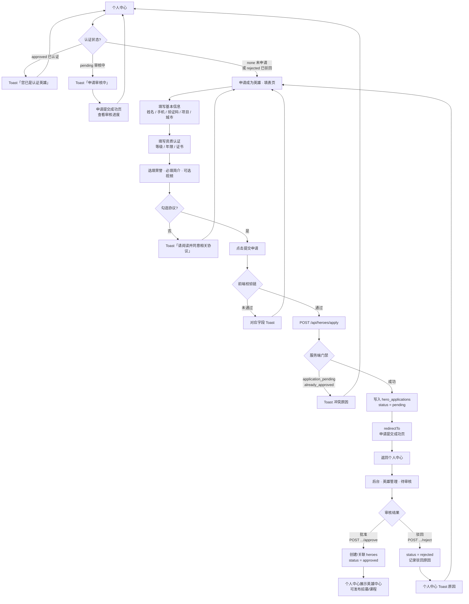
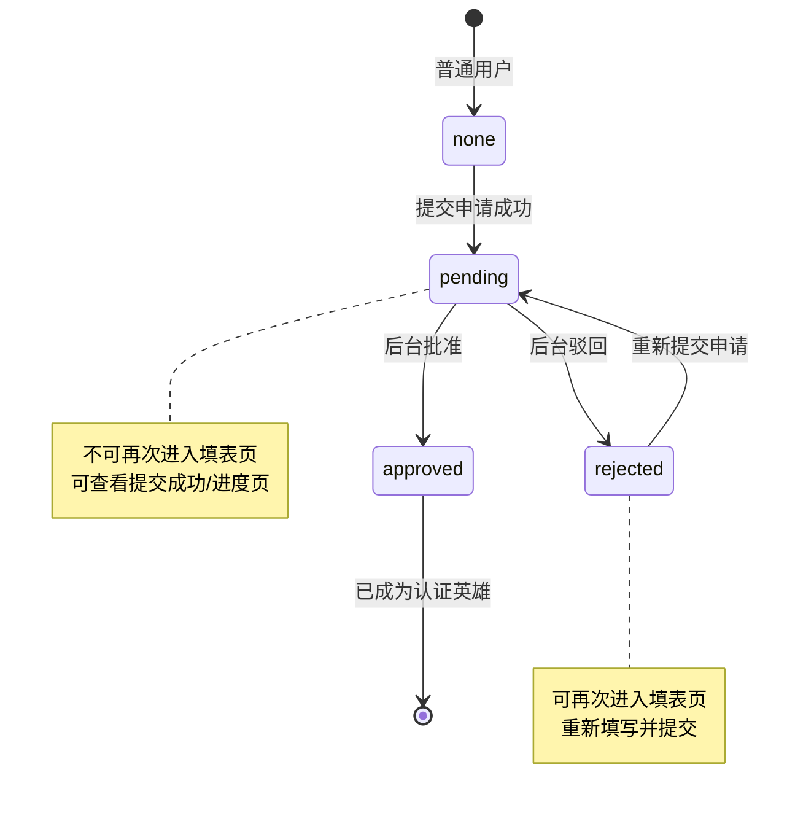

# 申请成为英雄

> 单页需求文档 · 英雄广场微信小程序  
> 状态：已实现 · P0 · M1  
> 最后更新：2026-07-10  
> 源码：`miniprogram/pages/hero-apply/` · 预览：`preview/miniprogram/hero-apply.html`

---

## 1. 页面概述

| 项 | 值 |
|---|---|
| 页面名称 | 申请成为英雄（英雄教练认证） |
| 路由 | `pages/hero-apply/hero-apply` |
| 导航栏标题 | **申请成为英雄** |
| 导航类型 | 子页；底部固定提交栏 |
| 页面参数 | 无 |
| 目标用户 | 未认证、非审核中、希望成为「英雄教练」的普通用户 |
| 设计规范 | `DESIGN-SPEC` · 表单分区卡片、标签多选、主色提交按钮 |

---

## 2. 业务需求

### 2.1 业务目标

- 收集教练认证所需材料，写入 `hero_applications` 待审核队列
- 通过短信验证码（M1 Mock）校验手机号真实性
- 提交成功后进入 [申请提交成功](./申请提交成功.md)，不可返回重复提交

### 2.2 适用角色与权限

| 角色 | status | 可否进入 | 处理 |
|------|--------|----------|------|
| 未申请 | `none` | ✅ | — |
| 审核中 | `pending` | ❌ | Toast「申请审核中」→ 1.5s navigateBack |
| 已认证 | `approved` | ❌ | Toast「您已是认证英雄」→ navigateBack |
| 已驳回 | `rejected` | ✅ | 个人中心 Toast 原因后可进入重新填写 |

### 2.3 正常流程

未认证填表 → 协议勾选 → 提交 → `hero_applications(pending)` → 成功页；后台批准 → `heroes` + `approved`；驳回 → `rejected` + 原因。

#### 2.3.1 整体流程图



#### 2.3.2 状态流转



### 2.4 核心业务规则

1. 仅 `none` / `rejected` 可进；`pending` / `approved` 不可进（Toast 后返回）
2. 同用户已有 `pending` → 拒绝重复提交（`application_pending`）
3. 已是 `approved` → 拒绝（`already_approved`）
4. 必填：姓名、手机 `/^1\d{10}$/`、验证码 6 位、项目类型 ≥1、城市、协议、证书 ≥1
5. M1 短信 Mock，发送后 60s 倒计时
6. 批准生成 `hero_id`，同步 `mock_hero_role=approved`
7. 驳回可填原因；驳回后可重新申请
8. 预览可 `withdraw` pending 申请

### 2.5 异常与边界

- `onLoad` 未拉完 status 前不展示表单
- 删除申请若已关联英雄：删英雄并回写角色

### 2.6 待确认项

- [ ] 驳回后历史申请是否不可删
- [ ] 证书/视频是否必须真实文件（非占位）
- [ ] 正式环境手机号是否唯一

---

## 3. 页面结构与 UI 元素规格

### 3.1 信息架构

```
导航栏
scroll-view.apply-scroll
├── .apply-header（引导头图）
├── .apply-section × N（表单分区）
│   └── .apply-field × 字段
└── （滚动区结束）
.apply-footer（固定底栏）
├── .apply-agreement（协议勾选）
└── .apply-submit（提交申请）
```

---

## 4. 字段与校验矩阵

### 4.1 基本信息

| 字段 key | 标签 | 控件 | 必填 | 长度/格式 | 占位符 | 校验时机 | 错误 Toast | API 字段 |
|----------|------|------|------|-----------|--------|----------|------------|----------|
| `name` | 姓名 | `input` text | ✅ | 1–20 字；trim 非空 | 请输入 | 提交 | 请填写姓名 | `name` |
| `phone` | 手机号 | `input` number | ✅ | `/^1\d{10}$/` | 请输入 | 发码/提交 | 请填写正确的手机号 / 手机号格式不正确 | `phone` |
| `sms_code` | 验证码 | `input` number | ✅ | 6 位；等于 `_sentSmsCode` | 请输入 | 提交 | 请填写正确的验证码 | —（M1 仅前端校验） |
| `project_types` | 项目类型 | 标签多选 | ✅ | 数组长度 ≥1 | — | 提交 | 请选择项目类型 | `project_types[]` |
| `city` | 常驻城市 | `textarea` | ✅ | 1–100 字；trim 非空 | 请输入 | 提交 | 请填写城市 | `city` |

**项目类型选项**（`mock.PROJECT_TYPES` 去掉「全部」「冲浪」）：

`帆船` · `皮划艇` · `桨板` · `潜水`

| 交互 | 规则 |
|------|------|
| 点击标签 | toggle 选中；可多选 |
| 选中样式 | `.apply-tag--active` |
| 至少一项 | 提交时 `project_types.length > 0` |

**短信验证码**

| 项 | 规则 |
|----|------|
| 发送按钮文案 | 未发：`获取验证码`；已发：`重新获取验证码`；倒计时：`Ns` |
| 可点击条件 | 手机号非空且倒计时=0 |
| 发送前校验 | 手机号 `/^1\d{10}$/` |
| 发送成功 | Toast「短信验证码已发送」；展示验证码输入框；倒计时 60s |
| Mock 码 | 6 位随机数存 `_sentSmsCode`（预览固定 666666） |
| 输入框显示 | `showSmsField=true` 后展示；`maxlength=6` |

---

### 4.2 资质认证

| 字段 key | 标签 | 控件 | 必填 | 规则 | 错误 Toast | API 字段 |
|----------|------|------|------|------|------------|----------|
| `certification` | 教练资质等级 | `picker` | ✅ | 非「请选择」 | 请选择教练资质等级 | `certification` |
| `years_exp` | 从业年限 | 标签单选 | ✅ | 四选一 | 请选择从业年限 | `years_exp` |
| `certFiles` | 资质证书上传 | 图片网格 | ✅ | ≥1 张 `url` 非空；最多 5 张 | 请上传资证证书 | `certFiles[]` |

**资质等级选项**（picker index 0 为占位「请选择」）：

`国家级教练` · `省级教练` · `ACA认证` · `ISA认证` · `其他`

**从业年限选项**（单选，互斥）：

`1-3年` · `3-5年` · `5-10年` · `10年+`

**证书上传**

| 项 | 规则 |
|----|------|
| 初始槽位 | 2 个空槽「证书①」「证书②」 |
| 添加 | 点击「+ 添加更多」；`wx.chooseMedia` image；`count = 5 - 当前数` |
| 上限 | 5 张；满额隐藏添加按钮 |
| 单张大小 | M2：压缩后 ≤2MB |
| 格式 | jpg/png |

---

### 4.3 荣誉与成就（选填）

| 字段 key | 标签 | 控件 | 必填 | 长度 | 占位符 | API 字段 |
|----------|------|------|------|------|--------|----------|
| `honors` | 曾获荣誉 | `textarea` | ❌ | ≤200 | 填写赛事获奖、执教荣誉等 | `honors` |

---

### 4.4 个人简介

| 字段 key | 标签 | 控件 | 必填 | 长度 | 占位符 | 错误 Toast | API 字段 |
|----------|------|------|------|------|--------|------------|----------|
| `bio` | 详细介绍 | `textarea` | ✅ | ≤500；trim 非空 | 介绍执教经历、教学风格与擅长方向 | 请填写详细介绍 | `bio` |
| `videoPath` | 个人展示视频 | 上传区 | ❌ | 时长 ≤30s | 点击上传/拍摄视频介绍（建议30秒以内） | — | `videoPath` |

**视频上传**

| 项 | 规则 |
|----|------|
| API | `wx.chooseMedia` video，`maxDuration: 30` |
| 已选展示 | 「已选择视频，点击重新上传」 |
| M1 | 本地 temp 路径，不上传 OSS |

---

### 4.5 协议与提交

| 元素 | 类型 | 必填 | 规则 | 错误 Toast |
|------|------|------|------|------------|
| `agreed` | checkbox 自定义 | ✅ | 必须为 true | 请阅读并同意相关协议（2s） |
| 协议链接 | 文本链 | — | 点击 Toast Mock 协议详情 | — |
| 提交按钮 | 按钮 | — | 见 §4.6 | — |

**协议文案（精确）**

「我已阅读并同意《英雄认证协议》《平台服务条款》和《安全保障须知》，承诺以上信息真实有效。」

---

### 4.6 提交前全局校验顺序

| 顺序 | 校验项 | 失败 Toast |
|------|--------|------------|
| 1 | `name` trim 非空 | 请填写姓名 |
| 2 | `phone` 11 位 1 开头 | 请填写正确的手机号 |
| 3 | `sms_code` 与 `_sentSmsCode` 一致 | 请填写正确的验证码 |
| 4 | `project_types.length ≥ 1` | 请选择项目类型 |
| 5 | `city` trim 非空 | 请填写城市 |
| 6 | `certification` 已选 | 请选择教练资质等级 |
| 7 | `years_exp` 已选 | 请选择从业年限 |
| 8 | 至少一张证书有 url | 请上传资证证书 |
| 9 | `bio` trim 非空 | 请填写详细介绍 |
| 10 | `agreed === true` | 请阅读并同意相关协议 |

全部通过后组装 `application` 对象并 `POST /api/heroes/apply`。

### 4.7 提交 payload 示例

```json
{
  "name": "张三",
  "phone": "13800138000",
  "project_types": ["帆船", "桨板"],
  "city": "三亚",
  "certification": "ACA认证",
  "years_exp": "5-10年",
  "honors": "2024 城市帆船赛裁判",
  "bio": "十年帆船教学经验……",
  "certFiles": [
    { "id": "1", "label": "证书①", "url": "wxfile://…" }
  ],
  "videoPath": "",
  "submitted_at": "2026-07-07T12:00:00.000Z"
}
```

---

## 5. 交互需求

| 序号 | 操作 | 行为 | 反馈 |
|------|------|------|------|
| 1 | 获取验证码 | 校验手机号 → 生成 Mock 码 → 倒计时 | Toast 已发送 |
| 2 | 切换项目标签 | toggle 多选 | 视觉 active |
| 3 | 选择年限 | 单选互斥 | active |
| 4 | 添加证书 | chooseMedia | 缩略图 |
| 5 | 上传视频 | chooseMedia video | 文案变更 |
| 6 | 勾选协议 | toggle agreed | 勾选框动画 |
| 7 | 提交申请 | 校验链 → POST | success: redirectTo 提交成功页 |
| 8 | 返回 ‹ | navigateBack | 回个人中心栈 |

---

## 6. 加载与刷新机制

| 时机 | 行为 |
|------|------|
| `onLoad` | GET status 门禁 → 通过则 `initMockForm` |
| `onUnload` | 清除短信倒计时 timer |
| 提交成功 | `redirectTo` hero-apply-submitted；**不** navigateBack 到 profile |
| 草稿 | M2 规划本地草稿恢复 |

---

## 7. 性能要求

| 项 | 要求 |
|----|------|
| 表单 setData | 字段级 `form.xxx` 更新 |
| 证书图 | 选图后压缩；网格最多 5 张 |
| 滚动 | scroll-view 独立滚动，footer 固定 |
| 短信 timer | 页面卸载必须 clearInterval |

---

## 8. 相关页面

| 方向 | 页面 | 方式 |
|------|------|------|
| 入口 | [个人中心](./个人中心.md) | navigateTo |
| 出口 | [申请提交成功](./申请提交成功.md) | redirectTo（提交成功） |
| 出口 | [个人中心](./个人中心.md) | navigateBack（放弃填写） |

---

## 9. 接口与数据

| 接口 | 方法 | 说明 |
|------|------|------|
| `/api/heroes/apply/status` | GET | onLoad 门禁 |
| `/api/heroes/apply` | POST | 提交；冲突：`application_pending` / `already_approved` |

---

## 10. 变更记录

| 日期 | 变更 |
|------|------|
| 2026-07-10 | 补充「申请成为英雄」整体流程图与状态流转图（§2.3） |
| 2026-07-07 | 重写：全字段校验矩阵、短信/证书/视频规则 |
| 2026-07-06 | 对接本地 API |
| 2026-07-03 | 初稿 |
