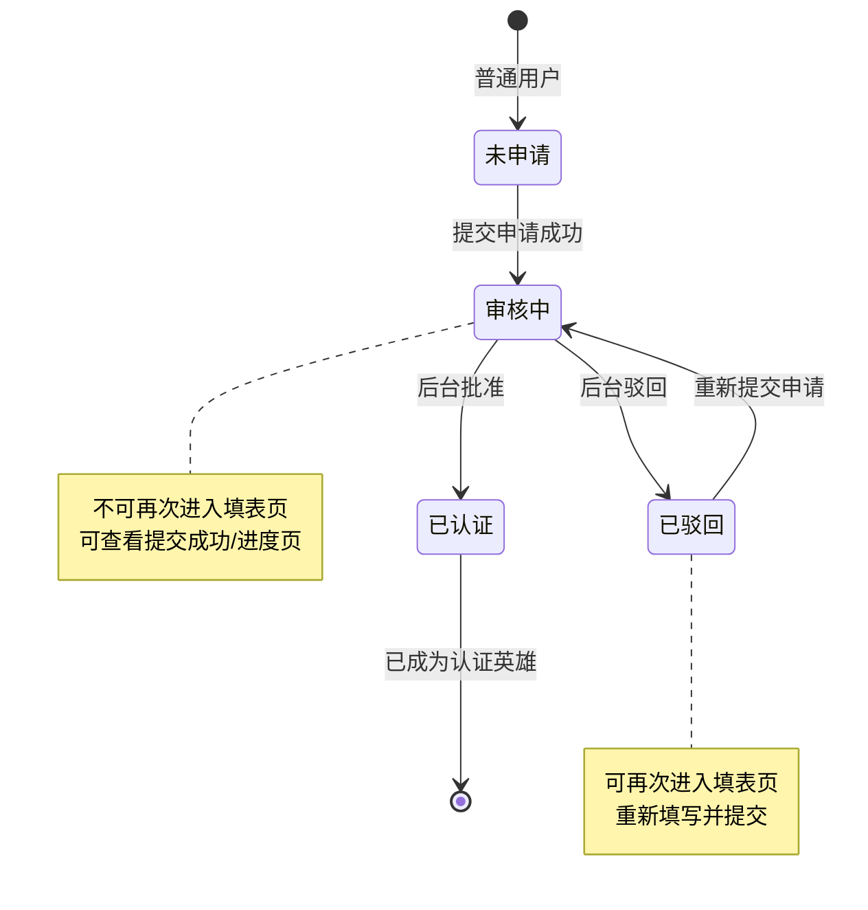

# 申请成为英雄

> 产品说明 · 微信小程序子页（英雄教练认证表单）  
> 状态：已实现 · 见 §6 规则补充与验收要点  
> 最后更新：2026-07-15  
> 预览地址：[http://127.0.0.1:8765/miniprogram/hero-apply.html](http://127.0.0.1:8765/miniprogram/hero-apply.html)  
> **协作提示**：桌面打开预览时，手机模型右侧会同步展示本文档（预览中不展示「§6 规则补充与验收要点」）；改文档后请运行 `python3 preview/build-pages.py` 再刷新。

---

## 1. 页面业务目标

「申请成为英雄」是用户填写**英雄教练认证材料**的表单页。

主要解决三件事：

1. **收集认证信息**：昵称、手机、身份、项目类型、资质证书、简介等
2. **检查填写并提交申请**：勾选协议后提交，进入平台待审核队列
3. **支持修改资料**：已认证英雄从个人中心「修改资料」进入时，走同一表单；提交后走资料变更审核

---

## 2. 登录和身份描述

| 身份  | 用户大概情况  | 能否进入                 | 页面上 / 行为上的差异                       |
| --- | ------- | -------------------- | ---------------------------------- |
| 未申请 | 还没提交过认证 | ✅ 申请模式               | 空白表单，底部「提交申请」                      |
| 已驳回 | 申请被平台驳回 | ✅ 申请模式               | 个人中心先看驳回原因后可重新填写                   |
| 审核中 | 申请待平台处理 | ❌                    | 页面提示「申请审核中」→ 约 1.5 秒后返回上一页         |
| 已认证 | 已是英雄    | ❌ 申请模式 / ✅ 从「修改资料」进入 | 申请模式提示「您已是认证英雄」；修改资料模式回填已通过资料或待审内容 |
| 未登录 | 尚未授权    | 需先授权                 | 从个人中心点「申请成为英雄」会先走手机号授权             |

**从「修改资料」进入时的补充说明**

- 对外展示的正式资料仍是已通过版本，后台审核通过后才更新
- 同一英雄最多一条资料变更待审；再次提交会覆盖上一条
- 有待审时，表单回填最新提交内容（缺的项用已通过资料补齐）；无待审则回填已通过资料

---

## 3. 页面详细描述

页面打开后直接进入表单，**不再展示**顶部「认证成为英雄教练」引导区块。

### 3.1 基本信息

| 展示内容 | 说明                                                                                                    |
| ---- | ----------------------------------------------------------------------------------------------------- |
| 昵称   | 必填，1–10 个字，支持中、英文，不要过滤空格                                                                              |
| 手机号  | 必填，11 位；旁侧「获取验证码」默认置灰，手机号输入框出现字符后，「获取验证码」变为可点击状态。                                                     |
| 验证码  | 发送短信后显示；6 位                                                                                           |
| 姓名   | 必填，1–10 个字，支持中、英文，不要过滤空格                                                                              |
| 证件类型 | 必填，底部单选；选项：身份证 / 护照 / 港澳居民居住证 / 港澳居民来往内地通行证 / 台湾居民来往大陆通行证 / 台湾居民居住证 / 外国人永久居留身份证 / 外国人居留许可证；默认选中「身份证」 |
| 证件号码 | 必填，输入中明文显示即可；证件类型为「身份证」时按 18 位含校验位校验                                                                  |
| 银行账户 | 选填，输入中明文显示即可                                                                                        |
| 项目类型 | 1、必填，底部面板多选，最多 3 个（选项来自后台「管理项目类型」），≥3 个时再次点击提示：最多可选 3 个 2、选中某一类型，在提交申请时若已选类型不存在，提示：当前所选项目类型不存在，请重新选择  |
| 收货地址 | 选填，多行文本最多 100 个字符，超出后无法键入                                                                             |

### 3.2 资质认证

| 展示内容   | 说明                                                                                                                                                                                                          |
| ------ | ----------------------------------------------------------------------------------------------------------------------------------------------------------------------------------------------------------- |
| 教练资质等级 | 1、必填，底部选择：国家级教练 / 省级教练 / ACA认证 / ISA认证 / 其他（选项以后台资质列表为准，系统默认含「其他」） 2、点「其他」弹出对话框「自定义教练资质等级」，单行输入；操作「取消」「确定」 3、确定时若名称与已有资质等级重名，页面提示「当前资质等级名称已存在，不可重复」；通过后展示自定义名称 4、选中某一选项，在提交申请时若已选选项不存在，提示：当前所选资质等级不存在，请重新选择 |
| 经验年限   | 1、必填，四选一：1年以内 /1-3年 / 3-5年 / 5-10年 / 10-15年 / 15年+ 2、前台写死 3、无默认选中项 4、选中某一选项，在提交申请时若已选选项不存在，提示：当前所选经验年限不存在，请重新选择                                                                                             |
| 资质证书   | 1、必填至少 1 张、最多 10 张；每次从相册单选 1 张 2、选图后弹窗「命名证书」必填名称（最多 15 字），确认后进列表；取消则丢弃本次图片 3、列表为竖排：左缩略图、右可改名称、删除；满 10 张隐藏添加入口 4、已上传图片不支持点开看大图 |

### 3.3 个人简介

| 展示内容 | 说明                                                                                                  |
| ---- | --------------------------------------------------------------------------------------------------- |
| 详细介绍 | 1、必填，最多 500 字 2、默认文案：请输入个人详细介绍，如教学风格，擅长方向 3、输入框的右下角为当前已输入字符数量/可输入字符总量，显示示例：0/500 4、输入框的高度跟随输入的内容自适应 |
| 个人展示 | 1、固定一个栏目 2、介绍文本必填，最多 300 字，字数显示在输入框右下角（白底实线输入区） 3、入口文案「上传图片/视频」；点击后底部弹出「上传图片」「上传视频」「取消」；已上传图片后入口文案变为「上传图片」；上传视频后入口消失，视频铺满媒体区且右下角显示时长；图片最多 9 张，或视频仅 1 个（选视频会替换已有图片）；媒体区为白底虚线框，与文本区视觉区分 4、媒体区外左下角说明：「若上传视频，建议使用5分钟以内的视频」 |

### 3.4 底部固定栏

| 元素   | 说明                                                                     |
| ---- | ---------------------------------------------------------------------- |
| 协议勾选 | 「我已阅读并同意《英雄认证协议》《平台服务条款》和《安全保障须知》，承诺以上信息真实有效。」                         |
| 提交按钮 | 1、申请模式：「提交申请」 2、提交时校验是否必填、已填是否格式正确，以及姓名和证件号码需实名校验 3、从「修改资料」进入：「提交资料变更」 |

填写检查未通过时对应字段给出页面提示；全部通过后提交，成功则打开 [申请提交成功](./申请提交成功.md) 并替换当前页（不可返回重复提交）。

注：首次提交申请成为英雄，再提交后不支持撤回申请。只有在C端修改资料提交后可以支持撤回。

---

## 4. 常见路径

- **首次申请：** 个人中心 → 申请成为英雄 → 填表 → 勾选协议 → 提交 → 申请提交成功页
- **英雄详情申请：** 英雄详情 → 申请成为英雄 → 填表 → 提交 → 申请提交成功页 → 返回原英雄详情
- **审核中被拦：** 个人中心点申请 → 页面提示「申请审核中」→ 可去 [申请提交成功](./申请提交成功.md) 查看进度
- **驳回再申请：** 个人中心查看原因 → 重新进入填表 → 再提交
- **已认证改资料：** 个人中心「修改资料」→ 本页（修改资料模式）→ 提交 → 资料变更待审（对外资料暂不更新）
- **后台审核通过：** 创建/关联英雄身份 → 个人中心变为已认证 → 可发布招募/课程

#### 状态流转

---

## 5. 相关页面

| 关系  | 页面                                | 何时                  |
| --- | --------------------------------- | ------------------- |
| 入口  | [个人中心](./个人中心.md)                 | 「申请成为英雄」或「修改资料」     |
| 入口  | [英雄详情](./英雄详情.md)                 | 底栏点击「申请成为英雄」         |
| 出口  | [申请提交成功](./申请提交成功.md)             | 提交申请成功（打开成功页并替换当前页） |
| 出口  | [个人中心](./个人中心.md)                 | 放弃填写返回              |
| 通过后 | [认证成功](./认证成功.md)                 | 审核通过后从个人中心进入        |
| 后台  | [供方列表](../../admin/pages/供方列表.md) | 平台审核待审申请            |

---

## 6. 规则补充与验收要点

### 6.1 谁能进、谁不能进

| 规则     | 说明                             |
| ------ | ------------------------------ |
| **允许** | 未申请、已驳回用户进入申请模式填表              |
| **允许** | 已认证用户从个人中心「修改资料」进入修改资料模式       |
| **禁止** | 审核中用户进入填表页；提示「申请审核中」后约 1.5 秒返回 |
| **禁止** | 已认证用户以申请模式进入；提示「您已是认证英雄」       |
| **禁止** | 审核中重复提交；提示已有申请在处理中             |
| **要求** | 页面加载完成认证状态前，不展示表单内容            |

### 6.2 各字段填写规则（要填什么、怎么选、错了提示什么）

#### 基本信息

| 要填什么 | 是否必填 | 怎么填 / 怎么选                                                                       | 填错或未填时的提示                                                          |
| ---- | ---- | ------------------------------------------------------------------------------- | ------------------------------------------------------------------ |
| 昵称   | 必填   | 文本输入，1–10 字，支持中、英文，不要过滤空格                                                       | 「请填写昵称」                                                            |
| 手机号  | 必填   | 11 位数字，以 1 开头                                                                   | 「请填写正确的手机号」或「手机号格式不正确」                                             |
| 验证码  | 必填   | 点击「获取验证码」收短信后填写 6 位数字；发送后 60 秒内按钮显示倒计时                                          | 未填或填错：「请填写正确的验证码」；发送成功提示：「短信验证码已发送」                                |
| 姓名   | 必填   | 文本输入，1–10 字，支持中、英文，不要过滤空格                                                       | 「请填写姓名」                                                            |
| 证件类型 | 必填   | 底部单选，默认「身份证」；选项见 §3.1                                                           | 「请选择证件类型」                                                          |
| 证件号码 | 必填   | 文本输入，输入中明文显示即可；证件类型为「身份证」时须为合法 18 位（含校验位）                                       | 「请填写证件号码」                                                          |
| 银行账户 | 选填   | 文本输入，输入中明文显示即可                                                                  | —                                                                  |
| 项目类型 | 必填   | 点击展开底部面板，多选，最多 3 个；选项来自后台「管理项目类型」，按创建时间倒序；字典为空时用默认：帆船 / 皮划艇 / 桨板 / 潜水 / 冲浪 / 游艇 | 未选：「请选择项目类型」；超过 3 个：「项目类型最多选择3个」；提交时已选类型不在当前列表：「当前所选项目类型不存在，请重新选择」 |
| 收货地址 | 选填   | 多行文本，最多 100 字                                                                   | —                                                                  |

**项目类型面板**

- 面板标题：「选择项目类型（最多3个）」
- 已选中项：主色文字加粗 + 浅蓝底 + 右侧「✓」，与未选项区分明确
- 已选项在触发器上以顿号拼接展示；未选时显示「请选择」
- 点击「完成」或遮罩收起面板

**短信验证码按钮**

- 未发送：「获取验证码」
- 已发送：「重新获取验证码」
- 倒计时中：显示「Ns」（N 为剩余秒数）
- 手机号为空或倒计时未结束时不可点击

#### 资质认证

| 要填什么   | 是否必填 | 怎么填 / 怎么选                                                                                                | 填错或未填时的提示                                                                   |
| ------ | ---- | -------------------------------------------------------------------------------------------------------- | --------------------------------------------------------------------------- |
| 教练资质等级 | 必填   | 底部选择：国家级教练 / 省级教练 / ACA认证 / ISA认证 / 其他。点「其他」→ 对话框「自定义教练资质等级」单行输入，取消 / 确定；确定时与已有等级重名则提示「当前资质等级名称已存在，不可重复」 | 「请选择教练资质等级」；空自定义名「请输入教练资质等级」；重名见左；提交时已选等级不在当前列表且非自定义成功值：「当前所选资质等级不存在，请重新选择」 |
| 经验年限   | 必填   | 标签单选，四选一：1-3年 / 3-5年 / 5-10年 / 10年+                                                                      | 「请选择经验年限」；提交时已选不在四选一：「当前所选经验年限不存在，请重新选择」                                    |
| 资质证书   | 必填   | 每次相册单选 1 张，最多 10 张；选图后弹窗命名（必填，最多 15 字）；列表竖排可改名/删除；不支持点开大图                                      | 「请上传资证证书」；名称为空：「请填写证书名称」；满额：「最多上传10张证书」                          |

#### 个人简介

| 要填什么 | 是否必填 | 怎么填 / 怎么选                                                                                    | 填错或未填时的提示              |
| ---- | ---- | -------------------------------------------------------------------------------------------- | ---------------------- |
| 详细介绍 | 必填   | 多行文本，最多 500 字；占位提示「请输入个人详细介绍，如教学风格，擅长方向」；右下角显示当前字数/500；输入框高度随内容自适应                           | 「请填写详细介绍」              |
| 个人展示 | 必填   | 介绍文本最多 300 字；入口「上传图片/视频」→ 底部选「上传图片」或「上传视频」；有图后入口变为「上传图片」；有视频后入口消失并铺满显示（右下角时长）；图片最多 9 张，或视频 1 个 | 缺介绍或媒体：「请完善个人展示栏目」 |

#### 协议与提交

| 元素   | 是否必填 | 规则                                                            | 未满足时的提示             |
| ---- | ---- | ------------------------------------------------------------- | ------------------- |
| 协议勾选 | 必填   | 须勾选后才能提交                                                      | 「请阅读并同意相关协议」（约 2 秒） |
| 协议链接 | —    | 点击可查看协议详情（预览中为模拟展示）                                           | —                   |
| 提交按钮 | —    | 申请模式文案「提交申请」；修改资料模式文案「提交资料变更」；提交时校验必填、格式、实名校验（姓名+18 位身份证含校验位） | —                   |

**协议文案（精确，不可改字）：**  
「我已阅读并同意《英雄认证协议》《平台服务条款》和《安全保障须知》，承诺以上信息真实有效。」

**实名校验：** 姓名与证件号码均填写；证件类型为「身份证」时还须为合法 18 位（含校验位）。未通过提示「实名校验未通过，请核对姓名与身份证号」（身份证）或「实名校验未通过，请核对姓名与证件号码」。

**提交前填写检查顺序：** 昵称 → 手机号 → 验证码 → 姓名 → 证件类型 → 证件号码 → 实名校验 → 项目类型 → 教练资质等级 → 经验年限 → 资质证书 → 详细介绍 → 个人展示栏目 → 协议勾选。任一项不通过则停留在当前页并给出对应提示。

### 6.3 修改资料模式专项规则

| 规则       | 说明                           |
| -------- | ---------------------------- |
| **允许**   | 已认证英雄从个人中心「修改资料」进入，表单回填已通过资料 |
| **允许**   | 有待审资料变更时，表单回填最新提交内容          |
| **规则**   | 对外展示的资料须等后台审核通过后才更新          |
| **规则**   | 同一英雄同时最多一条资料变更待审；再次提交覆盖上一条   |
| **后台要做** | 在供方列表处理资料变更待审；通过后更新对外英雄资料    |

### 6.4 后台与平台侧要做的事

| 场景         | 后台要做什么                 |
| ---------- | ---------------------- |
| 用户提交申请     | 在「英雄管理 · 待审核」收到新申请     |
| 审核批准       | 创建或关联英雄身份；用户个人中心变为已认证  |
| 审核驳回       | 填写驳回原因；用户可在个人中心查看并重新申请 |
| 删除供方       | 同步回写小程序认证状态为未认证        |
| 删除已关联英雄的申请 | 同步删除英雄并回写用户角色          |
| 预览环境       | 支持撤回审核中的申请（便于测试）       |

### 6.5 已对齐 / 待确认

**已对齐（可验收）**

- 全字段填写检查与提示文案
- 银行账户选填、昵称/姓名 10 字、地址 100 字
- 提交时项目类型/资质等级/经验年限失效校验
- 姓名+身份证实名校验（18 位含校验位）
- 个人展示固定单栏目（介绍+媒体必填）
- 详细介绍字数统计 0/500、输入框自适应高度
- 短信验证码发送与 60 秒倒计时（预览环境固定验证码 666666）
- 项目类型多选最多 3 个
- 证书 1–10 张、每张必填名称（最多 15 字）、展示视频最长 30 秒
- 提交成功后打开成功页并替换当前页
- 修改资料模式待审回填与覆盖提交

**待确认**

- 驳回后历史申请是否不可删
- 证书/视频是否必须真实文件（非占位图）
- 正式环境手机号是否唯一

---

## 7. 变更记录

| 日期         | 改了什么                                         |
| ---------- | -------------------------------------------- |
| 2026-07-15 | 资质认证：文案「从业年限」改为「经验年限」 |
| 2026-07-15 | 个人展示媒体区外左下角增加说明：建议使用5分钟以内的视频 |
| 2026-07-15 | 个人展示：有图后入口改为「上传图片」；上传视频后入口消失，视频铺满媒体区并显示时长 |
| 2026-07-15 | 个人展示入口改为「上传图片/视频」，底部选项：上传图片 / 上传视频 / 取消 |
| 2026-07-15 | 个人展示：文本框与上传媒体区分开（白底实线 / 白底虚线） |
| 2026-07-15 | 项目类型面板：选中态改为浅蓝底 + 右侧「✓」，更易辨认 |
| 2026-07-15 | 个人展示：介绍限 300 字；媒体统一上传入口（图≤9 / 视频 1） |
| 2026-07-15 | 详细介绍字数统计移入输入框右下角                           |
| 2026-07-15 | 去掉个人展示「增加栏目」，仅保留默认单栏目                      |
| 2026-07-15 | 资质证书改为竖排命名：上传弹窗命名 + 列表改名；最多 10 张、名称 15 字    |
| 2026-07-15 | 「银行账户」改为选填                                   |
| 2026-07-14 | 「身份证号」文案改为「证件号码」                             |
| 2026-07-14 | 基本信息新增「证件类型」可选，默认身份证                         |
| 2026-07-14 | 去掉 §4 整体流程图（保留常见路径文字与状态流转图）                  |
| 2026-07-14 | 表格说明中 1、2、3 分点换行，预览面板同步换行展示                  |
| 2026-07-14 | 按文档查缺补漏：银行账户、实名校验、展示栏目、提交失效校验等；流程图同步         |
| 2026-07-14 | 点「其他」可自定义教练资质等级；重名提示「当前资质等级名称已存在，不可重复」       |
| 2026-07-14 | 个人展示改为支持从相册选择图片或视频                           |
| 2026-07-14 | 去掉顶部「认证成为英雄教练」引导区块                           |
| 2026-07-14 | 全文改为产品可读中文                                   |
| 2026-07-14 | 按个人中心格式改写；保留流程图                              |
| 2026-07-13 | 待审期间修改资料回填最新提交；二次提交覆盖同一 pending；通过后才写 heroes |
| 2026-07-13 | 支持从「修改资料」进入：修改资料同表单，提交资料变更                   |
| 2026-07-13 | 项目类型改回下拉样式：底部面板多选，最多 3 个                     |
| 2026-07-13 | 项目类型改为标签多选，最多 3 个                            |
| 2026-07-13 | 后台删除供方后回写小程序认证状态为未认证                         |
| 2026-07-13 | 去掉「荣誉与成就」整块                                  |
| 2026-07-13 | 项目类型选项改为读取后台「管理项目类型」字典（创建时间倒序）；后台供方姓名改为必填    |
| 2026-07-13 | 去掉常驻城市；姓名移至手机号下方并改回必填                        |
| 2026-07-13 | 基本信息：新增昵称/身份证号必填、收货地址选填；姓名改为选填；项目类型改为下拉单选    |
| 2026-07-10 | 补充「申请成为英雄」整体流程图与状态流转图（§4）                    |
| 2026-07-07 | 重写：全字段校验矩阵、短信/证书/视频规则                        |
| 2026-07-06 | 对接本地 API                                     |
| 2026-07-03 | 初稿                                           |

