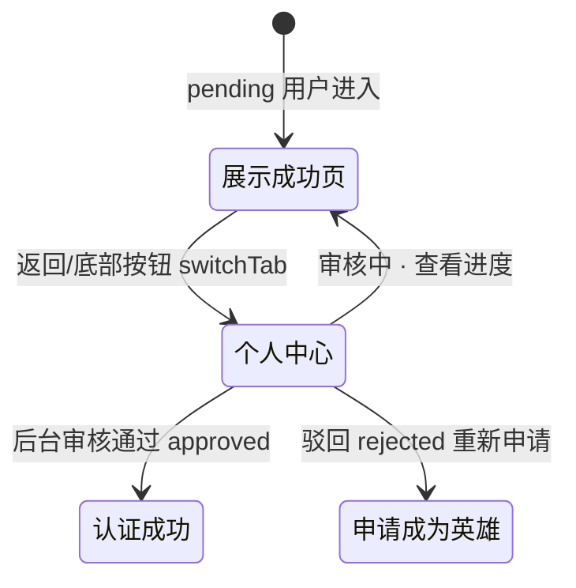

# 申请提交成功

> 单页需求文档 · 英雄广场微信小程序  
> 状态：已实现 · P0 · M1  
> 最后更新：2026-07-10  
> 源码：`miniprogram/pages/hero-apply-submitted/` · 预览：`preview/miniprogram/hero-apply-submitted.html`

---

## 1. 页面概述

| 项 | 值 |
|---|---|
| 页面名称 | 申请提交成功（审核等待页） |
| 路由 | `pages/hero-apply-submitted/hero-apply-submitted` |
| 导航栏标题 | **提交成功**（`navigationBarTitleText`） |
| 导航类型 | 子页；**无 TabBar** |
| 页面参数 | 无（不通过 URL 传递申请 id，状态以服务端为准） |
| 目标用户 | 已成功提交英雄认证申请、处于 `pending` 审核态的用户 |
| 设计规范 | `DESIGN-SPEC` · 成功态卡片 + 主色/强调色 CTA |

---

## 2. 业务需求

### 2.1 业务目标

- **确认提交结果**：让用户明确知道表单已送达，而非「还在编辑」
- **设定审核预期**：告知 1–3 个工作日审核周期，降低重复咨询
- **防止重复提交**：通过 `redirectTo` 替换表单页，且返回固定去个人中心
- **闭环后台审核**：与 `hero_applications.status=pending` 及后台「英雄管理 · 待审核」列表一致

### 2.2 适用角色与权限

| 角色 | `mock_hero_role` / API status | 可否进入本页 | 不可进入时的处理 |
|------|------------------------------|--------------|------------------|
| 未申请 | `none` | ❌ 不应直达 | 个人中心走 [申请成为英雄](./申请成为英雄.md) |
| 审核中 | `pending` | ✅ 主场景 | — |
| 已驳回 | `rejected` | ❌ | 个人中心 Toast 驳回原因 → 重新申请 |
| 已认证 | `approved` | ❌ | Toast「您已是认证英雄」→ 返回 |

### 2.3 正常流程

提交申请成功（`pending`）→ 本页展示审核说明 → 返回个人中心；不可从本页返回表单重复提交。

### 2.4 核心业务规则

1. 仅 `pending` 状态展示本页（主场景）
2. 提交成功须 `redirectTo` 进入，替换表单页，禁止返回重复提交
3. 返回统一 `switchTab` 个人中心
4. 审核中可从个人中心多次进入查看，不重复创建申请

### 2.5 异常与边界

- `none` / `rejected` / `approved` 不应直达本页

### 2.6 待确认项

- 无

### 2.7 状态机



---

## 3. 页面结构与 UI 元素规格

### 3.1 信息架构

```
mp-navbar（系统导航栏 + 预览自定义导航）
└── .apply-submitted（页面根容器）
    ├── .apply-submitted__hero（成功卡片）
    │   ├── .apply-submitted__icon-wrap
    │   │   └── .apply-submitted__icon  「✓」
    │   ├── .apply-submitted__title
    │   └── .apply-submitted__desc
    └── .apply-submitted__footer
        └── .apply-submitted__btn  「返回个人中心」
```

### 3.2 UI 元素清单

| 元素 ID | 类型 | 文案 | 样式要点 | 数据来源 | 必填 | 校验 | 交互 |
|---------|------|------|----------|----------|------|------|------|
| navbar-title | 导航标题 | 提交成功 | 系统导航栏 17px 半粗 | 静态 | — | — | — |
| navbar-back | 链接按钮 | ‹ | 左侧 40×40 热区 | 静态 | — | — | switchTab 个人中心 |
| icon-wrap | 容器 | — | 64px 圆形容器 | 静态 | — | — | 无 |
| icon | 文本 | ✓ | 28px/56rpx 粗体，主色 | 静态 | — | — | 无 |
| title | 文本 | 申请信息已提交成功 | 18px 半粗，主文本色 | 静态 | — | — | 无 |
| desc | 文本 | 预计 1-3 个工作日… | 14px 次要色，行高 1.6 | 静态 | — | — | 无 |
| btn-back | 按钮 | 返回个人中心 | 高 44px/88rpx，圆角 8px | 静态 | — | — | switchTab 个人中心 |

---

### 3.3 元素详细说明

#### 3.3.1 导航栏

| 属性 | 小程序 | 浏览器预览 |
|------|--------|------------|
| 标题文案 | `提交成功` | 同左 |
| 返回按钮 | 系统默认 ‹（无自定义 nav 时） | `.mp-navbar__back`，`data-back-fallback="profile.html"` **`data-back-target="profile.html"`** |
| 返回行为 | 需实现 `onBack` → switchTab（当前 js 仅底部按钮；**导航栏返回建议补齐**） | `preview-nav.js` 固定回 profile |
| 右侧区域 | 无 | 无 |

#### 3.3.2 成功图标区 `.apply-submitted__icon-wrap`

| 属性 | 规格 |
|------|------|
| 尺寸 | 宽×高 **64px**（小程序 **128rpx**） |
| 形状 | 正圆 `border-radius: 50%` |
| 背景 | 线性渐变 `#eef4ff → #f6f9ff` |
| 边框 | 2px（4rpx）`rgba(27, 87, 156, 0.12)` |
| 内容 | 字符 **✓**（非 SVG 图标，M2 可换 icon 组件） |
| 图标字重/色 | font-weight 700；`var(--color-primary)` #1b579c |
| 可见条件 | 始终展示 |
| 交互 | 无 |

#### 3.3.3 主标题 `.apply-submitted__title`

| 属性 | 规格 |
|------|------|
| 文案（精确） | **申请信息已提交成功** |
| 不允许变体 | 禁止使用「提交完成」「已提交」等不一致文案 |
| 字体 | 18px / `var(--text-section-title)`；font-weight 600 |
| 颜色 | `var(--color-text-primary)` #222222 |
| 对齐 | 居中 |
| 上边距 | 距图标区 16px / 32rpx |
| 换行 | 允许换行；最大视觉 2 行 |
| 数据来源 | **静态写死**，不读 API |
| 校验 | 无用户输入 |

#### 3.3.4 说明文案 `.apply-submitted__desc`

| 属性 | 规格 |
|------|------|
| 文案（精确） | **预计 1-3 个工作日完成审核，审核通过后会发送通知告知。** |
| 字体 | 14px / `var(--text-body)` |
| 颜色 | `var(--color-text-secondary)` #5c6c7a |
| 行高 | 1.6 |
| 对齐 | 居中 |
| 上边距 | 8px / 16rpx |
| 数据来源 | 静态；M2 可由运营配置 `audit_eta_copy` |
| 校验 | 无 |

#### 3.3.5 底部按钮 `.apply-submitted__btn`

| 属性 | 小程序 | 浏览器预览 |
|------|--------|------------|
| 文案（精确） | **返回个人中心** | 同左 |
| 尺寸 | 宽 100%，高 **88rpx** | 高 **44px** |
| 背景色 | `var(--color-accent)` #fecf13 | 预览 CSS 为 `var(--color-primary)` #1b579c（**待与小程序统一为 accent 金色**） |
| 文字色 | `var(--color-text-primary)` | 预览为 `#fff`（**待统一**） |
| 圆角 | `var(--radius-md)` 8px | 8px |
| 字重 | 600，15px | 同 |
| 阴影 | `0 4rpx 12rpx rgba(254,207,19,0.35)` | 预览无阴影 |
| 点击态 | opacity 0.9 | `:active` opacity 0.9 |
| 热区 | 全宽按钮，最小高度 44px 符合触控规范 | 同 |
| 行为 | `bindtap="onBackProfile"` → `wx.switchTab('/pages/profile/profile')` | `href="profile.html"` + SPA 导航 |
| 防抖 | M2：提交后 500ms 内忽略重复点击 | — |

#### 3.3.6 页面容器 `.apply-submitted`

| 属性 | 规格 |
|------|------|
| 最小高度 | 100vh（小程序）；预览 content 区 `min-height: 100%` |
| 内边距 | 上 48rpx / 24px，左右 `var(--space-page-x)` 16px，下含 safe-area |
| 背景 | `var(--color-bg-subtle)` #fafafa |
| 成功卡片背景 | 卡片内 `#fff`，圆角 8px，内边距 32×20px |

---

## 4. 字段与校验矩阵

> 本页**无用户输入字段**；以下为**逻辑字段**（门禁与状态）。

| 逻辑字段 | 类型 | 来源 | 必填 | 规则 | 违反时处理 |
|----------|------|------|------|------|------------|
| `apply_status` | enum | `GET /api/heroes/apply/status` | 建议校验 | 期望 `pending` | 见 §5.3 |
| `user_id` | string | 登录态 / 默认 demo 用户 | 是 | 服务端写入申请时绑定 | API 401 |

---

## 5. 交互需求

### 5.1 操作明细

| 序号 | 用户操作 | 前置条件 | 系统行为 | 成功反馈 | 失败反馈 |
|------|----------|----------|----------|----------|----------|
| 1 | 提交申请后自动进入 | POST apply 成功 | `redirectTo` 本页 | 展示成功 UI | Toast 错误，停留表单页 |
| 2 | 点击「返回个人中心」 | 无 | `switchTab` profile | Tab 切换至「我的」 | — |
| 3 | 点击导航栏 ‹ | 无 | 同序号 2 | 同左 | — |
| 4 | 个人中心「查看审核进度」 | `heroPending=true` | `navigateTo` 本页 | 进入成功页 | — |
| 5 | 系统返回键 | Android | 同 switchTab profile | — | — |

### 5.2 返回与导航

| 控件 | 小程序实现 | 预览实现 | 兜底 |
|------|------------|----------|------|
| ‹ | **待补齐** 与底部按钮一致 | `data-back-target="profile.html"` | profile Tab |
| 底部按钮 | `onBackProfile` | `nav-forward` → profile.html | — |
| 历史栈 | 表单页已被 redirect 替换 | SPA replace 提交页 | — |

### 5.3 页面级异常

| 场景 | 检测方式 | 处理 | Toast 文案 |
|------|----------|------|------------|
| 未登录 / 无用户 | M2 鉴权 | 跳转登录 | — |
| status=`none` 直达 URL | onLoad GET status | `navigateBack` 或 redirect 申请页 | 请先提交申请 |
| status=`approved` | onLoad | Toast + switchTab profile | 您已是认证英雄 |
| status=`rejected` | onLoad | redirect 申请页 | 申请已驳回，可重新提交 |
| 网络失败（status 接口） | catch | **仍展示成功页**（以本地 pending 为准） | 无 |

---

## 6. 加载与刷新机制

| 生命周期 | 触发 | 逻辑 | UI | 缓存 |
|----------|------|------|-----|------|
| `onLoad` | 首次进入 | 可选 `getHeroApplyStatus()` 门禁 | 静态 UI 立即渲染 | `wx.storage mock_hero_role=pending` |
| `onShow` | 每次展示 | M1 无刷新；M2 可轮询 status | — | — |
| 下拉刷新 | **不支持** | — | — | — |
| 从个人中心再次进入 | navigateTo | 不重新 POST 申请 | 相同静态 UI | — |

**与上一页衔接**

| 上一页 | 导航 API | 栈效果 |
|--------|----------|--------|
| hero-apply | `wx.redirectTo` | 表单页被替换，不可 back 到表单 |
| profile | `wx.navigateTo` | 栈：profile → submitted；返回 switchTab 清栈语义 |

---

## 7. 性能要求

| 项 | 指标 | 说明 |
|----|------|------|
| 首屏可交互 | < 100ms | 无网络依赖即可展示全部 UI |
| 接口 | ≤1 次 | 仅 status 门禁（可选） |
| setData | 0~1 次 | 静态页无列表 |
| 图片 | 0 | 纯文本 ✓，无网络图 |
| 包体 | 无额外组件 | 不引入 share-sheet 等 |

---

## 8. 相关页面

### 8.1 入口

| 来源 | 导航方式 | 参数 |
|------|----------|------|
| [申请成为英雄](./申请成为英雄.md) | `redirectTo` | 无 |
| [个人中心](./个人中心.md) | `navigateTo` | 无；按钮文案「查看审核进度」 |

### 8.2 出口

| 目标 | 导航方式 | 触发 |
|------|----------|------|
| [个人中心](./个人中心.md) | `switchTab` | 返回 / 底部按钮 |
| [认证成功](./认证成功.md) | 间接 | 审核通过后从个人中心进入 |
| [申请成为英雄](./申请成为英雄.md) | `navigateTo` | 驳回后重新申请 |

---

## 9. 接口与数据

### 9.1 接口列表

| 接口 | 方法 | 时机 | 说明 |
|------|------|------|------|
| `/api/heroes/apply` | POST | **上一页**提交 | 创建 `hero_applications`，status=pending |
| `/api/heroes/apply/status` | GET | onLoad（建议） | 门禁与 personal center 一致 |

### 9.2 `GET /api/heroes/apply/status` 响应

| 字段 | 类型 | 说明 | 本页关注点 |
|------|------|------|------------|
| `status` | string | `none` \| `pending` \| `approved` \| `rejected` | 应为 `pending` |
| `application_id` | string \| null | 最新申请 id | 展示可选 M2 |
| `reject_reason` | string \| null | 驳回原因 | 本页不展示 |
| `application` | object \| null | 完整申请 payload | M2「查看已提交信息」 |

### 9.3 写入侧（提交瞬间，上一页完成）

提交成功后服务端：

- 插入 `hero_applications`：`status='pending'`
- 更新 app_state：`mock_hero_role=pending`
- 持久化 `hero_apply_form` JSON（供后台审核详情）

---

## 10. 预览端差异

| 项 | 小程序 | 浏览器预览 | 对齐建议 |
|----|--------|------------|----------|
| 底部按钮颜色 | accent 金色 | primary 蓝色 | 预览改 accent |
| 导航栏返回 | 系统返回 | 自定义 + back-target | 小程序补齐 switchTab |
| 进入方式 | redirectTo | SPA replace | 已对齐 |
| 根节点 | 页面即 `.apply-submitted` | 注入 `#hero-apply-submitted-root` | 文案一致 |

---

## 11. 待确认项

- [ ] 导航栏系统 ‹ 是否已与底部按钮统一为 switchTab（当前 wxml 无自定义返回）
- [ ] 预览与小程序底部按钮配色统一（accent vs primary）
- [ ] M2 是否在成功页展示申请编号、提交时间
- [ ] M2 审核结果是否改 push + [消息](./消息.md) 而非仅个人中心态变化

---

## 12. 变更记录

| 日期 | 变更 |
|------|------|
| 2026-07-07 | 重写：逐元素 UI 规格、门禁逻辑、接口字段、预览差异 |
| 2026-07-07 | 独立需求文档 |
| 2026-07-06 | 页面实现 |
