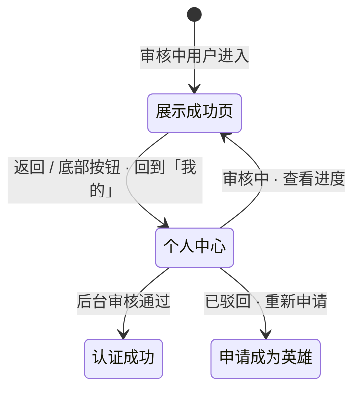

# 申请提交成功

> 产品说明 · 微信小程序子页（审核等待页）  
> 状态：已实现 · 见 §6 规则补充与验收要点  
> 最后更新：2026-07-14  
> 预览地址：http://127.0.0.1:8765/miniprogram/hero-apply-submitted.html  
> **协作提示**：桌面打开预览时，手机模型右侧会同步展示本文档（预览中不展示「§6 规则补充与验收要点」）；改文档后请运行 `python3 preview/build-pages.py` 再刷新。

---

## 1. 页面业务目标

「申请提交成功」是用户**提交英雄认证申请之后**看到的确认页。

主要解决三件事：

1. **确认已送达**：让用户明确知道表单已提交，而不是还在编辑
2. **设定审核预期**：告知预计 1–7 个工作日完成审核，减少重复咨询
3. **防止重复提交**：提交成功后用新页替换表单页，返回统一去个人中心

---

## 2. 登录和身份描述

| 身份 | 用户大概情况 | 能否进入 | 页面上 / 行为上的差异 |
|------|--------------|----------|------------------------|
| 审核中 | 刚提交或仍在待审 | ✅ 主场景 | 成功图标 + 标题 + 审核说明 +「返回个人中心」 |
| 未申请 | 还没提交过 | ❌ 不应直达 | 应去 [申请成为英雄](./申请成为英雄.md) |
| 已驳回 | 申请被驳回 | ❌ | 个人中心提示驳回原因 → 重新申请 |
| 已认证 | 已是英雄 | ❌ | 页面提示「您已是认证英雄」→ 回到「我的」 |

> 审核中的用户可从个人中心多次点「查看审核进度」进入，不会重复创建申请。

---

## 3. 页面详细描述

### 3.1 成功卡片（居中）

| 展示内容 | 说明 |
|----------|------|
| 成功图标 | 圆形背景内的 **✓**，主色 |
| 主标题 | **申请信息已提交成功**（固定文案，不用「提交完成」等变体） |
| 说明文案 | **预计 1-7 个工作日完成审核，审核通过后会发送通知告知。** |

### 3.2 底部按钮

| 元素 | 说明 |
|------|------|
| 返回个人中心 | 全宽主按钮；点击后回到「我的」Tab |

导航栏标题为 **提交成功**；左上角 **‹** 返回行为应与底部按钮一致，均回个人中心。

---

## 4. 常见路径

- **提交后自动进入：** 申请成为英雄 → 提交成功 → 本页（表单页已被替换，不可返回重复提交）
- **查看进度：** 个人中心（审核中）→「查看审核进度」→ 本页
- **返回：** 点底部按钮或导航 ‹ → 个人中心
- **审核通过：** 个人中心状态变为已认证 → 可进入 [认证成功](./认证成功.md)
- **审核驳回：** 个人中心提示驳回原因 → 重新进入 [申请成为英雄](./申请成为英雄.md)

---

## 5. 相关页面

| 关系 | 页面 | 何时 |
|------|------|------|
| 上一页 | [申请成为英雄](./申请成为英雄.md) | 提交成功，打开成功页并替换当前页 |
| 入口 | [个人中心](./个人中心.md) | 审核中「查看审核进度」 |
| 出口 | [个人中心](./个人中心.md) | 返回 / 底部按钮 |
| 通过后 | [认证成功](./认证成功.md) | 审核通过后从个人中心进入 |
| 驳回后 | [申请成为英雄](./申请成为英雄.md) | 重新填写提交 |

---

## 6. 规则补充与验收要点

### 6.1 谁能进、谁不能进

| 规则 | 说明 |
|------|------|
| **允许** | 审核中用户进入本页（主场景） |
| **允许** | 从个人中心「查看审核进度」多次进入，不重复创建申请 |
| **禁止** | 未申请、已驳回、已认证用户不应直达本页 |
| **禁止** | 从本页返回到表单页重复提交（表单页已被替换） |

### 6.2 文案与展示（精确，不可改字）

| 元素 | 精确文案 | 验收要点 |
|------|----------|----------|
| 导航栏标题 | **提交成功** | 固定 |
| 主标题 | **申请信息已提交成功** | 禁止用「提交完成」「已提交」等变体 |
| 说明文案 | **预计 1-7 个工作日完成审核，审核通过后会发送通知告知。** | 固定 |
| 底部按钮 | **返回个人中心** | 固定 |

**成功图标：** 圆形背景内字符 **✓**（非图片图标），主色。

### 6.3 交互与跳转

| 用户操作 | 系统行为 | 说明 |
|----------|----------|------|
| 提交申请成功后 | 打开本页并替换表单页 | 用户无法返回表单重复提交 |
| 点击「返回个人中心」 | 回到「我的」Tab | 与导航栏 ‹ 行为一致 |
| 个人中心「查看审核进度」 | 进入本页 | 不重新创建申请 |
| 安卓系统返回键 | 同「返回个人中心」 | 回到「我的」 |

### 6.4 异常场景处理

| 场景 | 处理方式 | 页面提示 |
|------|----------|----------|
| 未申请用户直达 | 返回上一页或跳转申请页 | 「请先提交申请」 |
| 已认证用户直达 | 回到「我的」 | 「您已是认证英雄」 |
| 已驳回用户直达 | 跳转申请页 | 「申请已驳回，可重新提交」 |
| 网络异常（无法确认状态） | 仍展示成功页 | 以本地已知「审核中」状态为准，无额外提示 |

### 6.5 后台要做什么

| 场景 | 后台要做什么 |
|------|-------------|
| 用户提交申请 | 申请进入待审核队列 |
| 审核通过 | 用户个人中心变为已认证；可进入认证成功页 |
| 审核驳回 | 填写驳回原因；用户在个人中心看到提示并可重新申请 |

### 6.6 已对齐 / 待确认

**已对齐（可验收）**

- 提交成功后打开本页并替换表单页
- 返回统一回到「我的」
- 主标题、说明文案、按钮文案固定
- 审核中可多次查看进度

**待确认**

- 导航栏系统 ‹ 是否已与底部按钮统一回到「我的」
- 预览与小程序底部按钮配色是否统一（金色 vs 蓝色）
- 是否在成功页展示申请编号、提交时间
- 审核结果是否改推送消息通知，而非仅个人中心状态变化

---

## 7. 变更记录

| 日期 | 改了什么 |
|------|----------|
| 2026-07-14 | 全文改为产品可读中文 |
| 2026-07-14 | 按个人中心格式改写；保留流程图 |
| 2026-07-13 | 审核时效文案改为「预计 1-7 个工作日…」 |
| 2026-07-07 | 重写：逐元素 UI 规格、门禁逻辑、接口字段、预览差异 |
| 2026-07-07 | 独立需求文档 |
| 2026-07-06 | 页面实现 |
