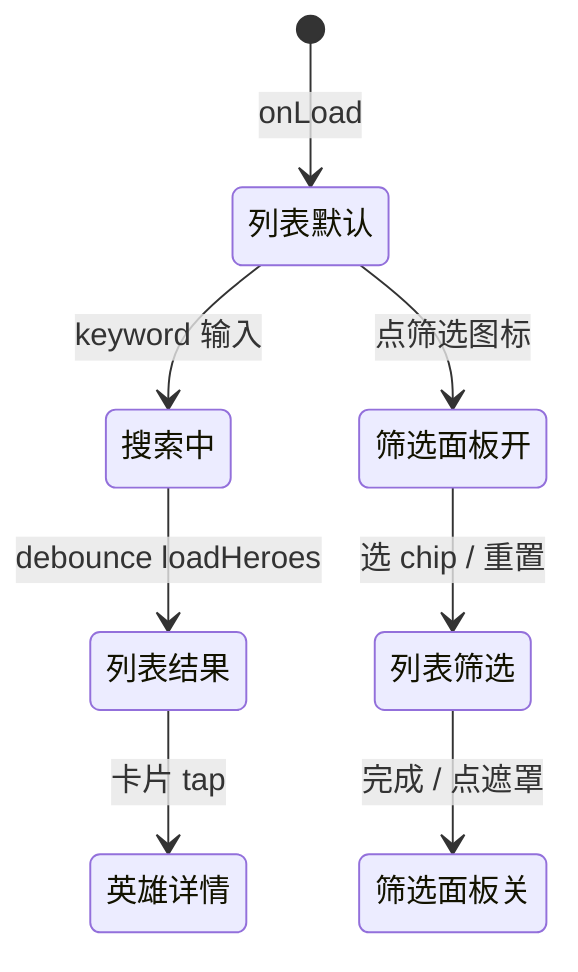

# 英雄广场

> 单页需求文档 · 英雄广场微信小程序  
> 状态：已实现 · P0 · M1  
> 最后更新：2026-07-07  
> 源码：`miniprogram/pages/heroes/` · 预览：`preview/miniprogram/heroes.html`

---

## 1. 页面概述

| 项 | 值 |
|---|---|
| 页面名称 | 英雄广场（教练列表 Tab） |
| 路由 | `pages/heroes/heroes` |
| 导航栏标题 | **英雄广场** |
| 导航类型 | **Tab 根页** |
| 页面参数 | 无 |
| 目标用户 | 寻找认证教练的普通用户 |
| 设计规范 | `DESIGN-SPEC` · 搜索栏 + 筛选 Bottom Sheet + 列表 hero-card |

---

## 2. 业务需求

### 2.1 业务目标

- 展示平台认证英雄教练列表，支持关键词搜索与多维筛选
- 引导用户进入 [英雄详情](./英雄详情.md) 了解教练并报名活动/课程
- 与首页「英雄广场」区块数据一致（同源 `mock.getHeroes` / API）

### 2.2 适用角色与权限

| 角色 | 可访问 | 不可访问时的处理 |
|------|--------|------------------|
| 全部用户 | ✅ | — |
| 未认证教练 | ✅ | 本人亦在列表中（M2 可配置是否展示） |

### 2.3 核心业务规则

1. 搜索框 placeholder：**搜索教练姓名或项目名称**；输入 **300ms 防抖** 后刷新列表
2. 筛选维度：项目类型（单选 chip）、排序（单选）、从业年限（单选）；非默认值计入 `filterCount` 角标
3. 筛选面板点 chip **即时生效**并 `loadHeroes()`；「完成」仅关闭面板；「重置」恢复三项默认
4. 有 keyword 且结果>0 显示 **找到 N 位教练**；keyword 无结果展示空态三行；无 keyword 无结果显示 **暂无符合条件的认证教练**
5. `onShow` 每次重新拉列表（从详情返回时刷新）
6. hero-card 列表布局 `layout="list"`；点击卡片应跳转详情（组件 triggerEvent `hero_id`）

### 2.4 状态机



---

## 3. 页面结构与 UI 元素规格

### 3.1 信息架构

```
.page.heroes
├── .heroes-search（搜索 + 筛选按钮）
├── .heroes-banner（顶部横幅占位）
├── .heroes-list
│   ├── .heroes-result-hint（条件：keyword && length>0）
│   ├── hero-card × N（layout=list）
│   └── .heroes-empty（空态）
└── .heroes-filter-sheet（wx:if filterVisible）
    ├── mask / panel
    ├── 项目 / 排序 / 年限 chip 组
    └── 「完成」按钮
```

### 3.2 UI 元素清单

| 元素 ID | 类型 | 文案/占位 | 样式要点 | 数据来源 | 必填 | 校验 | 交互 |
|---------|------|-----------|----------|----------|------|------|------|
| search-input | input | **搜索教练姓名或项目名称** | 圆角搜索框 | 用户输入 `keyword` | 否 | 无格式限制 | bindinput 防抖 |
| search-clear | 文本 | **×** | keyword 非空显示 | — | — | — | 清空并刷新 |
| filter-btn | 图标按钮 | 筛选图标 | active 态 + badge | `filterActive` | — | — | 打开 sheet |
| filter-badge | 数字 | `filterCount` | 角标 1~3 | 计算 | — | — | 无 |
| list-banner | 占位 | — | cover-placeholder | 静态 | — | — | 无 |
| result-hint | 文本 | **找到 {{n}} 位教练** | 列表顶提示 | `heroes.length` | — | — | 无 |
| hero-card | 组件 | 教练信息+活动行 | list 布局 | `heroes[]` | — | — | tap → 详情 |
| empty-search | 空态 | 🔍 / 未找到… / 试试调整… | keyword 有值 | — | — | — | 无 |
| empty-default | 空态 | 暂无符合条件的认证教练 | 无 keyword | — | — | — | 无 |
| filter-title | 文本 | **筛选** | sheet 头 | 静态 | — | — | 无 |
| filter-reset | 链接 | **重置** | 右上 | 静态 | — | — | 重置三项 |
| filter-project | chips | PROJECT_TYPES | 单选高亮 | `projectTypes` | — | — | onFilterTap |
| filter-sort | chips | SORT_OPTIONS.label | 单选 | `sortOptions` | — | — | onSortTap |
| filter-years | chips | YEARS_OPTIONS.label | 单选 | `yearsOptions` | — | — | onYearsTap |
| filter-confirm | 按钮 | **完成** | 底栏主按钮 | 静态 | — | — | 关闭 sheet |

#### 3.2.1 筛选选项（精确文案）

**项目**（`mock.PROJECT_TYPES`）：`全部` · `帆船` · `皮划艇` · `桨板` · `潜水` · `冲浪`

**排序**（`mock.SORT_OPTIONS`）：

| id | label |
|----|-------|
| default | 综合排序 |
| rating_desc | 评分从高到低 |
| rating_asc | 评分从低到高 |

**年限**（`mock.YEARS_OPTIONS`）：

| id | label |
|----|-------|
| 全部 | 不限年限 |
| 1-3 | 1-3年 |
| 3-5 | 3-5年 |
| 5-10 | 5-10年 |
| 10+ | 10年以上 |

---

## 4. 字段与校验矩阵

### 4.1 搜索与筛选字段

| 字段 key | 标签 | 控件 | 必填 | 格式/范围 | 默认值 | 校验时机 | 错误提示 | 查询映射 |
|----------|------|------|------|-----------|--------|----------|----------|----------|
| `keyword` | 搜索 | input | 否 | 任意字符串；trim 后参与模糊匹配 | `''` | 输入 300ms 后 / confirm | 无 | `filter.keyword` |
| `activeType` | 项目 | chip 单选 | 否 | PROJECT_TYPES 之一 | `全部` | 点击即时 | 无 | `filter.project_type` |
| `activeSort` | 排序 | chip 单选 | 否 | sortOptions.id | `default` | 点击即时 | 无 | `filter.sort_by` |
| `activeYears` | 年限 | chip 单选 | 否 | yearsOptions.id | `全部` | 点击即时 | 无 | `filter.years_range` |

### 4.2 filterCount 计算

| 条件 | +1 |
|------|-----|
| `activeType !== '全部'` | ✓ |
| `activeSort !== 'default'` | ✓ |
| `activeYears !== '全部'` | ✓ |

---

## 5. 交互需求

### 5.1 操作明细

| 序号 | 用户操作 | 前置条件 | 系统行为 | 成功反馈 | 失败反馈 |
|------|----------|----------|----------|----------|----------|
| 1 | 输入搜索 | — | 300ms 后 loadHeroes | 列表更新 / 空态 | — |
| 2 | 键盘搜索 confirm | — | 立即 loadHeroes | 同左 | — |
| 3 | 点 × 清空 | keyword 非空 | keyword='' + loadHeroes | 恢复全量 | — |
| 4 | 打开筛选 | — | filterVisible=true | 面板弹出 | — |
| 5 | 选筛选 chip | 面板打开 | 更新 active* + loadHeroes | 列表变化 + badge | — |
| 6 | 重置 | 面板打开 | 三项默认 + loadHeroes | badge 清零 | — |
| 7 | 完成/点遮罩 | 面板打开 | filterVisible=false | 关闭 | — |
| 8 | 点 hero-card | hero_id 有效 | navigateTo 英雄详情 | 跳转 | — |
| 9 | 下拉刷新 | — | loadHeroes + stopPullDownRefresh | 刷新 | — |

### 5.2 返回与导航

| 控件 | 行为 |
|------|------|
| TabBar | switchTab 其他 Tab |
| 从详情返回 | onShow 自动 refresh |

### 5.3 页面级异常

| 场景 | 处理 |
|------|------|
| API 失败 | 降级 mock.getHeroes |
| onUnload | clearTimeout 搜索定时器 |

---

## 6. 加载与刷新机制

| 生命周期 | 触发 | 逻辑 | UI |
|----------|------|------|-----|
| `onLoad` | 首次 | loadHeroes | 列表渲染 |
| `onShow` | 每次展示 | loadHeroes | 可能更新数据 |
| `onUnload` | 离开 | 清除 `_searchTimer` | — |
| 下拉刷新 | 用户 | loadHeroes | stopPullDownRefresh |

---

## 7. 性能要求

| 项 | 指标 | 说明 |
|----|------|------|
| 搜索防抖 | 300ms | `_searchTimer` |
| 列表规模 | ≤50 教练 M1 | 全量 render |
| setData | 每次筛选 1 次 | heroes + filter 状态 |
| 首屏 | < 400ms | Mock 本地过滤 |

---

## 8. 相关页面

### 8.1 入口

| 来源 | 场景 |
|------|------|
| TabBar「英雄」 | 主入口 |
| [营销首页](./营销首页.md) section 更多 | switchTab |

### 8.2 出口

| 目标 | 参数 | 触发 |
|------|------|------|
| [英雄详情](./英雄详情.md) | `?id={hero_id}` | hero-card tap |
| hero-card 内活动行 | recruit/course id | 组件内 navigateTo（不经过 page js） |

---

## 9. 接口与数据

### 9.1 接口列表

| 接口 | 方法 | 时机 | 说明 |
|------|------|------|------|
| `/api/heroes` | GET | loadHeroes | query: keyword, project_type, sort_by, years_range |

### 9.2 列表项字段（hero-card 消费）

| 字段 | 类型 | 说明 |
|------|------|------|
| hero_id | string | 主键 |
| name | string | 教练姓名 |
| rating | number | 评分 |
| project_types | string[] | 项目 |
| certification_level | string | 认证 |
| honor_titles | string[] | 荣誉标签 |
| cert_badges | string[] | 资质标签 |
| years_exp | number | 从业年限 |
| student_count | number | 学员数 |
| recruitments | array | 卡片底部活动/课程入口 |

---

## 10. 预览端差异

| 项 | 小程序 | 预览 |
|----|--------|------|
| 搜索防抖 | 300ms JS | 预览脚本应对齐 |
| 筛选 sheet | 原生 wx:if 层 | HTML modal |
| hero-card tap | `e.detail.hero_id` | 注意 page js 若用 dataset.id 需对齐组件事件 |
| 下拉刷新 | 支持 | 可能无 |

---

## 11. 待确认项

- [ ] `heroes.js` `onHeroTap` 使用 `dataset.id` 与组件 `hero_id` 事件是否一致（建议统一 `e.detail.hero_id`）
- [ ] 「冲浪」类型是否在筛选中展示（mock 含冲浪，申请页已去掉）
- [ ] M2 列表分页与骨架屏

---

## 12. 变更记录

| 日期 | 变更 |
|------|------|
| 2026-07-07 | 重写：搜索/筛选矩阵、空态文案、选项枚举、接口字段 |
| 2026-07-03 | 初稿 |
