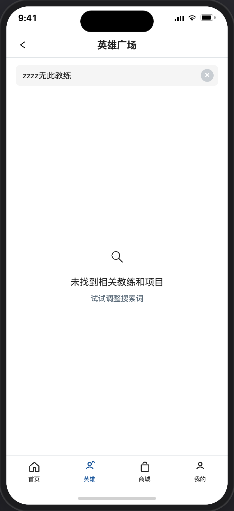
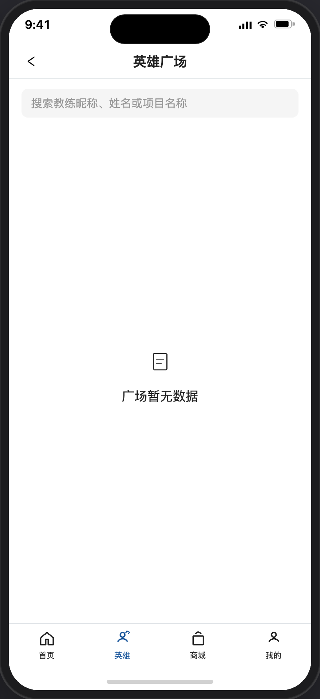
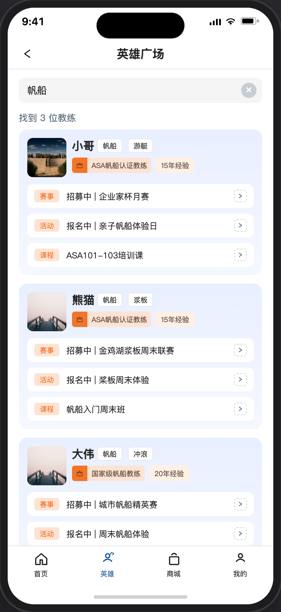

# 英雄广场（使用装修搭建）

> 产品说明 · 微信小程序底部 Tab「英雄」  
> 状态：已实现（见 §6；装修排序待接） · 优先级：最高 · 里程碑：第一期  
> 最后更新：2026-07-15 12:00
> 预览地址：[http://127.0.0.1:8765/miniprogram/heroes.html](http://127.0.0.1:8765/miniprogram/heroes.html)  
> UI设计图地址：https://www.figma.com/design/FQerHrZBo3Kx7ddFq7jKYx/%E5%BA%97%E9%93%BA%E8%A3%85%E4%BF%AE?node-id=8777-1717&t=m8tMpSkni5qRw93M-1
> **协作提示**：桌面打开预览时，手机模型右侧会同步展示本文档（预览中不展示「§6 规则补充与验收要点」）；改文档后请运行 `python3 preview/build-pages.py` 再刷新。

## UI说明

1、设计需增加搜索输入框样式，以及页面数据为空时设计空数据图标

---

## 说明

1. 使用装修页面搭建
2. 此页面比上一期增加了搜索和明确了列表排序规则。

## 1. 页面业务目标

1. **集中展示认证教练**：方便用户浏览平台已认证的英雄教练（已认证且没有禁用的教练才会显示出来）
2. **搜索**：按教练昵称、姓名、项目名称模糊搜索，实时显示搜索结果
3. **进入教练主页**：点击教练卡片进入 [英雄详情](./英雄详情.md)，可报名赛事、活动、课程；卡片底部赛事/活动/课程行可直达对应详情

---

## 2. 登录和身份描述

| 身份        | 用户大概情况 |
| --------- | ------ |
| 全部登录/访客用户 | 公开访问   |

### 2.1 列表有数据

1. 取已认证英雄且没有禁用教练身份的英雄。
2. 无赛事且无课程的英雄排在最下面，多个无赛事且无课程的英雄按认证通过时间倒序。
3. 有赛事、活动、课程的优先展示，多个有赛事、活动、课程的英雄按认证通过时间倒序。
4. 支持下拉刷新数据

### 2.2 列表无数据（空态）

| 场景           | 空态文案侧重                          |
| ------------ | ------------------------------- |
| 搜索无结果        | 提示「**未找到相关教练和项目**」；副文案「试试调整搜索词」 |
| 列表加载失败 / 空数据 | 「广场暂无数据」（图标 + 文案）；不显示顶部 banner  |

 

---

## 3. 页面详细描述

### 3.1 搜索区

| 展示内容   | 说明                                               |
| ------ | ------------------------------------------------ |
| 搜索输入框 | 1、占位：「搜索教练昵称、姓名或项目名称」； 2、输入后实时查询，加个 0.3 秒的防抖。 |
| 清空按钮 × | 仅关键词非空时显示；清空后自动重新拉全量列表；若键盘展示则同时收起                |

### 3.2 顶部banner

1、通过后台的装修页面可以上传并指定跳转地址  
2、搜索框获取光标，底部拉起字母键盘。  
3、列表加载失败 / 空数据（「广场暂无数据」）时不显示顶部 banner

### 3.3 教练列表区

| 展示内容            | 说明                                                                                                                                                            |
| --------------- | ------------------------------------------------------------------------------------------------------------------------------------------------------------- |
| 教练卡片 | 1、卡片 2、头像 3、昵称 4、资质等级：名称完整显示，资质等级只能设置 1 个，前台写死一个通用图标**（设计提供）**； 5、经验年限标签：标签名称完整显示； 6、底部最多三行：**赛事 / 活动 / 课程**；有则展示，文案是：「状态｜标题」（课程可仅标题） |
| 搜索结果条数显示 | 1、搜索结果条数：有结果则显示找到 N 位教练，无结果不显示。 2、搜索无结果：显示空数据页面。 |
| 点击卡片主体          | → 英雄详情                                                                                                                                                        |
| 点击卡片底部赛事/活动/课程行 | 1、→ 对应 [赛事详情](./赛事详情.md) / [活动详情](./活动详情.md) / [课程详情](./课程详情.md) 2、每个教练下的赛事、活动、课程数据获取是在后台装修读取配置 |

