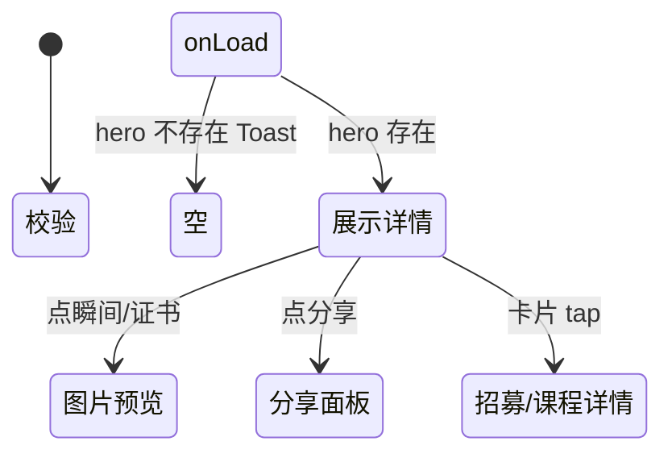

# 英雄详情

> 单页需求文档 · 英雄广场微信小程序  
> 状态：已实现 · P0 · M1  
> 最后更新：2026-07-07  
> 源码：`miniprogram/pages/hero-detail/` · 预览：`preview/miniprogram/hero-detail.html`

---

## 1. 页面概述

| 项 | 值 |
|---|---|
| 页面名称 | 英雄详情（教练主页） |
| 路由 | `pages/hero-detail/hero-detail` |
| 导航栏标题 | **动态** `hero.name`（onLoad setNavigationBarTitle） |
| 导航类型 | 子页 |
| 页面参数 | **`id`**（hero_id，缺省 Mock 默认 `'1'`） |
| 目标用户 | 浏览教练、准备报名活动/课程的用户 |
| 设计规范 | `DESIGN-SPEC` · 头图资料卡 + 分区内容 + 分享/看图组件 |

---

## 2. 业务需求

### 2.1 业务目标

- 公开展示认证教练完整资料：评分、标签、简介、荣誉、瞬间、证书、在招赛事与课程
- 支持微信分享（好友/朋友圈）与页内分享面板 `hero-share`
- 图片预览：精彩瞬间、资质证书 → `image-viewer`
- 引导至 [招募详情](./招募详情.md) / [课程详情](./课程详情.md)

### 2.2 适用角色与权限

| 角色 | 可访问 | 说明 |
|------|--------|------|
| 全部用户 | ✅ | 公开页 |
| 教练本人 | ✅ | M1 与访客同 UI；编辑走 [我的英雄资料](./我的英雄资料.md) |

### 2.3 核心业务规则

1. `onLoad`：`mock.getHeroById(id)` 不存在 → Toast **教练不存在**，不渲染
2. 存在则设置导航标题、开启分享菜单、`buildStars(rating)`、`detailTags` 取 honor_titles+cert_badges 前 3
3. 区块按数据有无 `wx:if`：past_honors / moments / certificates / recruitments / courses
4. 招募/课程卡片点击 navigateTo 对应详情
5. 分享标题：`{name} · {projects}教练`；path 带 id

### 2.4 状态机



---

## 3. 页面结构与 UI 元素规格

### 3.1 信息架构

```
.hero-detail（wx:if hero）
├── .hero-profile（封面+头像+分享+姓名+副标题+星级+标签+统计）
├── 关于我
├── 过往荣誉（可选）
├── 精彩瞬间 gallery（可选）
├── 资质证书 横滑（可选）
├── 赛事招募 列表（可选）
├── 我的课程 列表（可选）
├── hero-share
└── image-viewer
```

### 3.2 UI 元素清单

| 元素 ID | 类型 | 文案/内容 | 数据来源 | 交互 |
|---------|------|-----------|----------|------|
| cover | 背景 | — | CSS 渐变 | 无 |
| avatar | 占位 | — | cover-placeholder | 无 |
| share-btn | 按钮 | ↗ **分享** | 静态 | onShareTap → shareVisible |
| name | 文本 | `{{hero.name}}` | API/Mock | 无 |
| subtitle | 文本 | `{project_types.join(' · ')} · {years_exp}年经验` | hero | 无 |
| stars | 五星 | ★ 填充/半星 | buildStars(rating) | 无 |
| score | 文本 | `{{hero.rating}}` | hero | 无 |
| tag | chip | honor/cert 标签 | detailTags≤3 | 无 |
| stat-students | 统计 | 学员数 | student_count | 无 |
| stat-rating | 统计 | 评分 | rating | 无 |
| stat-honors | 统计 | 荣誉数 | honors_count | 无 |
| label-about | 标题 | **关于我** | 静态 | 无 |
| bio | 文本 | `{{hero.about_me}}` | hero | 无 |
| label-honors | 标题 | **过往荣誉** | 静态 | 无 |
| honor-icon | emoji | `{{item.icon}}` | past_honors | 无 |
| honor-name | 文本 | `{{item.name}}` | | 无 |
| honor-summary | 文本 | `{{item.summary}}` | | 无 |
| label-moments | 标题 | **精彩瞬间** | | 无 |
| gallery-item | 图 | 占位 | moments[] | onPreviewMoment |
| label-certs | 标题 | **资质证书** | | 无 |
| cert-name | 文本 | `{{item.name}}` | certificates | onPreviewCert |
| label-recruit | 行 | **赛事招募** + **共N个** | recruitments.length | 无 |
| recruit-card | 卡片 | 标题/时间/地点/费用/报名 | mock 招募 | onRecruitmentTap |
| recruit-location | 文本 | **赛事地点：**{location} | | 无 |
| recruit-fee | 文本 | **¥{fee}/人** | | 无 |
| recruit-signup | 文本 | signupDisplay | | 无 |
| label-courses | 行 | **我的课程** + **共N门** | courses.length | 无 |
| course-card | 卡片 | 同招募结构 | courses | onCourseTap |
| course-location | 文本 | **课程地点：**{location} | | 无 |

#### 3.2.1 招募/课程卡片字段

| 字段 | 说明 |
|------|------|
| title | 活动/课程标题 |
| timeDisplay | 格式化时间段 |
| location | 地点 |
| fee / price | 费用 |
| signupDisplay | 仅招募：已报/总数文案 |

---

## 4. 字段与校验矩阵

> 无用户输入；页面参数：

| 字段 | 必填 | 规则 | 错误 |
|------|------|------|------|
| `id` | 建议 | hero_id 字符串 | 缺省用 `'1'`；不存在 Toast **教练不存在** |

---

## 5. 交互需求

### 5.1 操作明细

| 序号 | 操作 | 行为 | 反馈 |
|------|------|------|------|
| 1 | 点分享 | shareVisible=true | 打开 hero-share |
| 2 | 关闭分享 | shareVisible=false | — |
| 3 | 点瞬间图 | openViewer(momentUrls) | image-viewer |
| 4 | 点证书 | openViewer(certUrls) | image-viewer |
| 5 | 点招募卡 | navigateTo recruitment-detail?id | 跳转 |
| 6 | 点课程卡 | navigateTo course-detail?id | 跳转 |
| 7 | 分享好友 | onShareAppMessage | 卡片标题含姓名项目 |
| 8 | 分享朋友圈 | onShareTimeline | query id |

### 5.2 返回与导航

| 控件 | 行为 |
|------|------|
| 导航 ‹ | navigateBack |
| 预览 | data-back-fallback 上一页 |

### 5.3 页面级异常

| 场景 | 处理 |
|------|------|
| id 无效 | Toast + 空白（wx:if hero） |
| 无 recruitments/courses | 区块隐藏 |

---

## 6. 加载与刷新机制

| 生命周期 | 逻辑 |
|----------|------|
| `onLoad(options)` | 读 id，拉 hero + 关联 recruitments/courses |
| `onShow` | M1 无刷新 |
| 下拉刷新 | 不支持 |

---

## 7. 性能要求

| 项 | 指标 |
|----|------|
| 首屏 | 1 次 getHeroById + 2 列表 Mock |
| 图片 | M1 占位；viewer 懒开 |
| setData | onLoad 单次 bulk |
| 证书横滑 | scroll-x enhanced |

---

## 8. 相关页面

### 8.1 入口

| 来源 | 参数 |
|------|------|
| [英雄广场](./英雄广场.md) | id |
| [营销首页](./营销首页.md) hero-card | id |
| 分享卡片 | id |

### 8.2 出口

| 目标 | 参数 |
|------|------|
| [招募详情](./招募详情.md) | recruit_id |
| [课程详情](./课程详情.md) | course_id |

---

## 9. 接口与数据

### 9.1 接口

| 接口 | 方法 | 说明 |
|------|------|------|
| `/api/heroes/:id` | GET | 教练详情 |
| `/api/recruitments` | GET | hero_id 公开招募 |
| `/api/courses` | GET | hero_id 课程 M2 |

### 9.2 Hero 响应关键字段

| 字段 | 类型 | 说明 |
|------|------|------|
| hero_id | string | id |
| name | string | 姓名 |
| rating | number | 评分 |
| project_types | string[] | 项目 |
| years_exp | number | 年限 |
| student_count | number | 学员 |
| honors_count | number | 荣誉数 |
| honor_titles | string[] | 标签 |
| cert_badges | string[] | 资质标签 |
| about_me | string | 简介 |
| past_honors | array | {icon,name,summary} |
| moments | string[] | 图片 key/url |
| certificates | array | {name,image} |

---

## 10. 预览端差异

| 项 | 小程序 | 预览 |
|----|--------|------|
| 分享 | wx.showShareMenu + hero-share | 模拟或隐藏 |
| image-viewer | 组件 | HTML lightbox |
| 导航标题 | 动态 set | document title |

---

## 11. 待确认项

- [ ] M2 真实头像/封面 CDN
- [ ] 是否展示「联系教练」按钮
- [ ] 课程列表 API 与 mock.getCoursesByHeroId 对齐

---

## 12. 变更记录

| 日期 | 变更 |
|------|------|
| 2026-07-07 | 重写：分区 UI、分享/预览、字段表、招募课程卡片 |
| 2026-07-03 | 初稿 |
