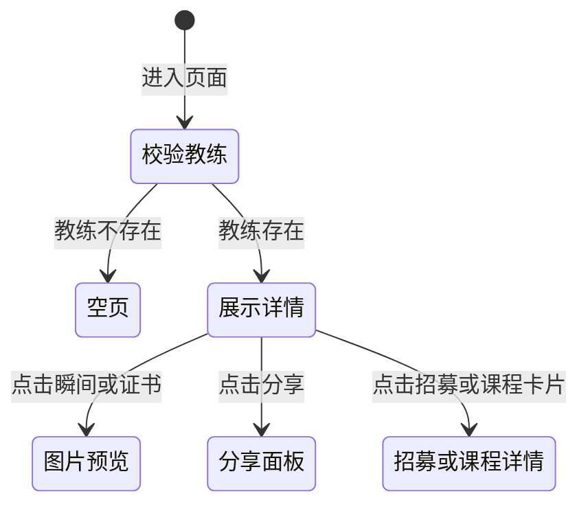

# 英雄详情

> 产品说明 · 微信小程序子页（教练主页）  
> 状态：已实现 · 第一期 · 优先级最高  
> 最后更新：2026-07-15  
> 预览地址：http://127.0.0.1:8765/miniprogram/hero-detail.html  
> **协作提示**：桌面打开预览时，手机模型右侧会同步展示本文档（预览中不展示「§6 规则补充与验收要点」）；改文档后请运行 `python3 preview/build-pages.py` 再刷新。

---

## 1. 页面业务目标

「英雄详情」是某位认证教练的 **个人主页**，展示完整资料与在招内容。

主要解决四件事：

1. **展示教练全貌**：评分、项目标签、简介、荣誉、精彩瞬间、资质证书
2. **浏览在招内容**：「活动与赛事」与「我的课程」列表，可进入对应详情页报名
3. **分享与看图**：支持微信分享；精彩瞬间、资质证书可大图预览
4. **引导成为英雄**：未认证时底部为「分享」+「申请成为英雄」；已认证仅「分享」

---

## 2. 登录和身份描述

| 身份 | 用户大概情况 | 页面上看到什么 |
|------|--------------|----------------|
| 全部用户 | 公开访问 | 完整教练资料与在招列表 |
| 教练本人 | 浏览自己的主页 | 第一期与访客相同；编辑资料走 [我的英雄资料](./我的英雄资料.md) |

### 2.1 教练存在

正常展示头图资料卡、各内容分区；底栏见 §3.8。

### 2.2 教练不存在

页面提示「教练不存在」，主体不渲染。

### 2.3 区块按数据有无展示

无招募/课程/荣誉/瞬间/证书时，对应区块隐藏。

---

## 3. 页面详细描述

### 3.1 顶部：资料卡

| 展示内容 | 说明 |
|----------|------|
| 封面背景 | 渐变占位 |
| 头像 | 占位图 |
| 姓名 | 教练姓名；同时作为导航栏标题 |
| 副标题 | 项目类型 · N年经验 |
| 星级与评分 | 五星展示 + 数字评分 |
| 标签 | 荣誉/资质标签，最多 3 个 |
| 三项统计 | 学员数 · 评分 · 荣誉数 |

### 3.2 关于我

标题「关于我」+ 教练简介正文。

### 3.3 荣誉成就（可选）

标题「荣誉成就」+ 荣誉列表：左侧圆角灰底图标，右侧名称（加粗）；项与项之间细分割线。

### 3.4 精彩瞬间（可选）

标题「精彩瞬间」+ 图片画廊；点击图片 → 大图预览。

### 3.5 资质证书（可选）

标题「资质证书」+ 横滑证书列表；点击 → 大图预览。

### 3.6 教学理念（可选）

浅蓝卡片：帆船图标 +「教学理念」；引言、「他相信：」；四条白底胶囊（标题 + 说明）。无数据时不展示。

### 3.7 赛事经验（可选）

浅橙卡片：奖杯图标 +「赛事经验」；引言；赛事条（文案与配图斜切交替左右）。无数据时不展示。

### 3.8 个人展示（可选）

标题「个人展示」+ 图片画廊；点击 → 大图预览。

### 3.9 社会贡献（可选）

浅桃卡片：橙星图标 +「社会贡献」；引言；四条白底要点（橙点 + 文案）。无数据时不展示。

### 3.10 活动与赛事（可选）

标题行「活动与赛事」+「共N个」+ 竖排大图招募卡（与首页精选活动同壳）。

每张卡片含：时间条（色点）、「赛事/活动」标签、标题、地点、价格、「立即报名」；点击 → 招募详情。

默认最多展示 2 条；超过 2 条时底部出「展开全部（N）」（N 为未展示条数），展开后展示全部且不再收起。

### 3.11 我的课程（可选）

标题行「我的课程」+「共N门」+ 课程卡片列表。

每张卡片含：标题、时间、课程地点、费用；点击 → 课程详情。

### 3.12 底部固定栏

| 当前用户状态 | 底栏 |
|--------------|------|
| 未认证（未申请 / 审核中 / 已驳回等） | 左侧「分享」+ 右侧「申请成为英雄」 |
| 已认证 | 仅「分享」（通栏） |

「申请成为英雄」点击分流：

| 认证状态 | 点击「申请成为英雄」后 |
|----------|--------|
| 未申请 | 跳转到申请成为英雄页 |
| 审核中 | 跳转到申请提交成功页（查看进度） |
| 已驳回 | 弹出驳回原因说明 |

| 元素 | 说明 |
|------|------|
| 分享 | ↗ **分享** → 打开分享面板 |
| 申请成为英雄 | 仅未认证展示；按上表分流 |

---

## 4. 常见路径

- **从列表进入：** 英雄广场 / 营销首页教练卡片 → 进入本页 → 展示详情
- **看活动/课程：** 点击招募/课程卡片 → 招募详情 / 课程详情
- **看图：** 点击精彩瞬间或证书 → 图片预览器
- **分享：** 点分享 → 分享面板 → 好友/朋友圈
- **申请成为英雄：** 点底栏按钮 → 按当前认证状态跳转或提示

---

## 5. 相关页面

| 关系 | 页面 | 何时 |
|------|------|------|
| 入口 | [英雄广场](./英雄广场.md) | 点击教练卡片 |
| 入口 | [营销首页](./营销首页.md) | 教练卡片 |
| 入口 | 分享卡片 | 从分享链接进入 |
| 出口 | [招募详情](./招募详情.md) | 点击招募卡片 |
| 出口 | [课程详情](./课程详情.md) | 点击课程卡片 |
| 申请 | [申请成为英雄](./申请成为英雄.md) | 底栏「申请成为英雄」 |
| 编辑 | [我的英雄资料](./我的英雄资料.md) | 教练本人改资料（非本页） |

---

## 6. 规则补充与验收要点

### 6.1 已对齐（产品已确认可验收）

| 能力 | 说明 |
|------|------|
| 资料卡（评分、标签、统计） | 有 |
| 关于我 / 荣誉成就 / 证书 / 教学理念 / 赛事经验 / 瞬间 / 社会贡献分区 | 有；无数据时隐藏；**无**「卓越长航领队」分区 |
| 活动与赛事与我的课程列表 | 有；卡片可跳转对应详情 |
| 精彩瞬间、证书大图预览 | 有 |
| 微信分享 | 有 |
| 底栏：未认证「分享+申请」；已认证仅「分享」 | 有 |
| 底栏「申请成为英雄」按认证状态分流 | 有 |
| 后台新审核通过的英雄可被打开 | 有 |
| 教练不存在时页面提示且不渲染主体 | 有 |

### 6.2 还没做完

| 优先级 | 能力 | 现状 |
|--------|------|------|
| P2 | 真实头像/封面图 | 第一期为占位图 |
| 待确认 | 是否展示「联系教练」按钮 | 未做 |

### 6.3 边界与提示

| 场景 | 期望表现 |
|------|----------|
| 教练不存在 | 页面提示「教练不存在」 |
| 无招募或课程 | 对应区块不展示 |
| 已通过认证用户 | 底栏不展示「申请成为英雄」，仅分享 |

---

## 7. 变更记录

| 日期 | 改了什么 |
|------|----------|
| 2026-07-15 | 「赛事招募」区块标题改为「活动与赛事」 |
| 2026-07-15 | 「过往荣誉」改为「荣誉成就」；「丰富赛事经验」改为「赛事经验」；去掉「卓越长航领队」分区 |
| 2026-07-14 | 赛事招募 mock 增至 5 条；默认展示 2 条，超出可「展开全部」（不可收起） |
| 2026-07-14 | 赛事招募改为与首页同壳的大图卡（时间条/类型标签/地点/价格/立即报名） |
| 2026-07-14 | 长航领队下方增加「社会贡献」圆点条目卡 |
| 2026-07-14 | 个人展示下方增加「卓越长航领队」2×2 图文卡 |
| 2026-07-14 | 教学理念下方增加「丰富赛事经验」斜切图文卡 |
| 2026-07-14 | 资质证书下方增加「教学理念」卡片（示意文案） |
| 2026-07-14 | 底栏双态：未认证「分享+申请」；已认证仅「分享」 |
| 2026-07-14 | 过往荣誉去掉摘要，仅保留图标与名称 |
| 2026-07-14 | 三项统计按示意改为：学员 / 评分 / 荣誉 |
| 2026-07-14 | 过往荣誉按示意对齐：左图标 + 名称/摘要双行 + 分割线 |
| 2026-07-14 | 分享按钮移到底部固定栏，位于「申请成为英雄」左侧 |
| 2026-07-14 | 全文改为产品可读中文 |
| 2026-07-14 | 按个人中心格式改写；保留流程图 |
| 2026-07-07 | 重写：分区说明、分享/预览、招募课程卡片 |
| 2026-07-03 | 初稿 |
