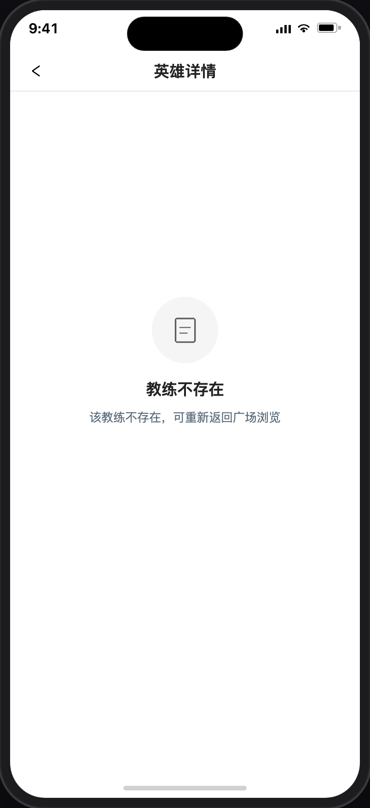
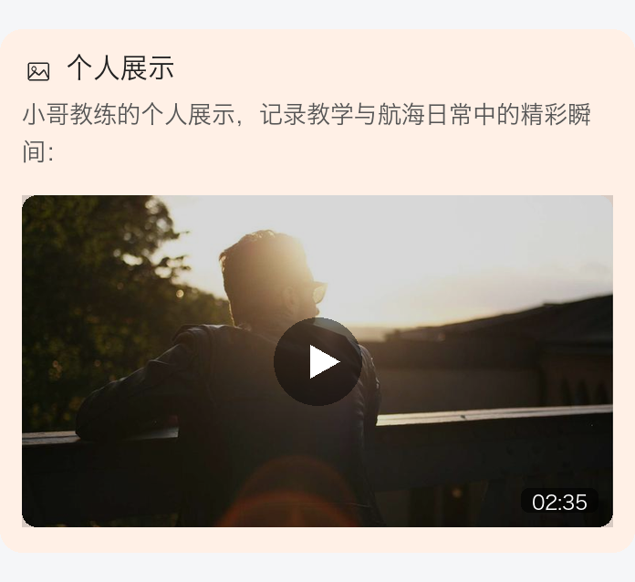
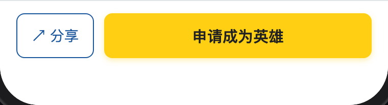
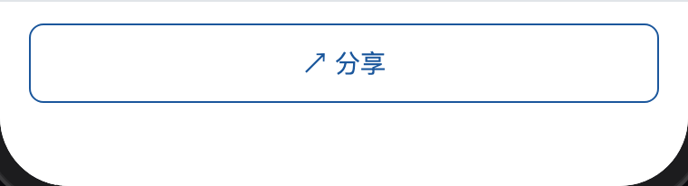
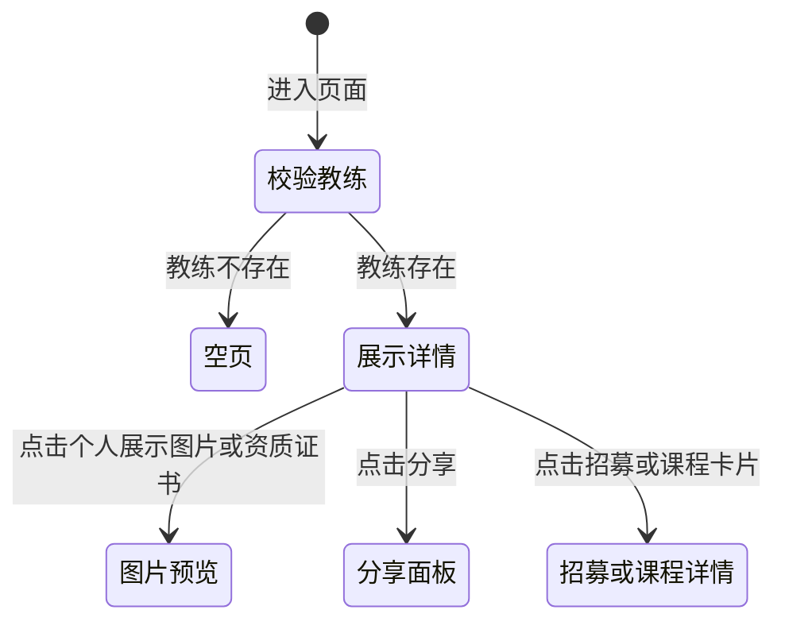

# 英雄详情

> 产品说明 · 微信小程序子页（教练主页）  
> 状态：已实现 · 第一期 · 优先级最高  
> 最后更新：2026-07-16  
> 预览地址：[http://127.0.0.1:8765/miniprogram/hero-detail.html](http://127.0.0.1:8765/miniprogram/hero-detail.html)  
> **协作提示**：桌面打开预览时，手机模型右侧会同步展示本文档（预览中不展示「§6 规则补充与验收要点」）；改文档后请运行 `python3 preview/build-pages.py` 再刷新。AI 补充时不覆盖你的原文；`【重复】`（紫）/ `【矛盾】`（红）为待你确认的标记。**铁律**：只根据原型改动写入本文，不按本文去改原型。

---

## 1. 页面业务目标

「英雄详情」是某位认证教练的 **个人主页**，展示完整资料与在招内容。

主要解决四件事：

1. **展示教练全貌**：评分、项目标签、简介、荣誉、个人展示、资质证书
2. **浏览在招内容**：「活动与赛事」与「我的课程」列表，可进入对应详情页报名
3. **分享与看图**：支持微信分享；资质证书可大图预览
4. **引导成为英雄**：未认证时底部为「分享」+「申请成为英雄」；已认证仅「分享」

---

## 2. 登录和身份描述


| 身份   | 用户大概情况 | 页面上看到什么                 |
| ---- | ------ | ----------------------- |
| 全部用户 | 公开访问   | 完整教练资料与在招列表（活动语赛事和我的课程） |


### 2.1 教练存在且未禁用

2.1.1、正常展示头图资料卡

2.1.2、各内容分区（关于我、荣誉成就、资质证书、教学理念、赛事经验、社会贡献、个人展示）

2.1.3、活动与赛事

2.1.4、我的课程

### 2.2 教练不存在

2.2.1、在上一页已加载出教练数据，此时后台把教练删除/禁用后，进入详情后页面提示「教练不存在」。

2.2.2、 空页面文案：该教练不存在，可重新返回广场浏览。



### 2.3 各内容区块按数据有无展示

（关于我、荣誉成就、资质证书、教学理念、赛事经验、社会贡献、个人展示）无数据时，对应区块隐藏。

---


## 3. 页面详细描述


### 3.1 顶部：资料卡


| 展示内容            | 说明                                                                                                                                               |
| --------------- | ------------------------------------------------------------------------------------------------------------------------------------------------ |
| 封面背景            | 渐变占位，最终以UI 效果图为准，前台写死或服务端提供研发自定决定。                                                                                                               |
| 头像              | 占位图                                                                                                                                              |
| 昵称              | 显示教练昵称，不显示姓名；同时作为导航栏标题                                                                                                                           |
| 副标题             | 取值项目类型 · 取值经验年限                                                                                                                                  |
| 星级与评分 | 1、五星展示 + 数字综合分；<br>2、**综合分为所有评价用户打分的算术平均值**（有几条评价就对几条分值求均值）<br>3、总分值 5 分 |
| 资质等级            | 取资质等级名称，只有一个                                                                                                                                     |
| 三项统计（仅作展示不支持点击） | 1、学员数：<br>1.1、所有参加了当前英雄相关的赛事，活动，课程的学员总数。（只要报名成功都算是学员，后续取消订单的情况忽略）。<br>1.2、若同一用户报名了不同英雄的赛事，活动，课程，会分别算到每个英雄的学员数量中。<br>3、评分：同上方的星级评分一致。<br>3、荣誉数：计算当前英雄的荣誉成就数量。 |


### 3.2 关于我

标题「关于我」+ 教练简介正文。

补充：内容完整显示，后台录入时加了字数限制。

### 3.3 荣誉成就

3.3.1、标题「荣誉成就」+ 荣誉列表。

3.3.2、左侧用**统一图标，前台写死。**

3.3.3、右侧名称：超出一行自动换行，完成显示，后台录入时加了字数限制。

### 3.4 资质证书

3.4.1、横滑证书列表；点击 → 大图预览，大图中可以捏和放大缩小，可以保存图片，可以左右滑动切换上下页、显示当前第几张一共几张，比如：2/7

3.4.2、无数据时不展示。

### 3.5 教学理念

3.5.1、先文后图，文和图都是选填

3.5.2、无数据时不展示。

### 3.6 赛事经验

3.6.1、先文后图，文和图都是选填

3.6.2、无数据时不展示。

### 3.7 社会贡献

3.7.1、先文后图，文和图都是选填

3.7.2、无数据时不展示。

### 3.8 个人展示

3.8.1、先文后图/视频，文和图/视频都是选填

3.8.2、无数据时不展示。

3.8.3、支持两类内容：


| 类型  | 展示规则                                                                                               |
| --- | -------------------------------------------------------------------------------------------------- |
| 图片  | **3 列宫格**（一排三张，最多 10 张），点击 → 大图预览，大图中可以捏和放大缩小，可以保存图片，可以左右滑动切换上下页、显示当前第几张一共几张，比如：2/7                |
| 视频 | **1、仅支持展示 1 个视频**；封面图上居中播放按钮，**右下角显示时长**（如 `02:35`）；点击进入播放。<br>2、播放时至少要暂停/播放、静音/播放、支持快进快退，全屏显示、小窗口播放。 |




### 3.10 活动与赛事

3.10.1、标题行「活动与赛事」+「共N个」

3.10.2、每张卡片含：

a、头图：取项目封面

b、名称：取项目标题，超出两行...

c、类型标识：取项目分类，目前有三种：赛事、活动和课程。

d、项目时间：取项目时间（也就是报名时间）：

```
 （1）同一天，示例：7月20日(周一) 08:00 - 17:00
 （2）非同一天，示例：7月20日(周一) 08:00 - 7月23日(周四)17:00
```

e、赛事/活动地点：取项目地址，超出一行...

f、价格：取项目费用（免费/收费），免费或收费是否显示取后台配置的活动费用是否展示。收费则取售价，存在划线价也不在列表显示。

g、招募名额：显示为「招募名额：已招募/共计招募」，例如「招募名额：10/16」；无上限时显示「招募名额：3/不限」。已招募只要成功报名的用户就 +1，取消报名后计数不减；共计招募取后台是否配置招募人数。点击整卡 → 赛事详情或活动详情（按类型）。

h、默认最多展示 2 条，超过 2 条时底部出「展开全部（N）」（N 为未展示条数），展开后展示全部且不再收起。

i、立即报名按钮：按钮文案不随活动或赛事的状态变化而变化，固定文案，点击后进入详情。

### 3.11 我的课程

字段、取值与操作与「活动与赛事」一致（头图、名称、类型标识「课程」、报名时间、课程地点、价格、招募人数、立即报名；默认最多 2 条，超出可「展开全部」）。点击整卡或「立即报名」→ 课程详情。

### 3.12 底部固定栏


| 当前用户状态               | 底栏                 |
| -------------------- | ------------------ |
| 未认证（未申请 / 审核中 / 已驳回） | 左侧「分享」+ 右侧「申请成为英雄」 |
| 已认证                  | 仅「分享」（通栏）          |

从本页进入「申请成为英雄」并提交成功后，成功页按钮显示「返回英雄详情」，点击返回发起申请时的原英雄详情。

**未认证状态：分享 + 申请成为英雄**



**已认证状态：分享通栏**



「申请成为英雄」点击分流：


| 认证状态 | 点击「申请成为英雄」后      |
| ---- | ---------------- |
| 未申请  | 跳转到申请成为英雄页       |
| 审核中  | 1、Toast「您的申请在审核中，无需重复提交」<br>2、停留当前页 |
| 已驳回  | 1、弹出对话框：标题「温馨提示」，正文「您提交的申请被驳回，请前往处理」，操作「取消」「去处理」<br>2、「取消」关闭弹窗<br>3、「去处理」跳转个人中心 |


| 元素     | 说明                |
| ------ | ----------------- |
| 分享     | 1、点击 ↗ **分享** 打开底部操作面板<br>2、第一组为上下两行白色圆角区域：「分享好友」「海报」<br>3、第二组为独立白色圆角「取消」按钮<br>4、点击遮罩或「取消」关闭 |
| 海报     | 1、点击「海报」后显示深色遮罩，中部为白色海报卡<br>2、海报卡含教练主图、昵称、简介、识别码及「扫码/长按识别」<br>3、底部白色圆角操作区含「分享给好友」「保存海报」<br>4、点击黑色半透明遮罩关闭海报页，等同取消 |
| 申请成为英雄 | 仅未认证展示；按上表分流      |


---


## 4. 常见路径

- **从列表进入：** 英雄广场 / 营销首页教练卡片 → 进入本页 → 展示详情
- **看活动/课程：** 点击招募/课程卡片 → 赛事详情 / 活动详情 / 课程详情
- **看图：** 点击个人展示图片 / 资质证书 → 图片预览器
- **分享：** 点分享 → 分享面板 → 分享好友 / 海报；海报页可继续分享给好友或保存海报
- **申请成为英雄：** 点底栏按钮 → 按当前认证状态跳转或提示




---


## 5. 相关页面


| 关系  | 页面                    | 何时           |
| --- | --------------------- | ------------ |
| 入口  | [英雄广场](./英雄广场.md)     | 点击教练卡片       |
| 入口  | [营销首页](./营销首页.md)     | 教练卡片         |
| 入口  | 分享卡片                  | 从分享链接进入      |
| 出口  | [赛事详情](./赛事详情.md) / [活动详情](./活动详情.md)     | 点击招募卡片（按类型）       |
| 出口  | [课程详情](./课程详情.md)     | 点击课程卡片       |
| 申请  | [申请成为英雄](./申请成为英雄.md) | 底栏「申请成为英雄」   |
| 编辑  | [我的英雄资料](./我的英雄资料.md) | 教练本人改资料（非本页） |


---


## 6. 规则补充与验收要点


### 6.1 已对齐（产品已确认可验收）


| 能力                                            | 说明                                               |
| --------------------------------------------- | ------------------------------------------------ |
| 资料卡（评分、标签、统计）                                 | 有；综合分为全部评价用户打分的均值                                |
| 关于我 / 荣誉成就 / 证书 / 教学理念 / 赛事经验 / 社会贡献 / 个人展示分区 | 有；无数据时隐藏；**无**「卓越长航领队」分区；个人展示为宫格图片（视频态需求已写，预览未接） |
| 活动与赛事与我的课程列表                                  | 有；卡片可跳转对应详情                                      |
| 精彩瞬间、证书大图预览                                   | 有                                                |


> 【重复】上表「精彩瞬间、证书大图预览」与 §3.4「不再单独展示精彩瞬间」易混；补充理解：大图预览能力仍在（证书 + 个人展示图），独立「精彩瞬间」分区已去掉。
> | 微信分享                                        | 有                        |
> | 底栏：未认证「分享+申请」；已认证仅「分享」                      | 有                        |
> | 底栏「申请成为英雄」按认证状态分流                           | 有                        |
> | 后台新审核通过的英雄可被打开                              | 有                        |
> | 教练不存在时页面提示且不渲染主体                            | 有                        |


### 6.2 还没做完


| 优先级 | 能力           | 现状      |
| --- | ------------ | ------- |
| P2  | 真实头像/封面图     | 第一期为占位图 |
| 待确认 | 是否展示「联系教练」按钮 | 未做      |


### 6.3 边界与提示


| 场景      | 期望表现              |
| ------- | ----------------- |
| 教练不存在   | 页面提示「教练不存在」       |
| 无招募或课程  | 对应区块不展示           |
| 已通过认证用户 | 底栏不展示「申请成为英雄」，仅分享 |


---


## 7. 变更记录


| 日期         | 改了什么                                                                 |
| ---------- | -------------------------------------------------------------------- |
| 2026-07-16 | 「我的课程」卡片与「活动与赛事」对齐（类型标签/人数/立即报名/展开）                                  |
| 2026-07-16 | 彻查配图丢失：根因是 `` 被收成纯文字；加 IMAGE_REGISTRY / check-doc-images / 预览兜底 |
| 2026-07-16 | 「教练不存在」空态截图挂入需求预览                                                    |
| 2026-07-16 | 「关于我」正文最多 200 字（详情展示截断）                                              |
| 2026-07-16 | 「个人展示」补充视频态需求：仅 1 个视频、右下角时长；示意截图入需求预览（手机预览暂不接）                       |
| 2026-07-16 | 「活动与赛事」改为横向卡（头图/类型/报名时间/地点/价格/人数/立即报名）；首页精选活动暂不改                     |
| 2026-07-16 | 明确资料卡综合分 / 统计「评分」= 全部评价用户打分的算术平均值                                    |
| 2026-07-16 | 「个人展示」改为赛事经验同款斜切图文卡，移至社会贡献下方；去掉原图片画廊                                 |


