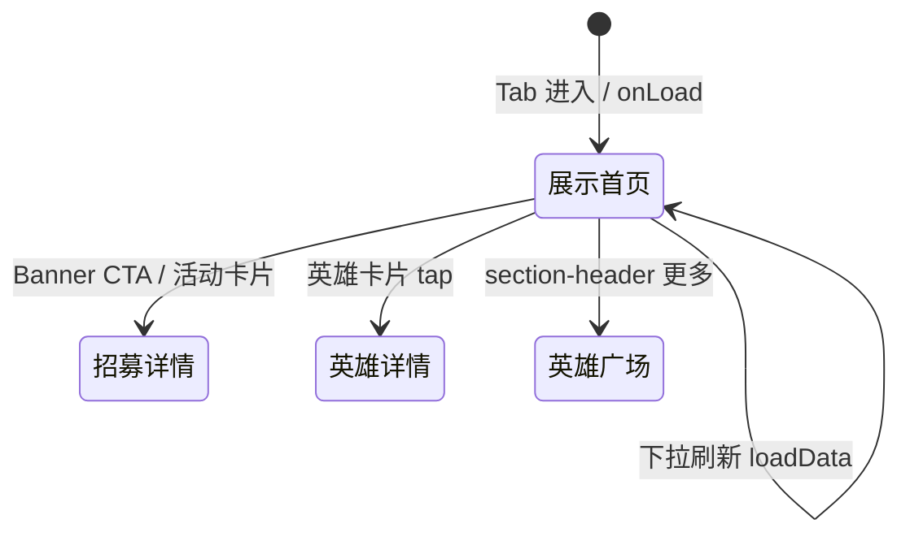

# 营销首页

> 单页需求文档 · 英雄广场微信小程序  
> 状态：已实现 · P0 · M1  
> 最后更新：2026-07-10  
> 源码：`miniprogram/pages/index/` · 预览：`preview/miniprogram/index.html`

---

## 1. 页面概述

| 项 | 值 |
|---|---|
| 页面名称 | 营销首页（Tab 首页） |
| 路由 | `pages/index/index` |
| 导航栏标题 | **无系统标题**（`navigationStyle: custom`） |
| 导航类型 | **Tab 根页** · 自定义导航（Banner 沉浸） |
| 页面参数 | 无 |
| 目标用户 | 全部访客；引流至英雄广场、招募/课程详情、商城 |
| 设计规范 | `DESIGN-SPEC` · 沉浸 Banner + 金刚区 + 横向滚动卡片 |

---

## 2. 业务需求

### 2.1 业务目标

- **品牌与赛季营销**：Banner 展示当季主推活动（企业家杯月赛等），引导 CTA 跳转招募详情
- **快捷入口**：金刚区提供船艇预约、活动赛事、精选课程、好物推荐四类入口（M1 仅展示，无跳转）
- **会员转化**：航海家权益卡区块展示价格与权益，引导开通（M1 按钮无绑定事件）
- **内容聚合**：英雄广场横滑、精选活动/课程/好物/新闻动态，各区块「更多」统一跳转英雄 Tab

### 2.2 适用角色与权限

| 角色 | 可访问 | 不可访问时的处理 |
|------|--------|------------------|
| 未登录访客 | ✅ | — |
| 普通用户 | ✅ | — |
| 英雄教练 | ✅ | — |

### 2.3 正常流程

进入首页 → 拉 Banner/英雄/活动等（API 优先，mock 兜底）→ 跳转详情或英雄 Tab。

### 2.4 核心业务规则

1. 列表类数据 API 优先，mock 兜底
2. 后台新批准英雄应出现在首页英雄区块
3. Banner CTA / 活动卡 → 招募详情；英雄卡 → 英雄详情；「更多」→ 英雄广场
4. 商城/好物区块若有则仅入口占位（M1 好物卡无跳转）
5. 支持下拉刷新

### 2.5 异常与边界

- 无活动时 Banner CTA 不跳转
- 精选课程/好物/新闻 M1 可仅展示

### 2.6 待确认项

- [ ] 筛选/排序等定稿细节以各列表页为准；首页聚合规则保持现有交互

### 2.7 状态机



---

## 3. 页面结构与 UI 元素规格

### 3.1 信息架构

```
.home（根容器）
├── .home-banner（沉浸 Banner）
│   ├── .home-banner__bg / __fade / __safe（状态栏占位）
│   ├── .home-banner__season（赛季标签）
│   └── .home-banner__content（标题/日期/描述/CTA）
├── .home-nav.section（金刚区 ×4）
├── .membership.section（航海家权益卡）
├── section ×5（英雄广场 / 精选活动 / 精选课程 / 精选好物 / 新闻动态）
│   ├── section-header（标题 + 更多）
│   └── 列表/网格内容
└── TabBar（系统）
```

### 3.2 UI 元素清单

| 元素 ID | 类型 | 文案/占位 | 样式要点 | 数据来源 | 必填 | 校验 | 交互 |
|---------|------|-----------|----------|----------|------|------|------|
| banner-season-dot | 圆点 | — | 小圆点 + 赛季文案 | `banner.season` | — | — | 无 |
| banner-season | 文本 | 如 `2026 夏季航季` | 叠于 Banner 左上 | Mock `banner.season` | — | — | 无 |
| banner-title | 文本 | 如 `企业家杯月赛` | 大标题白色 | `banner.title` | — | — | 无 |
| banner-date | 文本 | 如 `06.20` | 副标题 | `banner.subtitle` | — | — | 无 |
| banner-desc | 文本 | 如 `一站式高端水上运动体验平台` | 描述行 | `banner.desc` | — | — | 无 |
| banner-cta | 按钮 | **查看活动** | 主色 CTA 胶囊 | `banner.cta` | — | — | `onBannerCta` → 招募详情 |
| shortNav-item | 网格项 | icon + label | 4 列金刚区 | `shortNav[]` | — | — | M1 无 bindtap |
| membership-title | 文本 | **航海家** + **权益卡** | 白字 + 金色 | 静态 | — | — | 无 |
| membership-price | 价格 | `￥` + 数字 | 金色大号 | `membership.price` | — | — | 无 |
| membership-btn | 文本按钮 | **立即开通 ›** | 卡片内按钮 | 静态 | — | — | M1 无事件 |
| membership-benefit | 列表项 | `✓` + 权益文案 | 底部权益行 | `membership.benefits[]` | — | — | 无 |
| section-heroes | 区块 | 标题 **英雄广场** | section-header | 静态 | — | — | 更多 → heroes Tab |
| hero-card | 组件 | 教练卡片 | 横滑 scroll-x | `heroes[]` | — | — | tap → 英雄详情 |
| section-events | 区块 | **精选活动与赛事** | event-card 竖列表 | `events[]` | — | — | tap → 招募详情 |
| section-courses | 区块 | **精选课程** | 横滑 course-card | `courses[]` | — | — | M1 无 tap |
| course-card-title | 文本 | 课程名 | 两行省略 | `item.title` | — | — | 无 |
| course-card-price | 文本 | `待定中` 或 `¥{price}` | 价格色 | `item.price` | — | — | 无 |
| section-products | 区块 | **精选好物** | 2 列 product-grid | `products[]` | — | — | M1 无 tap |
| product-tag | 角标 | 如 `热销` | 封面角标 | `item.tag` | — | — | 无 |
| section-news | 区块 | **新闻动态** | 列表 news-item | `news[]` | — | — | M1 无 tap |
| news-category | 文本 | 分类名 | 次要色 | `item.category` | — | — | 无 |

#### 3.2.1 Banner 区 `.home-banner`

| 属性 | 规格 |
|------|------|
| 背景 | `.cover-placeholder` 占位图 + 渐变遮罩 `.home-banner__fade` |
| 安全区 | `statusBarHeight` 动态 inline style（px） |
| 赛季标签 | 圆点 + `{{banner.season}}`，Mock 默认 **2026 夏季航季** |
| 主标题 | `{{banner.title}}`，Mock **企业家杯月赛** |
| 日期 | `{{banner.subtitle}}`，Mock **06.20** |
| 描述 | `{{banner.desc}}`，Mock **一站式高端水上运动体验平台** |
| CTA 文案 | `{{banner.cta}}`，Mock **查看活动** |
| CTA 行为 | 有 `events[0]` 时 navigateTo `recruitment-detail?id={recruit_id}` |

#### 3.2.2 金刚区 `shortNav`

| id | icon | label | M1 交互 |
|----|------|-------|---------|
| boat | ⛵ | 船艇预约 | 无 |
| event | 🏆 | 活动赛事 | 无 |
| course | ⛵ | 精选课程 | 无 |
| goods | 🛍 | 好物推荐 | 无 |

#### 3.2.3 权益卡 `membership`

| 字段 | Mock 值 |
|------|---------|
| price | 300 |
| benefits | 课程体验 · 课程折扣 · 商城折扣 |

---

## 4. 字段与校验矩阵

> 本页**无用户输入**；以下为展示用数据字段。

| 逻辑字段 | 类型 | 来源 | 说明 |
|----------|------|------|------|
| `statusBarHeight` | number | `wx.getSystemInfoSync()` | Banner 顶部安全区 |
| `banner` | object | `mock.banner` | 首屏 Banner 文案 |
| `shortNav` | array | `mock.shortNav` | 金刚区 4 项 |
| `membership` | object | `mock.membership` | 权益卡 |
| `heroes` | array | `mock.heroes` | 英雄横滑列表 |
| `events` | array | `mock.events` | 活动卡片 |
| `courses` | array | `mock.courses` | 精选课程 |
| `products` | array | `mock.products` | 精选好物 |
| `news` | array | `mock.news` | 新闻动态 |

---

## 5. 交互需求

### 5.1 操作明细

| 序号 | 用户操作 | 前置条件 | 系统行为 | 成功反馈 | 失败反馈 |
|------|----------|----------|----------|----------|----------|
| 1 | 点击 Banner CTA | `events[0]` 存在 | navigateTo 招募详情 r1 | 页面跳转 | 无 events 时不响应 |
| 2 | 点击 section「更多」 | 无 | switchTab `/pages/heroes/heroes` | Tab 切换 | — |
| 3 | 点击 hero-card | `hero_id` 有效 | navigateTo 英雄详情 | 跳转 | — |
| 4 | 点击 event-card | `recruit_id` 有效 | navigateTo 招募详情 | 跳转 | — |
| 5 | 下拉刷新 | enablePullDownRefresh | loadData + stopPullDownRefresh | 列表更新 | — |
| 6 | 点击权益卡/课程/好物/新闻 | M1 | 无 | — | — |

### 5.2 返回与导航

| 控件 | 行为 |
|------|------|
| TabBar 切换 | 离开首页至其他 Tab |
| 系统返回 | Tab 根页无返回栈 |

### 5.3 页面级异常

| 场景 | 处理 |
|------|------|
| Mock 数据缺失 | 空数组，区块仍渲染标题 |
| events 为空 | Banner CTA 点击无效 |

---

## 6. 加载与刷新机制

| 生命周期 | 触发 | 逻辑 | UI | 缓存 |
|----------|------|------|-----|------|
| `onLoad` | 首次进入 | 读 statusBarHeight + loadData | Banner 与列表填充 | M1 无持久缓存 |
| `onShow` | Tab 切回 | M1 无额外请求 | — | — |
| 下拉刷新 | 用户下拉 | loadData → stopPullDownRefresh | 全量 setData | — |

---

## 7. 性能要求

| 项 | 指标 | 实现建议 |
|----|------|----------|
| 首屏可交互 | < 300ms | Mock 同步 setData，无网络等待 |
| 列表数据量 | heroes≤10, events≤8 | 横滑不虚拟化 |
| 图片 | M1 占位 class | M2 lazy-load + CDN |
| setData | 1 次 bulk | onLoad 合并字段 |
| scroll-view | enhanced + enable-flex | 横向英雄/课程 |

---

## 8. 相关页面

### 8.1 入口

| 来源 | 路径 | 场景 |
|------|------|------|
| TabBar | `pages/index/index` | 默认首页 Tab |
| 小程序启动 | app.json 首 Tab | 冷启动 |

### 8.2 出口

| 目标 | 路径/参数 | 触发 |
|------|-----------|------|
| [英雄广场](./英雄广场.md) | switchTab `pages/heroes/heroes` | section 更多 |
| [英雄详情](./英雄详情.md) | `?id={hero_id}` | hero-card tap |
| [招募详情](./招募详情.md) | `?id={recruit_id}` | Banner CTA / event-card |
| [商城](./商城.md) | switchTab | TabBar（非首页内链） |

---

## 9. 接口与数据

### 9.1 接口列表（M2）

| 接口 | 方法 | 时机 | 说明 |
|------|------|------|------|
| `/api/home/banner` | GET | onLoad | Banner 与赛季 |
| `/api/home/sections` | GET | onLoad | 各区块聚合 |
| `/api/heroes` | GET | onLoad | 推荐教练 |
| `/api/recruitments` | GET | onLoad | 精选活动 |

### 9.2 M1 Mock 数据源

**`mock.banner`**

| 字段 | 类型 | 示例 |
|------|------|------|
| season | string | 2026 夏季航季 |
| title | string | 企业家杯月赛 |
| subtitle | string | 06.20 |
| desc | string | 一站式高端水上运动体验平台 |
| cta | string | 查看活动 |

**`mock.heroes[]`（卡片字段）**

| 字段 | 类型 | 说明 |
|------|------|------|
| hero_id | string | 跳转 id |
| name | string | 姓名 |
| rating | number | 评分 |
| project_types | string[] | 项目标签 |
| certification_level | string | 认证等级 |
| recruitments | object[] | 卡片内活动/课程行 |

---

## 10. 预览端差异

| 项 | 小程序 | 浏览器预览 |
|----|--------|------------|
| 导航栏 | custom，Banner 顶到状态栏 | `.mp-navbar` 或模拟 custom |
| 下拉刷新 | 原生 enablePullDownRefresh | 预览可能无下拉 |
| TabBar | 系统 Tab | SPA 底部 Tab 模拟 |
| 数据 | `mock.js` | 同源 HTML 内嵌 Mock |
| 金刚区/权益卡点击 | 无事件 | 同左 |

---

## 11. 待确认项

- [ ] 金刚区四项 M2 跳转目标（外链 / 内页）
- [ ] 权益卡「立即开通」支付流程与页面
- [ ] 精选课程/好物/新闻点击跳转规则
- [ ] M2 首页接口是否合并为单一 BFF

---

## 12. 变更记录

| 日期 | 变更 |
|------|------|
| 2026-07-07 | 重写：逐元素 UI、Mock 字段、交互与 M2 接口规划 |
| 2026-07-03 | 初稿 |
