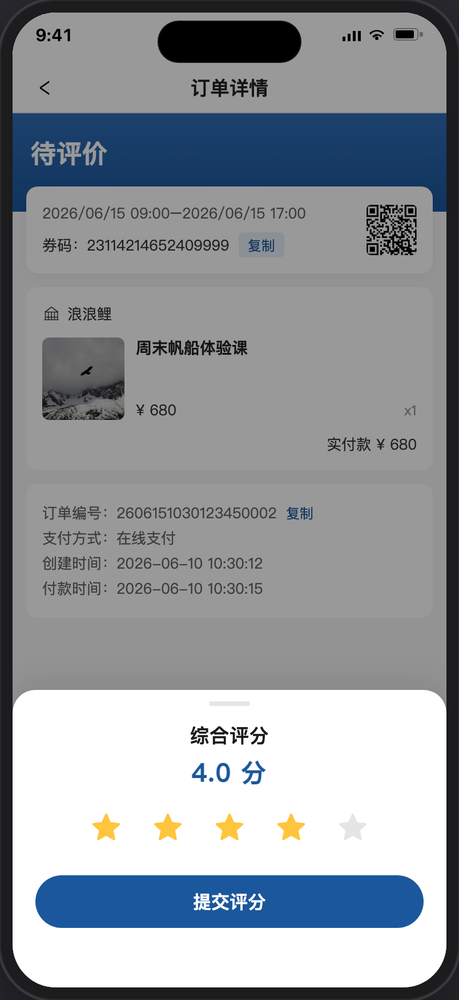

# 订单详情

> 产品说明 · 微信小程序  
> 状态：已实现 · 见 §4 验收要点  
> 最后更新：2026-07-21 17:25
> 预览地址：http://127.0.0.1:8765/miniprogram/order-detail.html  
> UI设计图地址：设计中  
> **协作提示**：桌面打开预览时，手机模型右侧会同步展示本文档（预览中不展示「§4 规则补充与验收要点」）；改文档后请运行 `python3 preview/build-pages.py` 再刷新。

## UI说明

1、需设计评分按钮、评分的对话框、评分后在订单详情页如何显示。

---

## 1. 页面业务目标

从 [我的订单](./我的订单.md) 点订单卡进入，查看单笔订单状态、券码、商品与支付信息；可复制券码/订单号，可进入 [二维码凭证](./二维码凭证.md)。

---

## 2. 页面详细描述

### 2.1 顶栏与状态

导航标题「订单详情」。状态区展示当前订单状态文案（演示：「待使用」）。

### 2.2 凭证信息

| 元素 | 说明 |
|------|------|
| 有效期 | 展示可用时间段 |
| 券码 | 「券码：」+ 号码；旁有「复制」，点后复制到剪贴板并提示「已复制」 |
| 二维码入口 | 右侧小图；点进 [二维码凭证](./二维码凭证.md) |

### 2.3 门店与商品

| 元素 | 说明 |
|------|------|
| 门店 | 门店名（演示：浪浪鲤） |
| 商品 | 封面、标题、单价、数量 |
| 实付款 | 右对齐展示实付金额 |

### 2.4 订单信息

| 元素 | 说明 |
|------|------|
| 订单编号 | 可「复制」 |
| 支付方式 | 如「在线支付」 |
| 创建时间 | 下单时间 |
| 付款时间 | 付款时间 |

### 2.5 底栏

| 状态 | 按钮 |
|------|------|
| 待使用等 | 「取消报名」（本期 toast「敬请期待」） |
| 已完成且未评分 | 「去评分」→ 底部滑出「综合评分」弹层 |
| 已完成且已评分 | 无「去评分」；页内展示「综合评分」+ 星星 + 分值（演示：城市定向挑战赛 · 5.0 分） |

### 2.6 综合评分弹层

1、标题「综合评分」。

2、5 颗圆角五角星，默认置灰；点选 1～5 星点亮，并显示具体分值（如「4.0 分」）；未选时提示「轻点星星评分」（占位不抖动）。

3、「提交评分」：未选星时不可点（置灰）；选星后可提交，提示「评分成功」并关闭弹层；本页展示「综合评分」+ 星星 + 分值，底栏「去评分」隐藏。从 [我的订单](./我的订单.md) 点「去评分」进入本页时，评分弹层自动从底部滑出。

4、点遮罩关闭弹层。

---

## 3. 相关页面

| 关系 | 页面 | 何时 |
|------|------|------|
| 来源 | [我的订单](./我的订单.md) | 点订单卡 |
| 来源 | [二维码凭证](./二维码凭证.md) | 「订单详情」入口 |
| 去向 | [二维码凭证](./二维码凭证.md) | 点凭证区二维码入口 |

---

## 4. 规则补充与验收要点

### 4.1 已对齐

- 列表点卡进详情；券码凭证仍直达凭证页
- 凭证页「订单详情」进本页
- 券码/订单号可复制
- 演示数据与列表一致（浪浪鲤 / 企业家杯月赛 / ¥5200）
- 已完成「去评分」打开综合评分弹层；提交后 toast「评分成功」，页内展示综合评分

### 4.2 还没做完

- 取消报名正式流程；评分写入后端
- 真实支付 / 核销

---

## 5. 变更记录

| 日期 | 改了什么 |
|------|----------|
| 2026-07-21 | 挂入评分对话框、已评价详情截图 |
| 2026-07-21 | UI说明：需设计评分按钮、评分对话框、评分后展示 |
| 2026-07-21 | 演示增加已评分订单；进详情直接展示综合评分 |
| 2026-07-21 | 列表「去评分」进详情后自动滑出评分弹层 |
| 2026-07-21 | 提交后 toast「评分成功」，页内展示综合评分 |
| 2026-07-21 | 评分弹层：柔和星形、显示分值、点击不抖动 |
| 2026-07-21 | 初稿：按参考图落地详情结构与跳转 |
