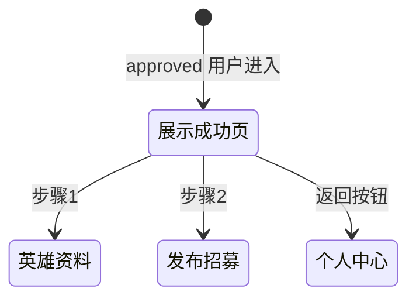

# 认证成功

> 单页需求文档 · 英雄广场微信小程序  
> 状态：已实现 · P0 · M1  
> 最后更新：2026-07-10  
> 源码：`miniprogram/pages/hero-apply-success/` · 预览：`preview/miniprogram/hero-apply-success.html`

---

## 1. 页面概述

| 项 | 值 |
|---|---|
| 页面名称 | 认证成功（英雄权益说明页） |
| 路由 | `pages/hero-apply-success/hero-apply-success` |
| 导航栏标题 | **认证成功** |
| 导航类型 | 子页；底部固定按钮 |
| 页面参数 | 无 |
| 目标用户 | 已通过英雄认证（`approved`）的用户 |
| 设计规范 | `DESIGN-SPEC` · 成功图标 + 权益列表 + 引导步骤 |

---

## 2. 业务需求

### 2.1 业务目标

- 庆祝认证成功，列出 **5 项认证权益**
- 温馨提示 3 条（审核周期、发布限制、保持畅通）
- 引导两步：完善英雄资料、发布首个赛事招募
- 底部 **返回个人中心** switchTab

### 2.2 适用角色与权限

| 角色 | 可否进入 | 处理 |
|------|----------|------|
| 已认证 approved | ✅ 主场景 | — |
| 未认证/审核中 | ❌ 不应直达 | M2 onLoad 门禁 redirect |
| 访客 | ❌ | — |

### 2.3 正常流程

已认证（`approved`）从个人中心进入 → 展示权益与下一步引导 → 可去资料/发布招募或回个人中心。

### 2.4 核心业务规则

1. 仅 `approved` 展示本页
2. 不可从成功页返回去重复提交申请（入口不在表单栈）
3. 权益/提示为静态文案；引导完善资料、发布首个招募

### 2.5 异常与边界

- 未认证 / 审核中不应直达（M2 可 onLoad 门禁 redirect）

### 2.6 待确认项

- 无

### 2.7 状态机



---

## 3. 页面结构与 UI 元素规格

### 3.1 信息架构

```
.hero-success-page
├── scroll-view.hero-success-scroll
│   ├── 成功头（✓ + 标题）
│   ├── 权益 section
│   ├── 温馨提示 section
│   └── 建议步骤 section（2 步）
└── .hero-success__footer（返回个人中心）
```

### 3.2 UI 元素清单

| 元素 ID | 类型 | 文案（精确） | 样式 | 交互 |
|---------|------|-------------|------|------|
| icon | 文本 | **✓** | 圆形主色 | 无 |
| title | 文本 | **恭喜您！成功认证英雄** | 18px 半粗 | 无 |
| section-benefits-title | 文本 | **🎁 您已获得的认证权益** | section 标题 | 无 |
| benefit-item | 行 | ✓ + 权益文案 | 列表 | 无 |
| section-tips-title | 文本 | **📌 温馨提示** | | 无 |
| tip-item | 文本 | **· {tip}** | 列表 | 无 |
| section-steps-title | 文本 | **接下来，建议您完成** | | 无 |
| step-1-title | 文本 | **完善英雄资料** | 可点行 | onGoProfile |
| step-1-desc | 文本 | **补充简介、荣誉与资质证书** | 次要 | |
| step-2-title | 文本 | **发布首个赛事招募** | | onGoRecruit |
| step-2-desc | 文本 | **开启您的第一场水上活动招募** | | |
| step-arrow | 文本 | **›** | | |
| btn-back | 按钮 | **返回个人中心** | footer 固定 | switchTab profile |

#### 3.2.1 权益列表 `benefits`（精确顺序）

1. **发布课程和赛事招募**
2. **接收学员在线报名**
3. **获得平台流量扶持**
4. **参与英雄排行榜评选**
5. **创建专属教练主页**

#### 3.2.2 温馨提示 `tips`（精确）

1. **您的资料将在 1-3 个工作日内完成审核**
2. **审核通过后可正式发布招募活动**
3. **请保持手机畅通，平台可能联系您核实信息**

---

## 4. 字段与校验矩阵

> **无用户输入**。

| 逻辑字段 | 来源 | 说明 |
|----------|------|------|
| benefits | page data 静态 | 5 条权益 |
| tips | page data 静态 | 3 条提示 |

---

## 5. 交互需求

### 5.1 操作明细

| 序号 | 操作 | 行为 | 反馈 |
|------|------|------|------|
| 1 | 步骤1 完善资料 | navigateTo hero-profile | 跳转 |
| 2 | 步骤2 发布招募 | navigateTo recruitment-create?type=event | 跳转 |
| 3 | 返回个人中心 | switchTab profile | Tab 切换 |
| 4 | 导航 ‹ | M1 系统默认 back | 建议 switchTab profile |

### 5.2 返回与导航

| 控件 | 建议行为 |
|------|----------|
| 底部按钮 | switchTab profile |
| 系统返回 | 同 switchTab（待补齐） |

### 5.3 页面级异常

| 场景 | M2 处理 |
|------|---------|
| 非 approved 直达 | redirect 个人中心 |

---

## 6. 加载与刷新机制

| 生命周期 | 逻辑 |
|----------|------|
| `onLoad` | M1 无 API |
| `onShow` | 无 |
| 下拉 | 不支持 |

---

## 7. 性能要求

| 项 | 指标 |
|----|------|
| 首屏 | < 100ms 纯静态 |
| 滚动 | scroll-view enhanced |
| 图片 | 无网络图 |

---

## 8. 相关页面

### 8.1 入口

| 来源 | 导航 |
|------|------|
| [个人中心](./个人中心.md) | navigateTo；已认证英雄徽章 |

### 8.2 出口

| 目标 | 触发 |
|------|------|
| [我的英雄资料](./我的英雄资料.md) | 步骤 1 |
| [发布招募](./发布招募.md) | 步骤 2 |
| [个人中心](./个人中心.md) | 底部按钮 |

---

## 9. 接口与数据

### 9.1 接口

| 接口 | 时机 | 说明 |
|------|------|------|
| `/api/heroes/apply/status` | M2 onLoad 门禁 | 期望 approved |

无写接口；本页只读静态文案。

---

## 10. 预览端差异

| 项 | 小程序 | 预览 |
|----|--------|------|
| footer 固定 | 小程序 safe-area | CSS sticky |
| 步骤链接 | navigateTo | SPA href |

---

## 11. 待确认项

- [ ] 温馨提示第 2 条与「已认证」语义是否矛盾（文案指资料审核？）
- [ ] 导航栏返回是否统一 switchTab
- [ ] M2 是否展示认证日期/证书编号

---

## 12. 变更记录

| 日期 | 变更 |
|------|------|
| 2026-07-07 | 重写：权益/提示精确文案、步骤交互、与申请提交成功页差异 |
| 2026-07-03 | 初稿 |
