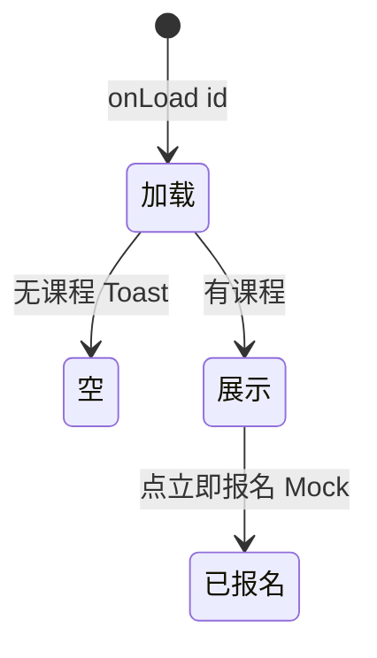

# 课程详情

> 单页需求文档 · 英雄广场微信小程序  
> 状态：已实现 · P0 · M1  
> 最后更新：2026-07-07  
> 源码：`miniprogram/pages/course-detail/` · 预览：`preview/miniprogram/course-detail.html`

---

## 1. 页面概述

| 项 | 值 |
|---|---|
| 页面名称 | 课程详情 |
| 路由 | `pages/course-detail/course-detail` |
| 导航栏标题 | **动态** `item.title` |
| 导航类型 | 子页 |
| 页面参数 | **`id`**（course_id，必填） |
| 目标用户 | 浏览并报名课程的用户 |
| 设计规范 | `DESIGN-SPEC` · Banner swiper + 课程标签 + 固定底栏 |

---

## 2. 业务需求

### 2.1 业务目标

- 展示课程 Banner、基本信息、富文本/纯文本详情
- M1 **一键报名**：无表单，固定写入「当前用户」与 Mock 手机号
- 与英雄详情「我的课程」、首页精选课程入口衔接

### 2.2 适用角色与权限

| 角色 | 行为 |
|------|------|
| 全部用户 | 可浏览、可报名（M1 无登录校验） |
| 课程发布者 | M1 无编辑入口（走我的课程/后台） |

### 2.3 核心业务规则

1. `mock.getCourseById(id)` 不存在 → Toast **课程不存在**
2. Banner：`banner_images` 优先；否则 `cover_image` 拼 `/assets/images/`；默认 course.jpg
3. 多图 swiper 4s 轮播；单图 image 组件
4. category-tag：`label="课程"` variant=`course`
5. Meta 行：时间/地点/授课教练/名额 按字段 wx:if
6. 详情：`detail_html` 存在用 rich-text，否则 `description` 纯文本
7. 报名：`addMySignup({ type:'course', course_id, title, name:'当前用户', phone:'13800000000' })`

### 2.4 状态机



---

## 3. 页面结构与 UI 元素规格

### 3.1 信息架构

```
.course-detail
├── .course-detail__banner（swiper / 单图）
├── .course-detail__body
│   ├── category-tag
│   ├── title / meta × N
│   └── 课程详情 section
└── .course-detail__footer（价格 + 立即报名）
```

### 3.2 UI 元素清单

| 元素 ID | 类型 | 文案 | 数据来源 | 交互 |
|---------|------|------|----------|------|
| banner-swiper | swiper | 多图 4s | bannerImages | 指示点 |
| banner-single | image | aspectFill | bannerImages[0] | 无 |
| type-tag | 组件 | **课程** | 静态 | 无 |
| title | 文本 | `{{item.title}}` | item | 无 |
| meta-time | 文本 | 🕐 `{{item.time}}` | wx:if time | 无 |
| meta-location | 文本 | 📍 `{{item.location}}` | wx:if | 无 |
| meta-hero | 文本 | **授课：{{item.hero_name}}** | 始终 | 无 |
| meta-quota | 文本 | **名额：{{signed}}/{{total}} 人** | wx:if total | 无 |
| label-detail | 标题 | **课程详情** | 静态 | 无 |
| detail-rich | rich-text | detail_html | item | 无 |
| detail-text | 文本 | description | fallback | 无 |
| footer-price | 文本 | **¥{{item.price}}**/人 | item.price | 无 |
| footer-btn | 按钮 | **立即报名** | 静态 | onSignupTap |

---

## 4. 字段与校验矩阵

### 4.1 页面参数

| 字段 | 必填 | 错误 |
|------|------|------|
| `id` | ✅ | Toast **课程不存在** |

### 4.2 报名（M1 无表单）

| 字段 | 值 | 说明 |
|------|-----|------|
| type | `course` | 区分招募报名 |
| course_id | 路由 id | |
| title | item.title | |
| name | **当前用户** | Mock 固定 |
| phone | **13800000000** | Mock 固定 |

> M2 应增加姓名/手机表单，对齐 [招募详情](./招募详情.md) 校验。

---

## 5. 交互需求

### 5.1 操作明细

| 序号 | 操作 | 行为 | 成功 | 失败 |
|------|------|------|------|------|
| 1 | 立即报名 | addMySignup | Toast **报名成功** | **报名失败** |
| 2 | 返回 | navigateBack | — | — |

### 5.2 返回与导航

| 控件 | 行为 |
|------|------|
| 系统 ‹ | navigateBack |

### 5.3 页面级异常

| 场景 | 处理 |
|------|------|
| 重复报名 M1 | 未去重，可多次写入 |
| 名额已满 M2 | 待实现 |

---

## 6. 加载与刷新机制

| 生命周期 | 逻辑 |
|----------|------|
| `onLoad` | getCourseById + setNavigationBarTitle |
| `onShow` | 无 |
| 下拉 | 不支持 |

---

## 7. 性能要求

| 项 | 指标 |
|----|------|
| 首屏 | 本地 Mock 单请求 |
| Banner 图 | 本地 assets 路径 |
| rich-text | M2 控制节点大小 |

---

## 8. 相关页面

### 8.1 入口

| 来源 | 参数 |
|------|------|
| [英雄详情](./英雄详情.md) 课程卡 | course_id |
| hero-card 组件课程行 | id |

### 8.2 出口

| 目标 | 说明 |
|------|------|
| [我的报名](./我的报名.md) | 间接（signup 写入） |
| 上一页 | back |

---

## 9. 接口与数据

### 9.1 接口（M2）

| 接口 | 方法 | 说明 |
|------|------|------|
| `/api/courses/:id` | GET | 课程详情 |
| `/api/signups` | POST | 报名 |

### 9.2 Course 对象字段

| 字段 | 类型 | 说明 |
|------|------|------|
| course_id | string | id |
| title | string | 名称 |
| hero_name | string | 授课教练 |
| time | string | 展示时间 |
| location | string | 地点 |
| price | number | 单价 |
| signed / total | number | 名额 |
| banner_images | string[] | 轮播 |
| cover_image | string | 封面 key |
| detail_html | string? | 富文本 |
| description | string? | 纯文本 fallback |

---

## 10. 预览端差异

| 项 | 小程序 | 预览 |
|----|--------|------|
| rich-text | 小程序组件 | HTML 直出 |
| 报名 | addMySignup | localStorage 对齐 |
| Banner | image 本地路径 | 相对 assets |

---

## 11. 待确认项

- [ ] M2 报名表单与支付
- [ ] 详情富文本编辑流程（见 [发布课程](./发布课程.md) 后台说明）
- [ ] 重复报名拦截

---

## 12. 变更记录

| 日期 | 变更 |
|------|------|
| 2026-07-07 | 重写：Banner 逻辑、M1 Mock 报名、字段与 rich-text 分支 |
| 2026-07-03 | 初稿 |
