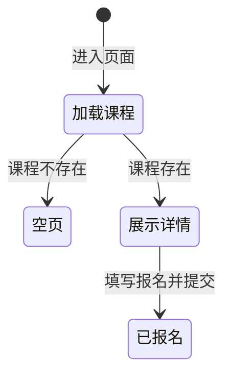

# 课程详情

> 产品说明 · 微信小程序子页（课程详情）  
> 状态：已实现 · 第一期 · 优先级最高  
> 最后更新：2026-07-15  
> 预览地址：http://127.0.0.1:8765/miniprogram/course-detail.html  
> **协作提示**：桌面打开预览时，手机模型右侧会同步展示本文档（预览中不展示「§6 规则补充与验收要点」）；改文档后请运行 `python3 preview/build-pages.py` 再刷新。

---

## 1. 页面业务目标

「课程详情」展示某门 **水上运动课程** 的完整信息，并支持用户报名。布局与交互对齐 [招募详情](./招募详情.md)。

主要解决三件事：

1. **看清课程信息**：封面、类型标签、时间地点、价格、主办与备注
2. **阅读课程详情**：详情文案（支持富文本）
3. **立即报名**：填写姓名 + 手机提交报名

---

## 2. 登录和身份描述

底栏左侧固定 **首页**、**客服**；右侧主按钮 **立即报名**（进行中可点）。

| 身份 | 页面上看到什么 |
|------|----------------|
| 全部用户 | 完整课程信息与报名入口 |
| 课程不存在 | 页面提示「课程不存在」，不渲染 |

---

## 3. 页面详细描述

### 3.1 自定义导航

| 展示内容 | 说明 |
|----------|------|
| 返回按钮 | ‹ → 返回上一页 |
| 滚动标题 | 页面向下滚动后显示课程标题（沉浸导航） |

### 3.2 封面区

封面多图时轮播并自动切换；**仅一张封面时不轮播**，静态展示。

### 3.3 课程信息

浅灰页面底上叠多张白卡片（左右留边，首卡略上移压封面）：

| 卡片 | 内容 |
|------|------|
| 概要卡 | 「课程」标签、标题、内容标签（最多 3 个，默认零基础友好/含装备/小班教学）、价格 + 分享 |
| VIP 引导条 | 「VIP会员卡 · 可享5大权益」+「立即尊享 ›」（本期 toast「即将开放」） |
| 时间地点卡 | 时间、地点（带 ›）、主办（建筑图标 +「{教练名}主办」）、备注 |
| 课程详情卡 | 「课程详情」描述（优先富文本） |

### 3.4 固定底栏

- 左侧：**首页**（回营销首页）、**客服**（第一期提示「功能开发中」）
- 右侧：**立即报名**（蓝色可点；不展示价格）

### 3.5 报名表单弹窗

标题「填写报名信息」：

| 字段 | 说明 |
|------|------|
| 联系人姓名 | 必填 |
| 联系电话 | 必填，11 位手机号 |
| 备注 | 选填 |
| 取消 / 提交 | 关闭弹窗 / 提交报名 |

**校验与结果提示：**

| 情况 | 提示原文 |
|------|----------|
| 姓名为空 | 「请填写联系人」 |
| 手机号格式不对 | 「手机号格式不正确」 |
| 提交成功 | 「报名成功」 |
| 提交失败 | 「报名失败」 |

---

## 4. 常见路径

- **浏览课程：** 英雄详情课程卡 / 教练卡片课程行 → 进入本页
- **报名：** 点「立即报名」→ 填表单 → 提交成功
- **首页 / 客服：** 底栏左侧入口
- **返回：** ‹ 或系统返回 → 上一页

---

## 5. 相关页面

| 关系 | 页面 | 何时 |
|------|------|------|
| 入口 | [英雄详情](./英雄详情.md) | 点击课程卡片 |
| 入口 | 教练卡片组件 | 课程行 |
| 间接 | [我的报名](./我的报名.md) | 报名写入后可查看 |
| 后台 | [课程管理](../../admin/pages/课程管理.md) | 课程图文由后台维护 |
| 姊妹页 | [招募详情](./招募详情.md) | 同壳布局参考 |
| 出口 | [营销首页](./营销首页.md) | 底栏「首页」 |
| 出口 | 上一页 | 返回 |

---

## 6. 规则补充与验收要点

### 6.1 已对齐（产品已确认可验收）

| 能力 | 说明 |
|------|------|
| 沉浸导航 + 封面 + 多卡片信息区 | 有（对齐招募详情） |
| 底栏：首页 / 客服 + 立即报名 | 有 |
| 报名表单（姓名、手机、备注）与校验提示 | 有 |
| 课程不存在时页面提示且不渲染 | 有 |

### 6.2 还没做完

| 优先级 | 能力 | 现状 |
|--------|------|------|
| 待确认 | 课程结束态主按钮禁用文案 | 第一期未做 |
| 待确认 | 满员是否禁止报名 | 第一期未校验 |
| P2 | 客服真实接入 | 第一期提示「功能开发中」 |

---

## 7. 变更记录

| 日期 | 改了什么 |
|------|----------|
| 2026-07-15 | 去掉前台发布课程入口；相关说明改为后台课程管理 |
| 2026-07-15 | 布局对齐招募详情：沉浸导航、概要/VIP/时间地点/详情卡、底栏首页客服+报名表单 |
| 2026-07-14 | 全文改为产品可读中文 |
| 2026-07-07 | 初稿 |
